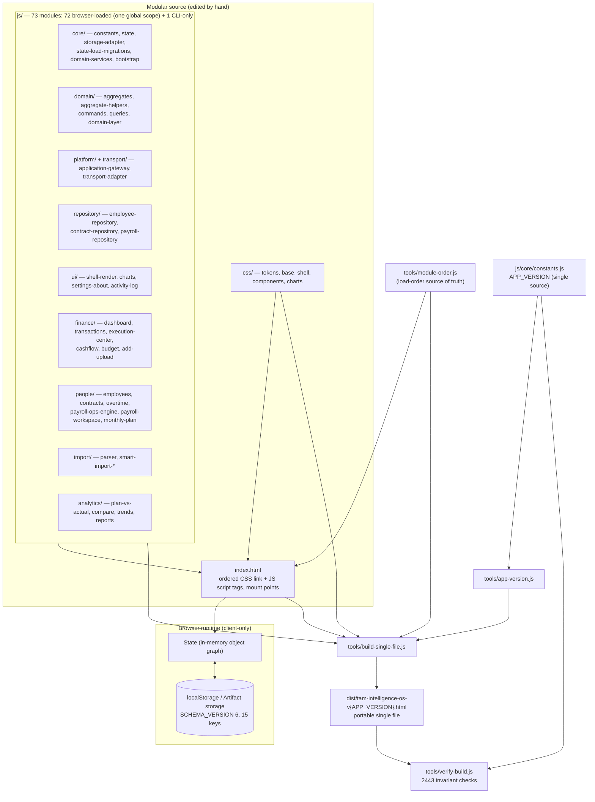
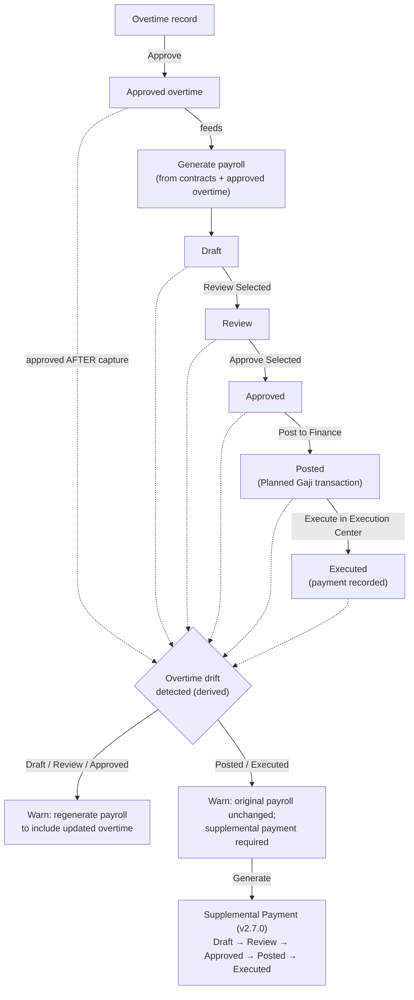
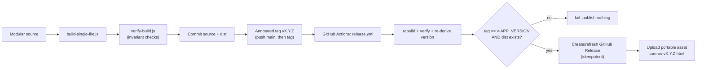

# TAM OS — Architecture

**Current published release:** **v2.11.0 — Identity Refresh** (**published, marked Latest** in
`fanoryu/TAM-OS-Next`, annotated tag `v2.11.0` peeling to `04c1503d`). It carries the merged BRAND-1
product-identity / offline-typography modernization; `APP_VERSION` **2.11.0**, `SCHEMA_VERSION` **6**,
`ACTIONS` **20** — identity/typography presentation only, no authorization, data-model or backend change.
Its published asset `tam-os-v2.11.0.html` (**1,676,709 bytes**, SHA-256
`57d8b0c23c83509a70a766d903e2ee19aa57e5bcfc70950652d930e8f2358557`) is byte-identical to the tracked
`dist/tam-os-v2.11.0.html`.

**Prior release — v2.10.0 (Governed Workspace):** published and intact, now the prior release (no longer
Latest). It was **originally published** (2026-08-11) from the predecessor repository `fanoryu/TAM-OS` —
annotated tag `v2.10.0` there, release commit `335d53ed` — and **canonically re-published unchanged**
(2026-08-13) from the canonical repository `fanoryu/TAM-OS-Next` — annotated tag `v2.10.0` here, peeling to
`856e3ca6a6bfee41f1840996eec2f292bf5ef4eb`. `fanoryu/TAM-OS-Next` now shows Latest = v2.11.0 while the
predecessor `fanoryu/TAM-OS` still shows Latest = v2.10.0; the predecessor's tag, Release and asset are
untouched historical provenance. That v2.10.0 re-publication was **not** a new product version:
`APP_VERSION` was **2.10.0**, `SCHEMA_VERSION` **6**, no runtime rebuilt. Its published asset
(`tam-os-v2.10.0.html`, **1,151,267 bytes**, SHA-256
`60382271a6dcea23431fabb91e0d16abb03196e5cf64c6dc4da1e1af2c7fa704`) is byte-identical across both Releases.
It packages the UX-006 authorization line and the Readiness programme. **Artifact identity is not tree
identity** — the canonical tag's source/docs checkpoint is newer than the predecessor's v2.10.0 snapshot
while the portable artifact is unchanged. `fanoryu/TAM-OS-Next` is canonical going forward.
**Current source / distributable:** `dist/tam-os-v2.11.0.html` — the published **v2.11.0 (Identity Refresh)**
artifact. It is a **single-file application package**: typography is **embedded** (offline-safe), while the
XLSX parser is CDN-loaded (see [ADR-0002](docs/03b-repository-adr/ADR-0002-canonical-distribution-architecture.md)).
The pilot has **not** launched — **PILOT-1 remains ON HOLD PENDING VPS**; backend **NOT STARTED**.
The prior **v2.9.0** release remains published and immutable (no longer Latest) — annotated tag
`v2.9.0` on commit `598edef0`; its published asset (`tam-os-v2.9.0.html`, **1,049,018 bytes**, SHA-256
`e7470ff5261896b8d7d1f8645294d2abd6a72e9820df94b799973627ddcaf3ea`) is unchanged and is the pilot
rollback target.
The prior **v2.8.6** release remains published and
immutable (no longer Latest) — annotated tag `v2.8.6` on commit `7ac0092d`; its published asset
(`tam-os-v2.8.6.html`, **998,413 bytes**, SHA-256
`8481523c11f78c8959291912551ee3205781daf0ec466ff79cfc59c7c91d3f62`) is immutable. The **published v2.8.5 tag, Release, and 965,767-byte asset
(`tam-intelligence-os-v2.8.5.html`, SHA-256 `32e624a262ef1da47bd4ec849471ff98e428402c33722db1715cf1c23a7db8cb`)
remain immutable and unchanged**; older tags/Releases and their assets are likewise untouched.
`SCHEMA_VERSION` is 6, unchanged.
**Basis:** `tam-intelligence-os-v2.5.2.html` (the retained legacy **JS-provenance** regression
comparator, and the data-safety invariants derived from it — not a general source of truth for the
current application). Since UX-002B it is **no longer the CSS comparator**: CSS is asserted
against a pinned SHA-256 of `concat(css/*.css)` — currently
`6d9c21375bdc608e99a56a3a65bc6fc293bbc506cda1b521742560902e3b4b96` (last revised for UX-006D3:
cross-surface presentation consistency) — with every superseded anchor kept
in [`audit/ux-002b-2026-08-05/`](docs/99-archive/audit/ux-002b-2026-08-05/CSS-GOLDEN-MASTER-REVISION.md).
**Shape today:** a modular source of **73 classic-script JS modules** (in `core/ ui/ finance/ people/
import/ analytics/ domain/ platform/ transport/ repository/ cli/`) + 5 CSS files, assembled into one
portable `dist/tam-os-v${APP_VERSION}.html`. **72 of the 73 are browser-loaded** — the
load-order manifest and `index.html` agree on all 72 — and `js/cli/cli.js` is the CLI-only ingress,
deliberately outside the browser load order. Still one shared global scope — no ES modules,
no bundler. `SCHEMA_VERSION` is 6 and `ACTIONS` is 20.
**Verification:** `tools/verify-build.js` — **2443** checks; **thirty-four** Node runtime harnesses —
**2921** checks (largest: contract timeline 349, authz C2C-4 164, integrity warning rules 146, integrity
payroll rules 144, Contract Core 129, authz C2C-3 129, UX-006D2 presentation 127, employee read scope 119,
monthly plan 118, finance/import mutation enforcement 118, payroll posting 106, authz 104,
Readiness-2 E2E 96, authz integration 91).
**Presentation architecture (UX-002A / UX-002B):** the application shell is mounted once by
`renderShell()` and persists; ordinary navigation replaces only the content inside `#main`
(`renderView()`) and reapplies the nav's derived state in place (`syncShellState()`), with `render()`
kept as a compatibility facade. CSS resolves from token scales in `css/tokens.css` (6 font sizes, 6
spacing steps, 4 radii, `--brand` / `--interactive` / `--warn` / six `--chart-*` series tokens); chart
colours resolve via `themeVar('--token', fallback)` at render time. Eight invariants guard this — three
shell-persistence, four token/typography, one production-JS colour-literal ban.
**Contract timeline architecture (UX-003A / UX-003B / UX-003C):** `contractCalc(c, refKey)` measures
every field — including `daysUntilEnd` — against one normalized reference date (UX-003A).
`contractTimeline(c, refKey)` is the single classifier and returns TWO independent derived dimensions
(UX-003B): an **effective state** (Draft / Cancelled / Renewed / Scheduled / Active / Expired) and an
**expiry horizon** (EndingToday / EndingThisWeek / EndingThisMonth / EndingNextMonth /
WithinWarningWindow / None). Presentation consumes that model through one counter
(`contractTimelineCounts()`), one label resolver (`contractPresentation()`) and one wording helper
(`contractProgressNote()`) (UX-003C). 131 invariants guard this — 20 reference-date, 63 model, 48
presentation/counter — plus a dedicated 349-check runtime harness.

> **How to read this document.** The header block above and **§18** (Repository layer) describe the
> architecture **as it stands today**; start there. Everything below §18 is a dated release record,
> ordered newest-first, and each section is accurate **for the release it names** — read those as
> historical provenance, not as current state.
>
> Sections 1 and 3–6 describe the founding **Phase 0** split (v2.6.0); the line ranges are the
> authority for how the original cut was derived. Section 2 is the original 20-file map. Then:
> **§8** (v2.6.1 incremental render), **§9** (v2.6.2 decomposition into the feature-folder tree — the
> 44-module layout *at that time*), **§10** (v2.6.3 Payroll workspace), **§11** (v2.6.4 release
> automation + audit visibility), **§12** (v2.6.5 Smart Import scroll preservation), **§13** (v2.6.6
> company settings checklist fix), **§14** (v2.6.7 repository governance & delivery — no runtime
> change), **§15** (v2.6.8 generic payroll bulk-selection model + immediate overtime-drift
> visibility), **§16** (v2.6.9 Enterprise Banking Foundation) and **§17** (v2.7.0 Supplemental Payroll
> Engine). Where an early section says "20 files" or "44 modules", the header block above is the
> current count.
>
> **Releases after v2.7.0 (v2.7.1 → v2.8.5) have no dedicated section here.** Their architectural
> substance is folded into the header block and §18; their per-release detail lives in
> [`CHANGELOG.md`](CHANGELOG.md) and [`RELEASE_NOTES.md`](RELEASE_NOTES.md), which are the source of
> truth for release-by-release history.

---

## Diagrams

These diagrams reflect the actual implementation. There is **no server, database, API, or external
service** — the app is client-only; Node is used solely for the build/verify tooling.

### A. Application structure



> **UX-006A Identity Foundation (implemented and frozen; merge commit `73096303`).** A new core leaf
> `js/core/identity.js` loads after `core/utils.js` (before `core/state.js`). It is an **identity
> abstraction, not authentication**: a minimal `User` contract, `PRINCIPAL_TYPES` (`ceo`/`employee`), CEO +
> Employee fixtures, a **canonical `IdentityProvider`** seam exposing only `getCurrentUser() → User|null`
> (delegating through a single internal active-provider handle, default `LocalIdentityProvider`), a
> **`LocalIdentityProvider`** dev/test adapter adding local-only `getAvailablePrincipals`/`selectPrincipal`,
> and the single `getCurrentUser()` consumer façade. Identity state is provider-owned and private — **no
> `State.identity` slice, no bootstrap change, no persistence key, no schema change** (`SCHEMA_VERSION`
> stays 6). Consumers depend only on `getCurrentUser()`; `null` is a valid fail-closed state (never a
> default CEO; malformed/throwing provider → `null`). Behaviour is proven by
> `tools/verify-identity-foundation-runtime.js` (33 checks); structure/boundaries by additive
> `tools/verify-build.js` guards.

> **UX-006B Personal Workspace & SELF-Scope (implemented and frozen; merge commit `f40fc064`; headless per
> owner amendment R1).** A new core leaf `js/core/workspace.js` loads after `core/identity.js`.
> It binds `User.employeeId → Employee.id` (via the unchanged `empById`; the human `Employee.employeeId` code
> is never used), derives **Executive** (`workspace:executive:company`, `ownerRef.kind='system'`,
> `ALL_COMPANY`) and **Personal** (`workspace:personal:<Employee.id>`, `SELF`) workspaces, and exposes a
> minimal public API — `getCurrentWorkspace()`, `getScopedRecords(entityType)`, `WORKSPACE_TYPES` — over a
> centralized internal `ENTITY_SCOPE` registry (employee→`r.id`, contract/payroll/overtime→`r.employeeId`).
> Everything is **fail-closed** and derived (no `State.identity`, no bootstrap change, no persistence key, no
> schema change; `SCHEMA_VERSION` stays 6). It is **record scope, not authorization** (no `can(...)`), and it
> wires **no** live consumer: **Global Search is intentionally untouched**; live principal-aware GS source
> scoping is deferred to **UX-006D** (a principal selector must exist first). Behaviour is proven by
> `tools/verify-workspace-selfscope-runtime.js` (31 checks).

> **UX-006C1 Authorization Foundation (implemented and frozen; merge commit `27aa882`; headless).** A
> new core leaf `js/core/authz.js` loads after `core/workspace.js`. It answers *which mutation/action a
> principal may perform on an in-scope record* — strictly separate from UX-006B scope (which answers *what is
> visible*). It exposes a **mutation-only** `ACTIONS` vocabulary (**no `*.read`**), a public
> `can(action, resource?)` façade, an internal pure `canPrincipal(principal, action, resource, ctx)`, and an
> internal `POLICY` action→predicate table. **CEO = pass-through; Employee = deny-by-default** with the single
> `overtime.submitSelf` (own in-scope Draft→Submitted). Defense-in-depth **AZ-1** uses an **internal,
> explicit-principal** predicate `isInScopeForPrincipal(principal, entityType, record)` added to
> `workspace.js` (so `canPrincipal(principal,…)` is deterministic from the supplied principal, not the
> globally-selected user; a current-context `isInScope` delegates to it) — both backed by `ENTITY_SCOPE`, not
> on `window`, not a fourth Workspace public API; **AZ-2** fail-closed (deny on any unknown state, never a CEO
> fallback). It is **headless**: no live mutation boundary is wired to `can(...)` (that is UX-006C2), no
> UI/Action Center/nav, `data-grid.js`/`global-search.js` untouched (DG 36 / GS 26), no `State.identity`, no
> bootstrap change, no persistence, `SCHEMA_VERSION` 6, no authentication. Behaviour is proven by
> `tools/verify-authz-runtime.js` (now 104 checks). **UX-006C2 (mutation enforcement) is COMPLETE** —
> C2A/C2B/C2C-1…C2C-4 are merged and frozen, the user-reachable mutation inventory is CLOSED, and `ACTIONS`
> is now **20** (`import.undo`, `data.restore` and `data.reset` were added by C2C-3; C2C-4 added none).
> **UX-006C3 (integration freeze) is COMPLETE, merged and frozen**: decision preparation merged (`049ae0e`),
> implementation merged (`675cb314`). It froze **43 integration surfaces** (27 sidebar nav items, 12 Quick
> Actions, 4 Action Center generators) behind the machine-enforced manifest
> `tools/integration-surface-manifest.js`, with source↔manifest closure checked in both directions. Navigation
> stays **visible + normal** for CEO / Employee / null (no route guard, no authorization-dependent hiding);
> seven single-capability mutation controls are **visible + disabled** when denied via the shared
> `authzDisabled(action, resource)` helper, which delegates to the frozen public `can(...)` and derives
> availability at render time (never cached, never persisted). UI availability is affordance only — the
> mutation boundary remains the authorization source of truth. Behaviour is proven by
> `tools/verify-authz-integration-runtime.js` (91 checks). `ACTIONS` stays **20**; `SCHEMA_VERSION` stays 6.
> **UX-006C — Authorization is therefore COMPLETE and FROZEN in full, and UX-006D is the current milestone.**

> **UX-006D2 — Principal & Workspace Presentation Polish (implemented, merged & frozen; merge `5163cfce`).** The first purely
> presentational UX-006D phase. `js/ui/identity-selector.js` gains a **workspace context block**
> (`#identityPrincipalContext`) labelling the active context from the frozen UX-006B `getCurrentWorkspace()`
> selector — which had been headless since B — and a **collapsed-rail chip** (`#identityPrincipalRail`), because
> the collapsed sidebar previously hid every trace of which principal was acting. Both carry
> `data-principal-state` and are refreshed by `syncIdentitySelector()` on the existing write-on-change
> discipline, so a principal switch re-derives them with no stale provenance and **zero storage writes**. The two
> causes of a null workspace — no principal, versus an employee principal with no linked Employee record (the
> frozen UX-006B fail-closed path) — are presented **distinctly**. `authzDisabled()` adds a
> `data-authz-denied="1"` marker on the **denied branch only**; the `can(action, resource)` delegation, the
> `disabled` attribute and the title are byte-identical, so the marker mirrors a decision it does not make. CSS is
> additive across `shell.css`/`components.css` (an authorized golden-master revision; `tokens.css`
> byte-unchanged): a distinct denied treatment (`opacity .4 → .65` plus a dashed edge, so "you may not" no longer
> looks like "not right now" — `#genPay` is disabled by a locked period too), a persistent chevron on navigable
> Action Center rows, and a quieter `.btn.quick-action` separating navigation from action. **Presentation only:**
> `js/core/authz.js` untouched, `ACTIONS` **20**, `APP_VERSION` **2.9.0**, `SCHEMA_VERSION` **6**, no route guard,
> no persistence, C3 manifest closure green. Proven by `tools/verify-ux006d2-presentation-runtime.js` (127
> checks). The pre-C3 UX-006D routing language is **superseded** (UX-006 architecture §20A); **Global Search
> scope wiring remains outside UX-006D**; **UX-006D3** is next.

> **Readiness-2 — End-to-End User Journey Acceptance (implemented, merged & frozen, merge `580d8999`).** Shifts the unit
> of validation from the boundary to the **journey**: every harness before it proved that a function
> authorizes or a selector scopes; Readiness-2 asks whether a real user can finish a workflow with correct
> state, feedback, persistence, privacy and recovery. Eight journeys are proven in the browser against real
> DOM (the `#manualForm` and `#settingsForm` submits, real modals, a real page reload) in **both** the
> modular source and the portable build, and automated in `tools/verify-readiness2-e2e-runtime.js`
> (**96 checks**), which drives production seams and asserts the **persisted payload** rather than memory —
> a workflow that mutates `State` but persists nothing fails there. Journeys: CEO finance
> (create→edit→schedule→execute, four-event history, `finance.execute` audit, survives reload); Employee
> self-service **and** privacy in one run (own-Draft overtime persists, finance/lock denials are typed and
> SE-0, Employee B never renders, navigation stays complete); payroll (generate→approve→**a locked period
> refuses posting with `PayrollPeriodLocked`, zero created, stages untouched**→unlock→post two *planned*
> transactions linked by `payrollPlanId` and `employeeId`, never auto-executed); Smart Import
> (commit takes a pre-import safety backup and writes `import.commit`, undo removes exactly the batch and
> writes `import.undo`); backup→restore→**Start Fresh** (forces a backup, refuses a wrong confirmation,
> clears every sensitive store while keeping only the deliberate reset-audit key); principal switching
> (CEO view byte-identical before and after, proving recomputation rather than a cache); settings; and
> supplemental generated from real overtime drift and linked to finance in both directions. **No product
> defect was found.** Three near-misses were fixture/probe errors of the author's own — most notably an
> apparent settings **authorization bypass** that proved to be a probe at the `saveSettings()` persistence
> primitive rather than the form-handler boundary (`settings-about.js`, UX-006C2C-4 row 27); the harness now
> asserts the policy the handler consults. It also **corrects the Readiness-1 line-ending recommendation**:
> `.gitattributes` already existed and was correct (`* text=auto eol=lf`); exactly one stale CRLF worktree
> file caused the non-canonical artifact, so no repository change was made. `ACTIONS` **20**, `APP_VERSION`
> **2.9.0**, `SCHEMA_VERSION` **6**. Next: **Readiness-3 — Release Candidate & Pilot Package**.

> **Readiness-1 — Employee Read Scope & Privacy Closure (implemented, merged & frozen, merge `3521d811`).** The
> post-UX-006D audit found the UX-006B self-scope layer built, tested and wired to nothing:
> `getScopedRecords()` had **zero production consumers**, so every list, detail, aggregate, report and
> Global Search read raw `State.*` and an Employee could read the whole company, salaries included.
> Readiness-1 wires it. `ENTITY_SCOPE` grows from four entities to six — `payrollAdjustment` and
> `transaction`, each with an **explicit** SELF predicate over an ownership field the domain already
> carries — and a new public `getScopedRecordById(entityType, id)` re-evaluates scope at **render** time,
> because a detail id may have been captured under a different principal; out-of-scope and non-existent
> both return `null`, deliberately indistinguishable so a renderer cannot leak a foreign record's
> existence. Scoped reads are wired into the Employees/Contracts/Overtime lists with their counters,
> facets and exports; the three detail renderers; **`payrollPlansForMonth()` — the single payroll read
> funnel**, which scopes the worksheet, month totals, cycle status, stage counts, bulk-action eligibility
> and Payroll Health together; payroll adjustments and employee pickers; every HR dashboard figure and
> report row; the finance ledger, `scopedMonths()`/`scopedTxnsForMonth()` and the derived analytics
> aggregates; the Action Center payroll generator; the **breadcrumb terminal label**; and **Global Search**
> at its collector seam — the engine stays source-agnostic, so a foreign record is never *indexed*.
> Finance/Analytics follow the Atlas ruling: navigation stays visible+normal with no route guards, and an
> Employee receives only records with an existing explicit `employeeId`; an unowned company expense is
> simply out of scope and no ownership model was invented. The canonical `State` is never narrowed,
> rewritten or filtered at persistence level, and `getMonths()`/`txnsForMonth()`, the import parser,
> `generatePayroll()` and the persistence/migration modules stay **deliberately unscoped** (documented in
> the plan). `null` now fails closed, so no business data renders until a principal is selected — the
> required semantic, flagged for Readiness-3. **No new ACTION, no schema or storage change:** `ACTIONS`
> **20**, `APP_VERSION` **2.9.0**, `SCHEMA_VERSION` **6**, `js/core/authz.js` byte-unchanged. Proven by
> `tools/verify-employee-read-scope-runtime.js` (**119 checks**), whose **negative control produces 49
> counted assertion failures** on the pre-Readiness-1 baseline.
>
> **Identity-disclosure closure.** A later Atlas ruling established that an employee's **name is itself
> scoped data**: scoping detail pages, salary and payroll is not sufficient while a roster, picker or
> selector still lists colleagues, because the identity is disclosed at render and refusing the later
> click is too late. Every identity-bearing source was inventoried and classified. Now scoped: the
> overtime employee picker (**the critical one — own-Draft overtime is Employee-authorized, so the picker
> is genuinely usable**), the overtime worksheet (one row per employee), the contract-form and payroll
> adjustment pickers, legacy-mapping, the Duplicate Review render, Settings employee diagnostics, the
> onboarding checklist, employee-naming HR/payroll alerts, and the Employees CSV export. Deliberately
> left canonical and documented: `findEmployeeDuplicateGroups()` (an **integrity input** — scoping it
> silently broke duplicate detection, so disclosure is handled at its render site instead), the payroll
> workspace **setup gate** (`!State.employees.length` asks whether the *company* is set up; scoping it
> pushed a null principal into the no-data state and removed `#genPay`/`#lockBtn`, breaking the frozen
> UX-006C3 visible+disabled contract — C3 wins), plus the merge snapshot, import matchers, integrity
> scans and persistence modules. DOM-verified in both artifacts: Employee A sees no Bravo identity, code
> or salary in any roster or picker; Employee B is the exact mirror; CEO is unchanged; null sees nothing
> while `#genPay`/`#lockBtn` remain visible + disabled + marked.

> **UX-006D3 — Cross-surface Presentation Consistency & Acceptance (implemented, merged & frozen; merge `e76460dc`).** The
> final UX-006D phase and its acceptance gate; presentation only, with `js/core/authz.js` byte-unchanged.
> `emptyState(title, sub)` in `js/finance/dashboard.js` previously replaced the **entire page**, so nine
> sidebar views (Overview, Executive Insights, Cash Flow, Budget Center, Execution Center, Planned vs Actual,
> Compare Months, Monthly Trends, Reports) rendered an **untitled card** whenever they had no data, while the
> other eighteen kept their heading. That early return also removed the `.page-head` slot
> `mountQuickActions()` mounts into, so a frozen UX-006C3 navigation surface silently never rendered in the
> empty state — Execution Center resolved 3 Quick Actions but displayed 0. The heading is now **derived from
> `PAGE_TITLES`** (itself derived from the one `NAV_GROUPS` manifest), so nothing is duplicated and no call
> site changed; context-only detail views are deliberately absent from that manifest, so a *record not found*
> state still renders none. A second, **pre-existing** defect found by the D3 responsive sweep is fixed by one
> additive rule — `.card li, .card p, .card .desc{overflow-wrap:break-word;}` — which stopped Release Notes
> overflowing a 375px viewport by 80px (`css/tokens.css` and `css/shell.css` untouched; authorized
> golden-master revision). The UX-005A dashboard guard, previously `!/UX-006/` on **raw** source, is
> **hardened**: the label check now runs on comment-stripped code and is joined by an explicit UX-006 API-symbol
> check, so prose is free while real API use is caught — strictly stronger, with regression proof. **Frozen
> throughout:** `ACTIONS` **20**, `APP_VERSION` **2.9.0**, `SCHEMA_VERSION` **6**, 43 C3 entries, navigation
> visible+normal, the seven denied controls visible+disabled, D2 principal/workspace semantics, and Global
> Search scope wiring still outside UX-006D. Proven by
> `tools/verify-ux006d3-presentation-runtime.js` (84 checks). **UX-006D is therefore COMPLETE / FROZEN** (D1 `4a53a35`, D2 `5163cfce`, D3 `e76460dc`).

> **UX-006D1 — Reachable Principal Selection (implemented and frozen; merge commit `4a53a35`).** A new UI leaf
> `js/ui/identity-selector.js` loads after `ui/shell-render.js`. It makes the existing UX-006A principals
> **reachable at runtime** so a live active principal exists as the prerequisite for future C2 enforcement —
> the roadmap is amended to `C1 → D1 → C2A → …` (live `can(...)` is unsafe while `getCurrentUser()` is always
> null). It mounts a compact **"Acting as"** native `<select>` into the persistent sidebar `.brand` via three
> call-sites in `shell-render.js` (`renderShell` mounts `renderIdentitySelectorHTML()`, `bindShell` calls
> `bindIdentitySelector()`, `syncShellState` calls `syncIdentitySelector()`) — the existing mount-once/sync
> lifecycle, **no new bootstrap**. It is the **only** UI adapter permitted to call the local-only
> `LocalIdentityProvider.getAvailablePrincipals()` / `selectPrincipal(id)` (verifier-enforced; every other
> module still uses `getCurrentUser()`). Initial `getCurrentUser() === null` is preserved (**no
> default/implicit/boot CEO, no auto-select**); a non-value placeholder + "No principal selected" helper makes
> the fail-closed state visible. Selection is **ephemeral** (closure only; resets on reload) — **no
> persistence, no `State.identity`, no schema change (`SCHEMA_VERSION` 6)**. CEO → Executive/ALL_COMPANY;
> Employee → Personal/SELF (or fail-closed null) — **reachability only; `can(...)` is wired at no business
> mutation boundary (C2A remains halted)**, `global-search.js`/`global-search-ui.js` untouched (GS 26 / DG 36),
> nav/Action Center unchanged. It is identity selection, **not** login/authentication/session/security. Native
> `<select>` with `<label for>` + `aria-describedby`; collapsed rail hides it (hover/drawer reveal). Behaviour
> is proven by `tools/verify-identity-selection-runtime.js` (29 checks); an authorized CSS golden-master
> revision adds `.identity-selector*` to `css/shell.css` (`tokens.css` unchanged). **UX-006C2/C2A resumes from
> `main` only after D1 is merged and frozen.**

> **UX-006C2A — Core HR Mutation Enforcement (implemented and frozen; merge commit `a7369447`).** Wires the
> frozen `can(action, resource?)` into the real **Employee** (`js/people/employees.js`) and **Contract**
> (`js/people/contracts.js`) mutation boundaries, enforcing **SE-0** (denied ⇒ no State/persist/audit/success).
> Guards sit at the top of each domain handler, before any side effect: employee create/update (modal),
> `setEmployeeActive`→`employee.update`, `deleteEmployee`→`employee.delete`,
> `updateEmployeeContact`/`updateEmployeeEmployment`/`updateEmployeeCompensation`→`employee.update`; contract
> create/update (modal), `deleteContract`→`contract.delete`,
> `updateContractDates`/`updateContractCore`→`contract.update`. Null and Employee principals deny (Employee
> denies even SELF records — Q-SELF-EDIT stays denied); CEO (explicitly selected via the D1 selector) is
> unchanged. Domain code depends only on `ACTIONS`/`can()` (never `canPrincipal`/`POLICY`/`isInScope*`); no
> authorization in `persist*`/StorageAdapter; `authz.js`/ACTIONS (13) unchanged; no schema/storage/UI/GS/DG
> change. Operational contract paths (`transitionContractStatus`, `renewContract`) and overtime remain
> unwired (C2B/C2C). Behaviour proven by `tools/verify-mutation-enforcement-hr-runtime.js` (66 checks, real
> handlers with persistence/audit spies); two legacy contract harnesses now select CEO in setup.

> **UX-006C2B — Overtime Mutation Enforcement (implemented and frozen; merge commit `023a8214`).** Amends
> `ACTIONS` **13 → 16** (adds `overtime.createSelfDraft`/`updateSelfDraft`/`deleteSelfDraft`; keeps
> `overtime.submitSelf`/`overtime.manage`; no `*.read`) via a shared `selfDraftOnly` policy (CEO pass-through;
> Employee only when the own, in-scope record is a Draft). Wires `can(...)` into `js/people/overtime.js`:
> `addOvertimeRecord`→createSelfDraft, `updateOvertimeRecord`→updateSelfDraft **with a post-update
> re-authorization** (rolls back an `employeeId` or `status` change by an Employee — ownership/status
> protection), `setOvertimeStatus` **split** (own `Draft→Submitted`=submitSelf; else manage),
> `duplicateOvertimeRecord`→createSelfDraft on the copy, `deleteOvertimeRecord`→deleteSelfDraft, and
> `worksheetSave`→`overtime.manage` authorized **once before the row loop** (atomic bulk SE-0). Employee =
> own-Draft self-service only; null denies all; CEO unchanged. Enforcement at the domain boundary via
> `ACTIONS`/`can()` only (no internal seams, no role checks, no persistence-layer auth). No UI availability
> wiring, no GS/DG change, no schema/storage change. Behaviour proven by
> `tools/verify-mutation-enforcement-overtime-runtime.js` (64 checks); the C1 authz harness grows 68 → 92.
> Operational domains (payroll/finance/import/supplemental/settings/bank + deferred operational Contract
> paths) remain unwired for **C2C**.

> **UX-006C2C-1 — Contract Operations + Payroll Enforcement (implemented and frozen; merge commit `c15a7ad`).**
> Wires `can(...)` into the operational Contract + Payroll boundaries with the frozen C2C-1 mappings and SE-0.
> Contract (`js/people/contracts.js`): `transitionContractStatus`→`contract.update`;
> `renewContract`→`contract.create` as a **composite top-level gate** (single authorization before predecessor
> mutation and successor creation — atomic denial). Payroll (`js/people/payroll-ops-engine.js`, all →
> `payroll.manage`): `generatePayrollForMonth`, `transitionPayrollLifecycle`, `commitReadyPayroll` (**composite
> payroll+finance**, single gate before any plan/txn write), `prepareNextMonthPayroll`, `setPayrollLock`, and
> the salary override/clear modal closures. Company/period-level paths authorize a `{employeeId:null}`
> `payroll.manage` probe (CEO ALL_COMPANY passes; Employee SELF and null fail); record-level paths pass the
> real plan. Null + Employee deny all; CEO unchanged (explicit D1). `ACTIONS`/`can()` only; `authz.js`
> unchanged (ACTIONS 16); no UI/GS/DG/schema change. Behaviour proven by
> `tools/verify-mutation-enforcement-contract-payroll-runtime.js` (59 checks incl. renewal + commit
> composite-atomicity); four legacy CEO harnesses now select CEO in setup. **C2C-3/4 remain unwired.**

> **UX-006C2C-2 — Finance + Import Authorization (implemented, merged & frozen; merge `9ab256a`).**
> Implements the frozen **Decision F2** ruling: the Finance vocabulary is split and `ACTIONS` grows **16 → 17**
> with exactly one new action, **`finance.manage`** (CEO-only; `ACTION_RESOURCE_ENTITY` `null`, like
> `finance.execute`, since transaction scope is Executive-only). Semantics: `finance.execute` =
> **irreversible execution/posting** (`executeTransaction` only — the domain command, `TransactionExecuted`
> event and `finance.execute` audit entry are unchanged); `finance.manage` = **reversible/administrative
> standalone transaction mutation** — manual create (`js/finance/add-upload.js`), `saveEditedTransaction`,
> `archiveTransaction`, `scheduleTransaction`, `cancelTransaction`, `duplicateTransaction`
> (`js/finance/execution-center.js`) and the inline permanent delete (`js/finance/transaction-modals.js`).
> Import: `commitSmartImport`→`import.commit`, a **single top gate before any write** (a denied commit writes
> neither the pre-import safety backup nor a record or audit entry). Each boundary authorizes **once**, at the
> top, before any mutation or persistence; the five administrative engine functions return a typed
> `{ok:false, reason}` so a denial is never reported as a success. Null + Employee deny all three actions; CEO
> allowed for all three (explicit D1). `ACTIONS`/`can()` only; no internal seams, role checks, null→allow
> shims, or persistence-layer authorization; no UI/GS/DG/schema change (`SCHEMA_VERSION` 6). Behaviour proven
> by `tools/verify-mutation-enforcement-finance-import-runtime.js` (118 checks, including an
> instrumented-`can()` proof that `executeTransaction` consults `finance.execute` and **not** `finance.manage`,
> and that each administrative boundary consults `finance.manage` and **not** `finance.execute`). Every UI call
> site propagates the typed result: the Execution Center **Schedule** control (`[data-schedule-txn]`) reports
> the denial instead of `showSuccess('Transaction scheduled.')` — an Atlas governance-review blocker on PR #119,
> now covered by a regression that drives the **real bound click handler** for Employee, null and CEO. **Backup
> restore, supplemental, settings, bank, reset, recurring, monthly plan, legacy mapping and employee dedup
> remain unwired (C2C-3/4).**

### B. Payroll workflow (and overtime drift)



Stages are a display mapping over the stored status values (`Draft` / `Reviewed` / `Ready` /
`Committed`), with `Executed` derived from the linked finance transaction — no schema change. Drift
is a **derived**, read-only comparison (`payrollOvertimeDrift`) reusing `approvedOvertimeForMonth` +
`sameIdSet`; Posted/Executed totals and transactions are never modified.

### C. Release pipeline



CI (`ci.yml`) runs build + verify on every push/PR to `main` and uploads the portable HTML as an
artifact. The release job publishes nothing unless every guardrail passes.

---

## 18. Repository layer — entity-named persistence-mechanics boundary (no runtime behavior change)

**Decision record:** [ADR-013](docs/03-adr/ADR-013-Repository-Layer.md) · **Baseline:**
[RDR-011](docs/99-archive/RDR/RDR-011-epsilon-repository-snapshot.md) (`6714beb`) · **Delivered:** PR-8A (Delta) …
PR-11A (Epsilon).

### Canonical path

```
Browser ┐
        ├→ Transport Adapter → Application Gateway → Domain → Aggregate
CLI    ─┘                                                        │
                                                                 ▼
                                        Handler → Entity-Named Repository → StorageAdapter
                                                                                  │
                                                                                  ▼
                                                              localStorage / Artifact storage
```

### Modules — `js/repository/`

| Module | Global | Collection | Delegates to |
|---|---|---|---|
| `employee-repository.js` | `EmployeeRepository` | employees | `persistEmployees()` |
| `contract-repository.js` | `ContractRepository` | contracts | `persistContracts()` |
| `payroll-repository.js` | `PayrollRepository` | payrollPlans | `persistPayrollPlans()` |

Each is a frozen object exposing exactly one method:

```js
async save() → { ok: true } | { ok: false, error: 'PersistFailed' }
```

Each loads **after** the persist function it delegates to (`core/hr-persistence-portability.js`) and
**before** its migrated handler — enforced by `tools/verify-build.js` against `tools/module-order.js`.

### Ownership boundaries

| Layer | Owns |
|---|---|
| **Aggregate** | **Business authority** — transition rules, legality, sanitized decisions |
| **Handler** | **Implementation authority** — validation, mutation, `updatedAt`, history, persistence decision, rollback, typed result |
| **Repository** | **Persistence mechanics** — delegate the write, normalize the strict boolean |
| **StorageAdapter** | **Storage-backend boundary** — unchanged |

The Repository owns no validation, mutation, `updatedAt`, history, rollback, UI, or audit, and never
touches Domain or Aggregates. Rollback stays with the handler. In `transitionPayrollLifecycle` the
best-effort audit also stays with the handler: after successful persistence, success path only,
`try/catch`-wrapped, never emitted on failure.

### Contract properties and limits

- **Collection-grained** — one `save()` writes one collection. It models no unit of work spanning
  collections.
- **Client-side** — it terminates at `StorageAdapter`. There is no network surface, and none is implied.
- **Compound persistence remains outside this contract.** `commitReadyPayroll` writes four stores in one
  logical unit and stays direct by design. Non-aggregate writes (whole-record editors, deletes,
  generation, regeneration, salary overrides, onboarding reset, the v2.5 migration) also stay direct.
  `commitMonthlyPlan` likewise writes two stores directly. SPR-079, SPR-081 and SPR-082 changed how
  compound writes are **reported and detected**, not how they are performed — see *Compound persistence:
  current state* below.
- **Two operations previously listed here are no longer compound.** Contract renewal is single-collection
  (predecessor and successor both live in `contracts`, so one write covers both) and is Repository-mediated
  since SPR-077. Payroll-planning posting was **retired in SPR-078**: its screen had been unreachable since
  v2.5.0 and its posting function was dead code — see *Retired surfaces* below.

### Retired surfaces

**Payroll Planning (retired, SPR-078).** The `renderPayrollPlanning` screen was superseded by the Payroll
Workspace in v2.5.0 and its route was removed at that time — no `State.view` value rendered it, no
navigation entry reached it, and its only callers were its own internal re-renders. Its posting function
`commitPayroll` was therefore dead code, and a second divergent Payroll posting authority: no period lock,
no commit blockers, no `Ready` gate, no audit entry, no `committedAt`, and a non-canonical lowercase
`'committed'` status that is not a member of `PAYROLL_STATUSES`. SPR-078 removed the dead surface;
`js/people/payroll-planning.js` is retained solely for two shared utilities defined nowhere else (`num`,
`ensureMonthlyPlan`). **`commitReadyPayroll` is the sole live Payroll posting path.**

Committed-state reads go through one shared predicate — `isPayrollCommitted()` in
`js/people/people-core.js` — which accepts the canonical `'Committed'` and, for **reads only**, the legacy
lowercase value the retired path may have persisted. No live writer writes the legacy value, and no
migration was added or re-run.

### Adoption

All nine aggregate-backed handlers are Repository-mediated — Employee 4 of 4, Contract 4 of 4,
Payroll 1 of 1 (**9 of 9**). This means *only* that every aggregate-backed handler delegates persistence
through an entity-named Repository. It is **not** full persistence abstraction (the layer mediates 3 of
11 persist functions), **not** compound-persistence support, and **not** backend readiness — the
application is client-only by `CLAUDE.md` §4.3. `tools/verify-build.js` asserts the 9-of-9 milestone
*and* the bound, including a check whose message reads *"adoption completeness != persistence
abstraction"*.

The operational surface (9 aggregates / 8 seam-routed aggregate-backed commands / 1 aggregate-backed
query) and registered surface (15 commands / 4 queries) were unchanged by every Repository slice.
Adoption and routing are distinct counts: the ninth aggregate-backed command, `contract.core.update`,
is Repository-mediated but reached by no ingress — see *Contract Core authority* below.

No generic Repository, factory, or base class exists; no Repository coordinates another Repository; and
there is **no Unit of Work and no Transaction Coordinator**. The verifier asserts each of these.

### Contract authority (SPR-077)

Contract status transitions are aggregate-backed, and renewal is **aggregate-authored**.
`ContractRenewalAggregate` is a pure decision boundary: it decides renewal eligibility and authors the
successor's business shape, the predecessor's canonical `Renewed` status, and both history note texts. It
never mutates, generates ids or timestamps, or persists. The `renewContract` handler owns the id,
timestamps, the history append, **one** `ContractRepository.save()`, strict result inspection, in-memory
rollback when that write fails, and the typed result. Renewal is therefore **single-collection, not
compound** — predecessor and successor both live in `contracts`, so one write covers both.

Renewability is evaluated against **stored** statuses (`Draft`, `Active`), never derived display states.
A contract displayed as *Expired*, *Final Month* or *Ending Soon* remains renewable while its stored
status is still `Active`; terminal statuses (`Renewed`, `Cancelled`) are never renewable. The UI eligibility mirror
(`contractIsRenewable`) is verifier-checked against the same rule.

### Contract Core authority — prepared, not routed (ADR-014 step 1 / SPR-095)

[ADR-014](docs/03-adr/ADR-014-Contract-Core-Field-Authority.md) (Accepted) fixed the permanent owner of
every mutable Contract field. SPR-095 implemented **step 1 of its recorded sequence and nothing else**:

- **`ContractCoreAggregate` is prepared** — a pure decision boundary owning exactly ten fields
  (`employeeId`, `employeeName`, `contractNumber`, `monthlySalary`, `notes`, and the five-field schedule
  group). It refuses any field it does not own with a typed failure rather than discarding it, and it
  enforces the atomic `employeeId`/`employeeName` pair, the all-or-nothing schedule group, PD-1 and PD-2.
- **`contract.core.update` is registered** in `DOMAIN_COMMANDS`, bound to the aggregate and to the
  `updateContractCore` handler, which is `ContractRepository`-mediated with handler-owned rollback.
- **No operational ingress exists.** No UI, modal, Platform, Gateway, Transport or `uiExecute` route
  invokes the command; the only invoker in the repository is `tools/verify-contract-core-runtime.js`.
  The seam-routed command count therefore remains **8** against a registered surface of **15**.
- **Editor routing is unchanged.** The full Contract editor still writes those ten fields directly and
  still persists through `persistContracts()`; the delete path is unchanged.
- **No authority migration has happened.** The editor's duplicate writes of `status`, `startDate` and
  `durationMonths` remain in place, and the two hazards ADR-014 measures remain reachable through it.
- **OQ-2 and OQ-3 remain OPEN**, and editor routing (ADR-014 step 2) stays blocked on OQ-2.

Behaviour is proven by `tools/verify-contract-core-runtime.js` (129 checks); the shape and the *absence*
of any call site are asserted by `tools/verify-build.js`.

### Payroll posting authority (SPR-078, SPR-081)

`commitReadyPayroll` is the **sole live Payroll posting path**; the retired Payroll Planning posting
surface remains absent. The canonical committed status is `'Committed'`; the legacy lowercase
`'committed'` is **read-compatible only**, accepted by `isPayrollCommitted()` and written by no live
writer.

Since SPR-081 the posting path:

- **captures and strictly inspects all four persistence results** — payroll plans, monthly plan,
  overtime, finance transactions. Success requires all four; failure returns a typed outcome naming the
  first failed step in the fixed write order, the completed steps, and that partial persistence occurred;
- **gates the success audit entry and the success UI on full persistence success** — the toast, the
  posted-vs-skipped summary and the selection clear sit on the success path only. The persistence-failure
  branch retains the row selection so the user can see exactly which rows were involved, and closes the
  modal explicitly because `render()` rebuilds the workspace beneath it;
- **resolves the finance transaction before mutating**, via a forward lookup plus a narrow reverse
  fallback (payroll-sourced only, exact `payrollPlanId`, exact period). The reverse fallback resolves
  **only when exactly one candidate exists**; a reverse-matched transaction has its forward linkage
  restored — with a `transaction-relinked` history entry — instead of being duplicated;
- **never guesses an ambiguous match.** More than one candidate yields a typed
  `PayrollTransactionAmbiguous` skip listing every candidate; the row stays uncommitted and no third
  transaction is created.

**None of this introduced atomicity or rollback.** The four writes are still sequential.

**The two SPR-080 failure modes are not equally addressed — neither should be described as "closed".**

| SPR-080 scenario | Current disposition |
|---|---|
| **Scenario A** — duplicate finance transaction on retry (payroll-plans write failed, transactions write succeeded; the retry could not see the orphaned transaction and created a second one, doubling the payroll) | **Prevented on retry** by the unique reverse transaction lookup: the existing transaction is resolved and relinked instead of duplicated. Prevention applies to the retry path; it does not make the original posting atomic |
| **Scenario C** — overtime paid twice (overtime write failed after the plan and transaction writes landed, leaving the overtime `Approved` and eligible for a later month) | **Detected before reuse** as a Critical `payroll-overtime-uncommitted` finding. **Not automatically repaired and not universally blocked** — nothing prevents that overtime from being included in a later payroll. The finding is advisory and requires a human to act |

### Multi-dataset persistence (SPR-079)

`saveAllData()` inspects every one of its 14 writes and returns `true` **only when all succeed**. Employee
Merge and Smart Import no longer report false success: a failed save shows a message stating the operation
did not complete, records no success audit entry, and preserves the pre-operation safety backup. Multi-key
saves remain **non-atomic** — a failure means the operation did not complete, **not** that nothing was
written. **Reload reads whatever storage keys successfully persisted. It does not restore a complete
prior state.**

Employee Merge and Smart Import **commit** each snapshot a pre-operation safety backup before writing.
**Smart Import undo does not** take an equivalent pre-operation snapshot.

### Monthly Plan commit result integrity (SPR-082)

`commitMonthlyPlan` (`js/people/monthly-plan.js`) writes **two storage keys sequentially** —
transactions first, monthly plans second. Since SPR-082 it:

- **captures and strictly inspects both persistence results.** The write order and the attempt-all
  behaviour are unchanged (a failing first write does not abort the second), so the failure matrix is
  the same; what changed is that neither result is discarded. Success requires both; failure returns a
  typed `MonthlyPlanPersistenceFailed` outcome carrying `failedStep` (deterministic — the first failure
  in the fixed write order), `failedSteps`, `completedSteps`, `partialPersistence` and a
  `recoveryHint` of `RunIntegrityCheckAndReview`;
- **inspects the result before any completion behaviour.** The failure branch **retains the preview**
  (clearing it would discard exactly the rows the user needs in order to review manually), emits no
  success toast, and shows a message stating that some data may already have been saved and that
  Integrity Check should be run before retrying. The message never claims a rollback, because none
  happened.

**No atomicity and no rollback were introduced.** A failure means the commit did not complete — **not**
that nothing was written. The harness asserts the module implements no snapshot/restore, no Unit of
Work, no coordinator, no journal, and no schema change.

**Retry is idempotent for transaction creation only; it reconciles no linkage.** Both residual states
below are reload-state proven by `tools/verify-monthlyplan-runtime.js`, and the current operational
response to each is **manual review**:

| Residual | Reloaded state | What retry does — and does not do |
|---|---|---|
| **Scenario A2** — the monthly plan was created by the failing commit and only the transactions write landed | The transactions return carrying a `monthlyPlanId` that points at **no existing plan**; `monthlyplan-orphan-transaction` fires as **Critical**. `corrupt-plan-ref` cannot see this state — it walks `committedTxnIds`, and these ids were never added to any list | The reloaded rows are recognised as duplicates, so **no duplicate transaction is created** (`created === 0`). Because they are skipped, they are **never linked** to the newly created plan, which lists no transactions — so the Critical finding **remains after a successful retry** |
| **Scenario B** — only the monthly plans write landed | No transactions exist; the plan is `Committed` with **dangling** `committedTxnIds`; `corrupt-plan-ref` fires. The new orphan rule does **not** fire — there is no transaction to carry a `monthlyPlanId` | The row is `new` again, so retry is reachable and creates the missing transaction under a **new id**. The stale dangling ids **stay on the plan** — nothing removes them — so `corrupt-plan-ref` **remains** and the commit **reports success while that finding still stands** |

### Integrity checker

`runIntegrityCheck` (`js/core/stabilization.js`) is **read-only detection**. Two rules were added in
SPR-081 and one in SPR-082, all three **Critical**:

| Rule | Detects |
|---|---|
| `payroll-orphan-transaction` | a payroll-sourced Finance transaction whose referenced `PayrollPlan` is **either not `Committed`** — the residue of a partial posting — **or does not link back to that transaction**. Both broken-linkage directions fire the rule; a row is healthy only when it is committed **and** linked back |
| `payroll-overtime-uncommitted` | committed payroll whose linked Overtime is still `Approved`, which was runtime-proven to be re-included in the next month's generated payroll |
| `monthlyplan-orphan-transaction` (SPR-082) | a **non-payroll** Finance transaction carrying a `monthlyPlanId` whose referenced monthly plan is **absent entirely** (Scenario A2 — the plan write never landed) **or** exists but **does not list the transaction** in `committedTxnIds`. Payroll-sourced rows are deliberately out of scope: they are owned by `payroll-orphan-transaction` and `payroll-missing-monthlyplan` |

The pre-existing `corrupt-plan-ref` **warning** covers the opposite direction — a monthly plan whose
`committedTxnIds` point at transactions that do not exist (Scenario B).

All of these **detect only and repair nothing.** They report that a partial state exists and where it
is, and none of them blocks the underlying operation.

### Compound persistence: current state

| Property | Status |
|---|---|
| Payroll posting write count | **four storage keys, written sequentially** |
| Monthly Plan commit write count | **two storage keys, written sequentially** |
| Atomicity | **none** — the browser is atomic per key only |
| Attempt-all behaviour | **retained** — a failing write does not abort the remaining writes |
| Result inspection | **complete** — all four payroll-posting results checked (SPR-081); both Monthly Plan results checked (SPR-082) |
| Coordinated rollback | **none** |
| Compensating action | **none** |
| Detection of partial states | three Critical Integrity Check rules + the `corrupt-plan-ref` warning |
| Repair of partial states | **none** — manual review may still be required |
| Retry idempotency | prevents duplicate transaction creation; **does not reconcile transaction–plan linkage** |

Not every possible partial Payroll state is automatically detectable or repairable. The two failure modes
**addressed** in SPR-081 are the two proven by SPR-080 runtime discovery — one **prevented on retry**
(Scenario A), one **detected but neither repaired nor blocked** (Scenario C). Neither is "closed" in the
sense of being made impossible.

**Known residuals.**

- **Monthly Plan retry reconciles no linkage.** SPR-082 made `commitMonthlyPlan`'s partial states
  *reported and detectable*, not prevented or repaired. **Scenario A2** leaves
  `monthlyplan-orphan-transaction` standing after a successful retry (the duplicate rows are skipped and
  therefore never linked to the new plan); **Scenario B** leaves the stale dangling `committedTxnIds` on
  the plan, so `corrupt-plan-ref` stands and the retry **reports success while a finding remains**.
  Current operational response: **manual review**. Unresolved.
- **Smart Import undo has an unresolved partial-persistence case.** The `undone` marker is set *before*
  the write, because it is part of the `importBatches` payload. If the `importBatches` write **succeeds**
  but another required dataset write **fails**, reload may preserve `undone:true` while some record
  removals did not persist; because the marker is also the batch selector (`find(b=>!b.undone)`), **the
  batch may then be unavailable for retry after reload**. **Immediate retry is available only where the
  failure branch clears the in-memory completion marker before reload** — once a divergent state has been
  reloaded, that path is gone. Explicitly **not** a rollback: the record removals stay applied in memory
  and whatever the fan-out wrote stays written. **Reload reads whatever storage keys successfully
  persisted; it does not restore a complete prior state.**
- **Smart Import undo takes no pre-operation backup.** Employee Merge and Smart Import commit each
  snapshot one before writing; the undo path does not, so there is no undo-specific restore point.
- There is **no backend, server-side transaction, or multi-user synchronisation**, so cross-key atomicity
  cannot be delegated to a server. Backend remains prohibited by [`CLAUDE.md`](CLAUDE.md) §4.3.

### Architecture frontier — what is and is not authorised

Compound persistence is the open architectural question. It is **not** an approved design direction, and
nothing below should be read as scheduled work.

- **Deferred, evidence-gated:** operation-specific compensation, only where a concrete failure mode
  justifies it; a persisted recovery marker, only if runtime evidence requires one; a generic
  coordination mechanism, only after a **second** convergent operation demonstrates the need.
- **Not authorised:** a Unit of Work; a Transaction Coordinator; a `StorageAdapter` journal; a single-key
  envelope; any backend assumption.

Generic compound-persistence coordination has **not** been approved. The verifier actively asserts that
SPR-077, SPR-078, SPR-079, SPR-081 and SPR-082 each introduced no transaction abstraction.

### Release engineering

`release.yml` is **tag-triggered**: it rebuilds, verifies, re-derives the version from `APP_VERSION`,
refuses to publish unless the tag equals that version and the portable HTML exists, then creates or
refreshes the GitHub Release idempotently and uploads the portable asset. The portable build is
**reproducible** — the same source yields a byte-identical artifact, so the published SHA-256 verifies any
downloaded copy. Shipped releases are never rewritten. The workflow titles a Release
`TAM OS <tag>` — the short convention — which is why the published v2.9.0 Release is titled
`TAM OS v2.9.0` rather than carrying the release name. Releases published before the branding change
(v2.8.5 and earlier) carry the older `TAM Intelligence OS <tag>` title and are never rewritten.

**v2.8.4 publication (REL-001).** Pushing annotated tag `v2.8.4` triggered the workflow, which rebuilt,
verified, re-derived the version, passed the tag-equals-`APP_VERSION` guard, confirmed the
version-derived portable HTML existed, resolved the Release body from `RELEASE_NOTES.md`, created the
Release, and uploaded the asset. The published asset `tam-intelligence-os-v2.8.4.html` (914,409 bytes,
SHA-256 `09c622b3…a02c6`) was byte-identical to the repository artifact **at the tagged commit**, and the
Release body is byte-identical to `RELEASE_NOTES.md` at that commit. *(v2.8.4 has since been superseded by
v2.8.5 — see below — and its tag, Release, and published asset remain unchanged.)* Publication produced a tag and a GitHub
Release only: no source commit, runtime behavior, schema, storage key, or artifact byte changed, and
v2.8.3 remains published and unmodified apart from no longer being Latest.

**v2.8.5 publication (REL-002).** Pushing annotated tag `v2.8.5` — which peels to the merged `main`
commit `96a8d178987142fedd43372646abf9d597b8bac2` — triggered the same guarded workflow, which rebuilt,
verified (**1713** checks), re-derived the version, passed the tag-equals-`APP_VERSION` guard, confirmed
the version-derived portable HTML existed, resolved the Release body from `RELEASE_NOTES.md`, created
the Release, and uploaded the asset. The published asset `tam-intelligence-os-v2.8.5.html` (**965,767
bytes**, SHA-256 `32e624a2…3a7db8cb`) is byte-identical to the repository artifact at the tagged commit,
independently re-measured after download. Publication produced a tag and a GitHub Release only: no source
commit, runtime behavior, schema, storage key, or artifact byte changed. v2.8.4 remains published and
unmodified apart from no longer being Latest. `ci.yml` builds and verifies every
push/PR to `main`; `codeql.yml` runs code scanning with two Analyze jobs (`javascript-typescript`,
`actions`).

---

## 17. v2.7.0 — Supplemental Payroll Engine (one additive storage key; SCHEMA 6)

A **separate accounting document** that settles overtime approved after the base payroll became
immutable (Posted/Executed). The base payroll total, its finance transaction, and its execution
history are **never** modified. New module `js/people/supplemental-engine.js` (engine + UI, loaded
after `payroll-workspace.js`) and store `tam_supplemental_payments_v1` (the **15th** key).

- **Source (v1): overtime only.** The amount reuses the existing `payrollOvertimeDrift(pp)` per-ID
  basis via `supplementalAmountForIds` — no second overtime-delta formula.
- **Centralized rules** (not in UI handlers): `supplementalEligibleOvertime` (drift minus overtime
  already captured by non-cancelled supplementals — the duplicate-prevention core),
  `openSupplementalForPlan` (at most one open Draft/Review per plan/source), `generateSupplementalForPlan`
  (explicit, idempotent), `refreshSupplemental` (explicit, audited; open records only),
  `canTransitionSupplemental` / `transitionSupplemental`, `postSupplemental`, `linkSupplementalExecution`.
- **Lifecycle** Draft → Review → Approved → Posted → Executed (+ Cancelled). Amount and source
  overtime **freeze at Approved**; later overtime forms a **new** supplemental rather than mutating a
  frozen one.
- **Finance/Execution reuse:** posting creates exactly one Planned transaction (`source:'supplemental'`,
  `supplementalId` link both ways, immutable company-account snapshot); `executeTransaction` calls
  `linkSupplementalExecution`, which closes the supplemental (idempotent) — the base payroll and its
  execution are untouched.
- **Data safety:** additive store (empty default, **no seed** — fresh installs start empty); backup /
  restore include `supplementalPayments`; `SCHEMA_VERSION` unchanged (6); verifier known-key count
  **14 → 15**.
- **Housekeeping shipped alongside:** a centralized `FEATURE_REGISTRY` + `featureBadgeHTML` replace the
  hardcoded sidebar badge (Projects/Vendors/Financial Calendar → SOON; Recurring Expenses stable);
  the general employee CSV export masks account numbers; CI/Release "Verify build" labels are
  count-neutral.

---

## 16. v2.6.9 — Enterprise Banking Foundation (one additive storage key; SCHEMA 6)

Adds structured banking without touching payroll/finance calculations or committed data. Files:
`js/core/constants.js` (Bank Master + account enums), `js/core/utils.js` (`maskAccountNumber`),
`js/core/domain-services.js` (company-account helpers + dropdown options), `js/core/hr-persistence-portability.js`
(new store + backup/restore + guarded seed), `js/core/state-load-migrations.js` (seed wired into
init), `js/ui/settings-about.js` (Bank Accounts page + modal), `js/ui/shell-render.js` (nav +
dispatch), `js/ui/activity-log.js` (audit labels), `js/people/employees.js` (bank from master +
Account Holder), and the transaction/recurring dropdowns.

- **Indonesian Bank Master** is a constant (`BANK_MASTER_GROUPS` / `INDONESIAN_BANKS`) — grouped,
  alphabetized, single source of truth. **No storage key**; reference data only.
- **Company Bank Accounts** are a new persistent store `tam_company_accounts_v1` (the **14th** key;
  the 13 legacy keys are unchanged). Model: `{ id, label, bankName, holder, accountNumber, purpose,
  status }`. Account numbers are **masked** in all lists (`maskAccountNumber`, last 4 only); the full
  value appears only in the edit field. Only **Active** accounts feed transaction/payroll dropdowns,
  displayed as "Label — Bank". The stored transaction value remains the account **label string**, so
  legacy `bankAccount` strings keep resolving.
- **Employee banking** selects its bank from the master (legacy short names mapped, unknown values
  preserved) and gains an Account Holder field; `bankAccountNumber` and the legacy `bankAccount` are
  kept in sync on save.
- **Backward compatibility:** a one-time, guarded, non-destructive seed (`tam_migrated_bankaccts_v269`)
  converts the five legacy bank strings into Active company accounts **only on installs that already
  have data** — a fresh install stays empty (the empty-seed invariant holds). Complete Backup /
  Restore include `companyAccounts`; older backups without it restore cleanly.
- **`SCHEMA_VERSION` is unchanged (6)** — the new store is additive with an empty default; no existing
  data is transformed. The verifier's known-key count moves **13 → 14** and gains checks for the new
  key, the seed flag, and that the Bank Master is a constant (114 checks total).
- **Supplemental Payment is out of scope** here (planned for v2.7.0); the v2.6.8 overtime-drift
  warning and its disabled placeholder are unchanged.

---

## 1. Design principle: preserve the shared global scope (Phase 0, still in force)

The stable app is one `<script>` in one global function scope. Templates reference
functions by bare name, delegated event handlers call globals, and top-level `const`
initializations (`State`, `PAGE_TITLES`, `PLACEHOLDER_IDS`, `TAM_DATA_KEYS`, …) depend on
earlier declarations. Converting to ES modules now would require rewiring hundreds of
cross-references — high risk, zero user benefit.

**Phase 0 therefore keeps the exact global scope.** The JavaScript is split into
**contiguous slices in original order** and loaded as **classic `<script src>` tags** (no
`type="module"`, no `import`, no `export`). Classic scripts on a page share one global
lexical + object scope, so `const State` in `js/04-state.js` is visible to
`js/12-people-pages.js` exactly as before. Concatenating the files in order reproduces the
original script body byte-for-byte (except three intentional version edits).

Because each file is loaded as an independent classic script, **every cut lands on a
top-level boundary** (between complete declarations) so each file parses on its own.

---

## 2. JavaScript modules — the original Phase 0 split (20 files) — *historical*

> **Historical (v2.6.0).** This is the original 20-file cut. In v2.6.2 these files were
> decomposed into the current 44-module feature-folder tree (see **§9**), and v2.6.4 added one
> more module (`ui/activity-log.js`). This table is retained because its line ranges are the
> provenance for how the source was first derived from the golden master.

Each file is a verbatim, contiguous slice of `tam-intelligence-os-v2.5.2.html`. The line
ranges are the provenance; they are the authority for how the split was derived.

| # | File | v2.5.2 lines | Contents |
|---|---|---|---|
| 00 | `00-constants.js` | 327–462 | Section map, app identity (`APP_*`, `SCHEMA_VERSION=6`), STATUS / employment / contract / plan / overtime meta maps, `computeStatus`/`statusOf`/`statusBadge`, month & category dictionaries |
| 01 | `01-utils.js` | 463–525 | `uid`, `fmtIDR*`, `escapeHtml`, `normStr`, date/key helpers, `toast`/`showSuccess`/`showWarning`/`showError`/`confirmAction`, `levenshtein`/`similarText` |
| 02 | `02-storage-adapter.js` | 526–634 | **Atomic:** `StorageAdapter` (claude/local gateway) + `safeParse` |
| 03 | `03-chart-engine.js` | 635–998 | Self-contained SVG chart engine (`drawLineChart`, `drawBarChart`, shell, tooltip, legend) |
| 04 | `04-state.js` | 999–1090 | **Atomic:** `DEFAULT_SETTINGS` + `State` singleton shape |
| 05 | `05-state-load-migrations.js` | 1091–1205 | `loadState` orchestration, `migrateToExecutionSchema`, `loadSettings`/`saveSettings`/`persist` |
| 06 | `06-domain-services.js` | 1206–1336 | Derived business logic: `getMonths`, `monthTotals`, `categoryBreakdown`, `execStats`, `recurringItems`, `computeInsights` |
| 07 | `07-import-parser.js` | 1337–1766 | Excel/CSV parsers, letter-doc + generic table parsing, column mapping, `parseUploadedFile` (XLSX), `detectDuplicates` |
| 08 | `08-ui-shell-render.js` | 1767–1932 | `NAV_GROUPS`, `render()`, `renderView()` → `renderViewContent()` dispatcher, sidebar scroll, placeholder pages, `monthSelectHTML`; UX-004D breadcrumbs (`breadcrumbTrail`/`breadcrumbHTML`/`mountBreadcrumb`, derived from `navOwnerItem`/`navItemGroup`) and the centralized `QUICK_ACTIONS_BY_VIEW` manifest (`quickActionsFor`/`mountQuickActions`, navigation-only via `hrNavTo`); UX-004E sidebar interaction (`sidebarApplyState`/`setSidebarCollapsed`/`openSidebarDrawer`/`closeSidebarDrawer`, session-only collapse/pin/drawer, class-toggle only — never remounts the shell) |
| 09 | `09-finance-pages.js` | 1933–2918 | Dashboard, Execution Center, Transactions, Add/Upload, execution-engine actions, execute/edit/detail modals, backup panel |
| 10 | `10-hr-persistence-portability.js` | 2919–3147 | `HR_KEYS`, `loadHRData`/`persistHR`, HR/overtime/payroll-ops/dedup migrations, **atomic:** complete backup / validate / restore |
| 11 | `11-import-ui-analytics.js` | 3148–4727 | `handleFile`, import preview + update-diff UI, Planned vs Actual, Compare, Trends, Executive Dashboard, Cash Flow, Budget Center, Settings, About, **Release Notes**, Reports |
| 12 | `12-people-pages.js` | 4728–6224 | People & Contracts engine: `contractCalc`, employees, contracts, payroll planning, recurring, monthly plan generator, legacy mapping, HR dashboard integration (**atomic:** payroll calc helpers) |
| 13 | `13-stabilization.js` | 6225–6627 | `saveAllData`, `migrateNormalizeEntities`, validators, `runIntegrityCheck`, a11y helpers, theme (`applyTheme`/`themeVar`) |
| 14 | `14-overtime.js` | 6628–7019 | Overtime engine: `overtimeCalc`, records CRUD, `renderOvertime`, worksheet |
| 15 | `15-onboarding-reset.js` | 7020–7216 | Onboarding checklist, empty states, `startFresh`/reset, demo data, dashboard OT/payroll strips |
| 16 | `16-smart-import.js` | 7217–7349 | Smart Import extraction + matching (`buildSmartImport`, `smartMatchEmployee/Contract`) |
| 17 | `17-employee-dedup.js` | 7350–7935 | **Atomic:** employee dedup + merge engine, Smart Import commit/undo, dedup review UI, import results |
| 18 | `18-payroll-ops.js` | 7936–8518 | Native Payroll Operations engine + Payroll Workspace UI (worksheet, commit, adjustments, salary override) |
| 19 | `19-app-bootstrap.js` | 8519–8528 | The `init()` IIFE: `loadState → applyTheme → installGlobalUIHandlers → render → maybeShowFirstRunChoice` |

**Load order == declaration order == original file order.** This is required: top-level
`const` initializations and the `loadState` migration-call ordering must run in the same
sequence as v2.5.2.

---

## 3. CSS modules (5 files, cascade order preserved)

Contiguous slices of the original inline `<style>` (v2.5.2 lines 12–304). Load order is
fixed and must not change (later files rely on tokens; the cascade is order-sensitive).

| Order | File | v2.5.2 lines | Contents |
|---|---|---|---|
| 1 | `tokens.css` | 13–68 | `:root` theme variables (dark + light) — must load first |
| 2 | `base.css` | 69–88 | Reset, `body`, scrollbar, selection, light-theme pill/toast overrides |
| 3 | `shell.css` | 89–155 | Sidebar, nav groups, brand, responsive shell |
| 4 | `components.css` | 156–287 | Cards/grid, tables, forms, dropzone, tabs, pills, badges, empty states, toast, modal, KPI chips |
| 5 | `charts.css` | 288–303 | `.chart-*` styles (plus trailing `.month-strip` / `textarea.input`, kept here to preserve exact source order) |

---

## 4. index.html (entry)

Minimal shell, reusing the original outer template verbatim (only the `<title>` is bumped
to v2.6.0):

- `<head>`: charset/viewport/title/theme-color, Google Fonts, **external XLSX 0.18.5 CDN**,
  then the five CSS `<link>`s in order.
- Pre-paint theme boot script (verbatim from v2.5.2) — runs before first paint to prevent
  a theme flash; reads `tam_settings_v1` from `localStorage`.
- Mount points `#app`, `#toast-root`, `#modal-root`.
- Empty seed data: `<script id="seed-data" type="application/json">[]</script>`.
- The twenty JS `<script src>` tags, in order, at end of `<body>` (matching where the
  original single script lived).

---

## 5. Atomic groups (never split — per the architecture review)

Kept whole inside a single file:

- `StorageAdapter` + `safeParse` → `02`
- `DEFAULT_SETTINGS` + `State` shape → `04`
- `loadState` + migration-call ordering → `05` (the ordering lives in `loadState`; the
  individual migration function definitions are hoisted and may sit in `05`/`10`/`13`
  without changing the call sequence)
- Complete backup / validate / restore → `10`
- Storage-key registry (`HR_KEYS`) + `SCHEMA_VERSION` → `10` / `00`
- Employee merge engine → `17`
- Payroll calculation helpers → `12` (legacy) and `18` (native ops)

---

## 6. Build & golden master

- **Build** (`tools/build-single-file.*`): inline the 5 CSS into one `<style>` and the 20
  JS into one `<script>`, in order → `dist/tam-intelligence-os-v2.6.0.html`. No minify.
- **Golden master** (`tools/verify-build.*`): the dist `<style>` payload must equal v2.5.2
  CSS byte-for-byte, and the dist main `<script>` payload must equal v2.5.2 JS with **only**
  the three intentional edits — any other difference fails the build. Additional invariant
  checks cover storage keys, migration flags, `SCHEMA_VERSION==6`, empty seed data, mount
  points, single `init()`, and absence of ES module syntax.

### The only intentional changes in v2.6.0

1. `APP_VERSION` `'2.5.2'` → `'2.6.0'` (propagates to `FILE_BASE`, About, Diagnostics,
   report headers, and every export filename).
2. `APP_RELEASE_NAME` → `'Modular Frontend Architecture'`.
3. One additive **Release Notes** entry for 2.6.0 (no historical entry altered).
4. `<title>` → `TAM Intelligence OS v2.6.0` (index.html + dist).

Everything else — including every `v2.5.2`/`v252` string inside migration flags
(`tam_migrated_dedup_v252`), pre-migration backup labels, and historical comments/notes —
is **unchanged**, because those are storage keys and history, not version identity.

---

## 7. Roadmap (NOT in Phase 0)

Deliberately deferred to later phases:

- **Phase 1:** true ES module boundaries (`import`/`export`) for the pure leaves
  (constants, utils, notifications, StorageAdapter, charts, validators) once a bundler
  (esbuild → IIFE) and the golden master are wired to catch dead-code elimination of
  string-referenced functions.
- **Phase 2+:** extract the data core atomically, then services/import, then UI
  infrastructure (resolving the `router ↔ pages` cycle), then the business page modules.
- **Later:** de-duplicate CSV export / modal scaffolding / table rendering (the review
  estimated ~3–8% reclaimable) — intentionally **not** done now to protect behavior.

---

## 8. v2.6.1 — Incremental list rendering (Search Focus fix)

The first behavioral change after the split. Previously every search box called its full
page renderer on each `input` event (`renderEmployees(main)`, etc.), rebuilding
`main.innerHTML` — which destroyed and recreated the `<input>`, so focus, caret, and
selection were lost on every keystroke. (This bug pre-existed in v2.5.2; the split did not
introduce it.)

**Pattern applied to each list page** (Employees, Contracts, Transactions, Payroll
worksheet, Overtime):

- `xFiltered()` — pure filter+sort of `State` → array (shared by rows, summaries, export).
- `xRowsHTML()` / `xBodyHTML()` — array → `<tbody>` markup (incl. empty-state row).
- `bindXRows()` — (re)binds only row-level handlers (action menus, inline edits, selection
  checkboxes). Safe to re-run after a `<tbody>` swap: `bindActionMenus`/`bindHRActions` add
  their document-level outside-click closer only on menu-open, never at bind time, so no
  listener accumulates; old row nodes are GC'd on `innerHTML` replacement.
- `applyXFilter(...)` — swaps only `#xRows`, updates filter-dependent summaries in place
  (`#txnCount`, Overtime `#otStat*`), and calls `bindXRows`. The page shell, toolbar, and
  search/filter inputs are never rebuilt.

Search `input` and filter `change` handlers now call `applyXFilter` instead of the full
renderer. The `<input>` element is never replaced, so focus/caret/selection persist
natively; the `.table-wrap` scroll container is untouched; and payroll selection survives
because it lives in `State.payrollSel` and is re-applied from `sel.has(id)` when rows
rebuild. No calculations, storage, or CSS changed — see `tools/verify-build.*`.

---

## 9. v2.6.2 — Module decomposition (feature-folder tree)

The 20 flat `js/NN-*.js` files were split into **43 modules** grouped by feature. This is a
**pure line-move**: `tools/decompose.js` sliced each file at top-level boundaries and
asserted that the concatenation of the new files (in load order) is **byte-identical** to
the old concatenation before writing anything. Runtime behavior is therefore unchanged.

Still classic ordered `<script>` tags, one shared global scope — no ES modules, no
`import`/`export`, no bundler. **Load order is behavior-critical** (top-level `const`
initializations depend on it) and lives in exactly one place: `tools/module-order.js`.
`index.html` mirrors it as `<script src>` tags; `build-single-file.js`/`verify-build.js`
`require()` it; `verify-build.js` asserts `index.html` matches the manifest.

```
js/
  core/        constants, utils, storage-adapter, state, state-load-migrations,
               domain-services, hr-persistence-portability, stabilization,
               onboarding-reset, app-bootstrap
  ui/          charts, shell-render, settings-about
  finance/     dashboard, execution-center, transaction-modals, transactions,
               add-upload, cashflow, budget
  people/      people-core, employees, contracts, payroll-planning,
               recurring-expenses, monthly-plan, legacy-mapping,
               hr-dashboard-reports, overtime, employee-dedup,
               payroll-ops-engine, payroll-workspace
  import/      parser, import-preview, smart-import-extract,
               smart-import-commit, smart-import-ui
  analytics/   plan-vs-actual, compare, trends, executive-dashboard,
               executive-insights, reports
```

Folders are organizational only — a file's position in the **load order** is set by the
manifest, not its folder, so a `finance/` file (e.g. `cashflow.js`) may load in the middle
of the `analytics/` group where its code originally sat. That ordering is deliberate and
must not be "tidied" without re-verifying the byte-identical concatenation.

Provenance (old flat file → new modules):

| Old file | New modules |
|---|---|
| `09-finance-pages.js` | `finance/dashboard, execution-center, transaction-modals, transactions, add-upload` |
| `11-import-ui-analytics.js` | `import/import-preview` · `analytics/plan-vs-actual, compare, trends, executive-dashboard, executive-insights, reports` · `finance/cashflow, budget` · `ui/settings-about` |
| `12-people-pages.js` | `people/people-core, employees, contracts, payroll-planning, recurring-expenses, monthly-plan, legacy-mapping, hr-dashboard-reports` |
| `17-employee-dedup.js` | `import/smart-import-commit, smart-import-ui` · `people/employee-dedup` |
| `18-payroll-ops.js` | `people/payroll-ops-engine, payroll-workspace` |
| all others (00–08,10,13–16,19) | moved 1:1 into `core/`, `ui/`, `import/` |

Average module size dropped from ~410 to ~190 lines; the largest is now ~350 (was 1,581).

---

## 10. v2.6.3 — Payroll Intelligence Workspace

Payroll is an **operational workspace**, not a CRUD spreadsheet. Two modules carry it:

- `people/payroll-ops-engine.js` — data + rules: generation (duplicate-safe), review
  lifecycle, commit/post, and the v2.6.3 additions: `payrollStage`/`payrollStagePill`/
  `payrollStageCounts`, `payrollSummary`, `payrollHealth`, and the period lock
  (`isPayrollLocked`/`setPayrollLock`).
- `people/payroll-workspace.js` — the UI: `renderPayrollWorkspace` (period banner, KPI cards,
  health, summary), the read-only `renderPayrollWorksheet` (incremental search preserved), and
  `renderPayrollDetail` (read-only preview).

**Lifecycle = display mapping, not new data.** Stored `pp.status` stays
`Draft/Reviewed/Ready/Committed/Cancelled` (unchanged — no migration). `payrollStage(pp)` maps
them to **Draft → Review → Approved → Posted**, and derives **Executed** from the linked
transaction's status. So the operational vocabulary is presentation-only.

**Single source of truth.** Payroll = Base Salary + Approved Overtime. Salary comes from the
Contract, overtime from Approved overtime records; both flow into the read-only Total
(`computePayrollPlanned`, untouched). The worksheet edits nothing — it removed the
allowance/bonus/benefits/deduction columns. Posting (`commitReadyPayroll`) creates **Planned**
finance transactions and flips their approved overtime to "Committed to Payroll"; execution
stays in the Execution Center.

**Period lock** persists in `State.settings.payrollLocks` (`{monthKey: true}`) — an additive
field on the existing `tam_settings_v1` key, so **no new storage key and no SCHEMA_VERSION
change**. Guards live at the mutation chokepoints: `setPayrollStatus`, `bulkPayrollStatus`,
`commitReadyPayroll`, and the overtime mutators (`add/update/setStatus/duplicate/delete/
worksheetSave`) all refuse when the target month is locked.

**Health** (`payrollHealth`) is deterministic — contract-expiry, ±20% period-over-period,
high-overtime, and missing-contract rules — no AI, no external calls.

---

## 12. v2.6.5 — Smart Import selection scroll preservation

A targeted UX fix in `js/import/smart-import-ui.js`. No change to parsing, matching, payroll
generation, transaction creation, duplicate prevention, storage, `SCHEMA_VERSION`, audit or CSS.

**Root cause.** Every review checkbox `change` called `renderSmartImport(main)`, which does
`main.innerHTML = …`. That rebuilds the review `.table-wrap` (a `max-height:520px; overflow:auto`
scroller), so its `scrollTop` reset to 0 and the list jumped to the top on every toggle.

**Key insight.** `smartCounts(model)` derives every stat card and tab count from `actions.*`,
`reviewRequired` and match status — **never from `item.selected`**. So toggling a row's selection
changes nothing on screen except that row's own checkbox (already toggled natively by the click).
A re-render was pure waste.

**Fix, by control:**

- **Row selection** (`[data-sisel]` change) — fully incremental: set `model.items[idx].selected`
  and call `updateSmartSelectionCount(model)` (updates only the new live "N selected" indicator).
  No re-render → the scroll container is never rebuilt → scroll position and keyboard focus are
  preserved natively.
- **Select All Safe / Unselect All** — also incremental: flip `selected` on the model, then
  `syncSmartCheckboxes(main, model)` sets each visible checkbox's `checked`/`disabled` in place.
  No re-render.
- **Skip Conflicts** and **column-mapping override** — these change `actions.skip` (moving rows
  between buckets, changing counts and disabled state) or rebuild the whole model, so a re-render
  is genuinely required. They run inside `preserveSmartImportView(main, mutate)`, which captures
  the `.table-wrap` `scrollTop`/`scrollLeft`, the `window` scroll, and the focused control's
  identity (`data-sisel`/`data-simap`/`data-sitab`); runs the mutation/render; then restores scroll
  and focus. Restoration is scheduled on **both** `requestAnimationFrame` (primary; matches the
  sidebar-scroll pattern) and a guarded `setTimeout` backstop (so it still runs when the tab is
  hidden and rAF is paused), runs once (a `done` flag), forces a reflow (`void scrollHeight`) so the
  `scrollTop` assignment sticks, and calls `focus({preventScroll:true})` so nothing is scrolled
  into view.
- **Review tab switch** is intentional navigation and is left to start the new tab at the top.

Selection state and the visible checkbox set continue to survive tab switches because selection
lives in `model.items[].selected` and every render reads it back.

---

## 13. v2.6.6 — Company settings checklist fix

A one-line-of-logic fix in `js/core/onboarding-reset.js`. No storage, schema, calculation or CSS
change; no company data is reset or modified.

**Bug.** The onboarding "Configure company settings" step used
`State.settings.companyName !== COMPANY_NAME_DEFAULT || State.settings.openingCashBalance != null`.
It ignored the **Product Name** field entirely and treated the shipped default company name as
"not configured", so a user who saved Settings while keeping the default company name (which is
the real company's name) and without entering an opening cash balance never saw the step check —
even after saving.

**Fix.** Completion is derived from persisted settings via a small pure helper:

```js
function companySettingsConfigured(s){
  s = s || State.settings || {};
  const name = (s.companyName||'').trim();
  const product = (s.productName||'').trim();
  return (!!name && name !== COMPANY_NAME_DEFAULT)   // intentional, non-default company name
      || (!!product && product !== APP_NAME)         // intentional, non-default product name
      || (s.openingCashBalance != null);             // opening cash balance supplied
}
```

- **Derived, persisted, reload-safe.** It reads only `tam_settings_v1` fields, so the state is
  correct immediately after `saveSettings()` and after navigation/reload — no transient UI flag.
- **Meaningful change, not just any save.** Unchanged shipped defaults return `false` (a fresh
  install stays "not configured"), and a theme-only save leaves the identity at defaults so it
  also returns `false` — Appearance is not a company-identity field. Any one of the three
  identity signals is enough, so optional blank fields never block completion.
- **Refresh without reload.** The Settings form's submit handler already calls `render()` after
  `saveSettings()`, so the dashboard checklist recomputes from the new persisted settings the
  next time it renders — no browser reload required.

---

## 14. v2.6.7 — Repository governance & delivery (no runtime change)

An **engineering/governance** release. The application runtime is byte-identical to v2.6.6 apart
from the version identity (`APP_VERSION` 2.6.7, `APP_RELEASE_NAME`, the `<title>`, the additive
Release Notes entry, and the regenerated dist). No `SCHEMA_VERSION`, storage key, migration flag,
calculation, backup format, module load order, or `.css` change.

**Delivery automation** (both derive the version from `constants.js` via `tools/app-version.js`,
matching the local tooling — a single source of truth):

- `.github/workflows/ci.yml` — on push / PR to `main` and on demand: `build-single-file.js` →
  `verify-build.js` (109 checks) → confirm the version-derived dist exists → upload it as an
  artifact. No `npm install` (the app has no dependencies).
- `.github/workflows/release.yml` — on `v*` tags: rebuild, verify, re-derive the version, and
  **refuse to publish unless the tag equals `v<APP_VERSION>`** and the portable HTML exists; then
  create/refresh the GitHub Release idempotently and upload the asset.

**Governance & docs** (non-runtime files): issue templates + `config.yml`, `pull_request_template.md`,
`CODEOWNERS` (@fanoryu), `SECURITY.md`, `CONTRIBUTING.md`, `PROPRIETARY-LICENSE-NOTICE.md`
(proprietary), `.github/RELEASE_TEMPLATE.md`, `RELEASE_NOTES.md`, and `docs/{QA-CHECKLIST,
RELEASE-PROCESS,DATA-SAFETY}.md`. Hardened `.gitignore`/`.gitattributes` (secrets, `.env`, local
backups, uploaded evidence, real workbooks kept out of version control; a sample-data policy allows
only fabricated samples under `samples/`). README gains CI/release/version/proprietary badges.

These files live **outside** the module load order and the build inlining, so `verify-build.js`
(build fidelity, CSS golden master, decomposition, `index.html` ↔ `module-order.js`) is unaffected.

---

## 15. v2.6.8 — Payroll selection & overtime drift UX (no schema/CSS/calculation change)

Two targeted UX/correctness fixes in `js/people/payroll-workspace.js` and
`js/people/payroll-ops-engine.js` (plus one banner call in `js/people/overtime.js`). The runtime
identity changes to `APP_VERSION` 2.6.8 / `APP_RELEASE_NAME` "Payroll Selection and Overtime Drift
UX Fixes". No `SCHEMA_VERSION` (still 6), storage key, migration flag, backup format, module load
order, or `.css` change; payroll status rules and committed-payroll immutability are unchanged.

**Generic bulk-selection model (Issue 1).** The payroll selection set is now stage-agnostic — it
simply holds the rows the user picked. Each bulk action declares its own eligible stages in one
registry, `PAYROLL_BULK_ACTIONS` (`review` → Draft; `approve` → Draft/Review; `post` → Approved),
and `partitionPayrollSelection(ids, action)` splits a selection into `{eligible, skipped}` with a
per-row reason (`payrollActionSkipReason`). Select All / the header checkbox select **all** visible
rows; the selected count is the actual number selected; each action auto-disables when the period
has no row eligible for **that** action and reports eligible / skipped / reason on run. Adding a
future action (Export, Delete, …) means adding one registry entry — the selection model does not
change. Post to Finance reuses the same partition and merges ineligible-stage skips with the
existing commit blockers in its result modal.

**Overtime drift visibility (Issue 2).** `payrollOvertimeDrift(pp)` is a derived, read-only
comparison (reusing `approvedOvertimeForMonth` + `sameIdSet`) between the approved overtime that
currently applies to a plan's employee/month and the set the plan captured. `payrollDriftBannerHTML`
renders one reusable warning from that source of truth in three places (Overtime page, Payroll
Workspace, Payroll Detail): Draft/Review/Approved → "regenerate to include the updated overtime";
Posted/Executed → the original payroll is unchanged and a supplemental payment will be required
(with a **disabled** "Supplemental Payment (Coming in a future release)" placeholder). Because the
warning is recomputed at render with no stored flag, it appears immediately (no Generate click),
survives reload, and never duplicates. Posted/Executed payroll totals and transactions are never
modified.

Both changes are confined to the payroll/overtime render + engine helpers; `verify-build.js` (build
fidelity, CSS golden master, decomposition, audit features) is unaffected and stays at 109 checks.

---

## 11. v2.6.4 — Release automation + Activity Log + payroll audit visibility

Two independent concerns, no schema/CSS/calculation change.

**Release automation (single version source).** The version lives once, as `const APP_VERSION`
(and `APP_RELEASE_NAME`) in `js/core/constants.js`. `tools/app-version.js` parses those two
constants and exposes `readAppMeta() → {version, releaseName, distName, distPath}`;
`build-single-file.js` and `verify-build.js` both `require()` it, and the PowerShell fallbacks
parse the same constants with a regex. Consequences:

- The dist filename is **derived** — `dist/tam-intelligence-os-v${APP_VERSION}.html` — never
  typed by hand. `build` asserts the assembled HTML actually carries that `APP_VERSION` and
  `<title>`, and fails clearly if `APP_VERSION` is missing/malformed or the filename would not
  match. `verify` derives the expected version and checks `APP_VERSION`, `<title>`,
  `APP_RELEASE_NAME`, the Release Notes entry and the filename all agree.
- Cutting a release = edit the two constants + add a Release Notes entry. No tooling edits.

**Activity Log + audit trail (`js/ui/activity-log.js`).** A read-only, cross-module view over
the **existing** `tam_audit_log_v1` store (the same key the Start-Fresh reset record already
used — **no new storage key, no SCHEMA_VERSION change**). `logActivity(entry)` prepends a record
(`{ts,type,module,entity,entityId,desc,refs}`), caps the store at the newest 500, and is
best-effort (never throws, so auditing can never break a user action). The store lives in
`localStorage` (like the pre-existing reset record) so it survives a data reset;
`normalizeAuditEntry` maps both the legacy `{event,ts,note}` reset shape and the rich shape to
one display shape. `renderActivityLog` filters (search / module / event-type / period), renders
newest-first, and mirrors the v2.6.1 incremental pattern (`applyActivityFilter` swaps only the
`#actRows` tbody, so the search box keeps focus). CSV export honours the active filters.

Instrumentation lives at existing mutation chokepoints so nothing new is threaded through the
app: payroll generate / status change (single + bulk) / post / lock-unlock / salary override
(`payroll-ops-engine.js`), overtime status change (`overtime.js`), transaction execution
(`execution-center.js`), Smart Import commit (`smart-import-commit.js`), and employee/contract
deletes. `logActivity`/`getAuditEvents` are defined in a module that loads before its callers,
but every call is at **runtime** (inside handlers), so classic-script load order is not a factor.

**Payroll audit visibility (derived, real events only).** `buildPayrollTimeline(pp)` merges the
plan's own `history[]` (Generated → Reviewed → Approved → Posted), the linked transaction's
`executed` history (Executed), and lock/unlock records from the audit log — **omitting any event
that has no real timestamp** (nothing is fabricated). `buildPayrollPeriodTimeline(monthKey)`
surfaces period-level generate/post/lock/unlock events. Both are read-only views over data that
already exists; no business state is duplicated. Payroll Detail renders the per-plan timeline;
the Workspace renders Period Activity.

**Post-blocker feedback.** `commitReadyPayroll` now returns `{created, updated, skipped, posted,
skippedDetails}`. Blocker rules are unchanged (`payrollCommitBlockers`): a blocked Approved row
is **skipped**, stays Approved, creates no transaction, and its exact reasons are captured.
`openPostResultModal` shows a single read-only posted-vs-skipped summary (employee + reason) when
anything was skipped; a clean post just toasts.
