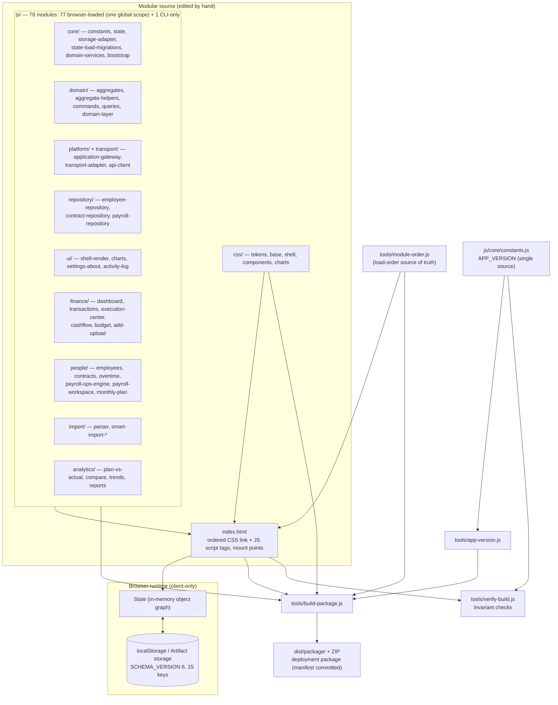
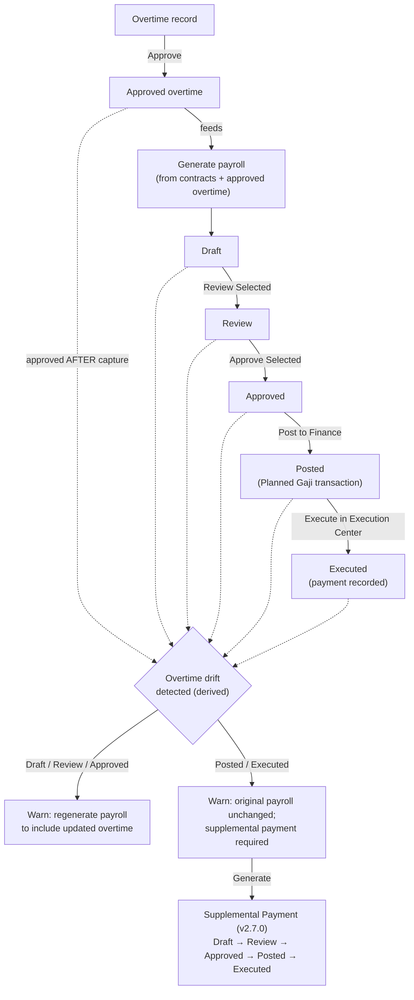
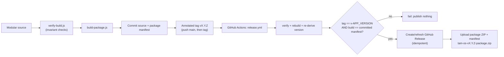

# TAM OS — Architecture

**Current published release:** **v2.11.0 — Identity Refresh** (**published, marked Latest** in
`fanoryu/TAM-OS-Next`, annotated tag `v2.11.0` peeling to `04c1503d`). It carries the merged BRAND-1
product-identity / offline-typography modernization; `APP_VERSION` **2.11.0**, `SCHEMA_VERSION` **6**,
`ACTIONS` **20** — identity/typography presentation only, no authorization, data-model or backend change.
Its published asset `tam-os-v2.11.0.html` (**1,676,709 bytes**, SHA-256
`57d8b0c23c83509a70a766d903e2ee19aa57e5bcfc70950652d930e8f2358557`) is byte-identical to the tracked
`dist/tam-os-v2.11.0.html`.

**Prior release — v2.10.0 (Governed Workspace):** published and intact, now the prior release (no longer
Latest). It was **originally published** (2026-08-11) from the predecessor repository `fanoryu/TAM-OS` —
annotated tag `v2.10.0` there, release commit `335d53ed` — and **canonically re-published unchanged**
(2026-08-13) from the canonical repository `fanoryu/TAM-OS-Next` — annotated tag `v2.10.0` here, peeling to
`856e3ca6a6bfee41f1840996eec2f292bf5ef4eb`. `fanoryu/TAM-OS-Next` now shows Latest = v2.11.0 while the
predecessor `fanoryu/TAM-OS` still shows Latest = v2.10.0; the predecessor's tag, Release and asset are
untouched historical provenance. That v2.10.0 re-publication was **not** a new product version:
`APP_VERSION` was **2.10.0**, `SCHEMA_VERSION` **6**, no runtime rebuilt. Its published asset
(`tam-os-v2.10.0.html`, **1,151,267 bytes**, SHA-256
`60382271a6dcea23431fabb91e0d16abb03196e5cf64c6dc4da1e1af2c7fa704`) is byte-identical across both Releases.
It packages the UX-006 authorization line and the Readiness programme. **Artifact identity is not tree
identity** — the canonical tag's source/docs checkpoint is newer than the predecessor's v2.10.0 snapshot
while the portable artifact is unchanged. `fanoryu/TAM-OS-Next` is canonical going forward.
**Current distributable — Distribution-1 (ADR-0002 Model B):** the **deployment package** built by
`tools/build-package.js` — the static document root (`index.html`, 6 stylesheets, `js/boot/theme-boot.js`,
the module-order scripts, vendored SheetJS 0.18.5, licence texts), each file byte-identical to its source,
recorded by the committed `dist/package-manifest.json`. The page has no inline executable script and makes
no third-party request, so it runs under a strict Content-Security-Policy (header contract:
`tools/package-headers.js`; see [`docs/DEPLOYMENT.md`](docs/DEPLOYMENT.md) §8). It is **unreleased** until the
next version. The published **v2.11.0 (Identity Refresh)** single-file artifact, `dist/tam-os-v2.11.0.html`
(typography embedded, XLSX parser CDN-loaded), stays in `dist/` as frozen history, pinned by digest.
The pilot has **not** launched — **PILOT-1 remains ON HOLD** pending the multi-user readiness gate (no VPS
is required; see [`docs/DEPLOYMENT.md`](docs/DEPLOYMENT.md) §8); backend **NOT STARTED**.
The prior **v2.9.0** release remains published and immutable (no longer Latest) — annotated tag
`v2.9.0` on commit `598edef0`; its published asset (`tam-os-v2.9.0.html`, **1,049,018 bytes**, SHA-256
`e7470ff5261896b8d7d1f8645294d2abd6a72e9820df94b799973627ddcaf3ea`) is unchanged and is the pilot
rollback target.
The prior **v2.8.6** release remains published and
immutable (no longer Latest) — annotated tag `v2.8.6` on commit `7ac0092d`; its published asset
(`tam-os-v2.8.6.html`, **998,413 bytes**, SHA-256
`8481523c11f78c8959291912551ee3205781daf0ec466ff79cfc59c7c91d3f62`) is immutable. The **published v2.8.5 tag, Release, and 965,767-byte asset
(`tam-intelligence-os-v2.8.5.html`, SHA-256 `32e624a262ef1da47bd4ec849471ff98e428402c33722db1715cf1c23a7db8cb`)
remain immutable and unchanged**; older tags/Releases and their assets are likewise untouched.
`SCHEMA_VERSION` is 6, unchanged.
**Basis:** `tam-intelligence-os-v2.5.2.html` (the retained legacy **JS-provenance** regression
comparator, and the data-safety invariants derived from it — not a general source of truth for the
current application). Since UX-002B it is **no longer the CSS comparator**: CSS is asserted
against a pinned SHA-256 of `concat(css/*.css)` — currently
`6d9c21375bdc608e99a56a3a65bc6fc293bbc506cda1b521742560902e3b4b96` (last revised for UX-006D3:
cross-surface presentation consistency) — with every superseded anchor kept
in [`audit/ux-002b-2026-08-05/`](docs/99-archive/audit/ux-002b-2026-08-05/CSS-GOLDEN-MASTER-REVISION.md).
**Shape today:** a modular source of **73 classic-script JS modules** (in `core/ ui/ finance/ people/
import/ analytics/ domain/ platform/ transport/ repository/ cli/`) + 5 CSS files, assembled into one
portable `dist/tam-os-v${APP_VERSION}.html`. **72 of the 73 are browser-loaded** — the
load-order manifest and `index.html` agree on all 72 — and `js/cli/cli.js` is the CLI-only ingress,
deliberately outside the browser load order. Still one shared global scope — no ES modules,
no bundler. `SCHEMA_VERSION` is 6 and `ACTIONS` is 21 (20 in the v2.11.0 release; BF-4a2 added `account.manage`,
SDR-0004, as vocabulary only — no frontend feature consumes it).
**Verification:** `tools/verify-build.js` — **2443** checks; **thirty-four** Node runtime harnesses —
**2921** checks (largest: contract timeline 349, authz C2C-4 164, integrity warning rules 146, integrity
payroll rules 144, Contract Core 129, authz C2C-3 129, UX-006D2 presentation 127, employee read scope 119,
monthly plan 118, finance/import mutation enforcement 118, payroll posting 106, authz 104,
Readiness-2 E2E 96, authz integration 91).
**Presentation architecture (UX-002A / UX-002B):** the application shell is mounted once by
`renderShell()` and persists; ordinary navigation replaces only the content inside `#main`
(`renderView()`) and reapplies the nav's derived state in place (`syncShellState()`), with `render()`
kept as a compatibility facade. CSS resolves from token scales in `css/tokens.css` (6 font sizes, 6
spacing steps, 4 radii, `--brand` / `--interactive` / `--warn` / six `--chart-*` series tokens); chart
colours resolve via `themeVar('--token', fallback)` at render time. Eight invariants guard this — three
shell-persistence, four token/typography, one production-JS colour-literal ban.
**Contract timeline architecture (UX-003A / UX-003B / UX-003C):** `contractCalc(c, refKey)` measures
every field — including `daysUntilEnd` — against one normalized reference date (UX-003A).
`contractTimeline(c, refKey)` is the single classifier and returns TWO independent derived dimensions
(UX-003B): an **effective state** (Draft / Cancelled / Renewed / Scheduled / Active / Expired) and an
**expiry horizon** (EndingToday / EndingThisWeek / EndingThisMonth / EndingNextMonth /
WithinWarningWindow / None). Presentation consumes that model through one counter
(`contractTimelineCounts()`), one label resolver (`contractPresentation()`) and one wording helper
(`contractProgressNote()`) (UX-003C). 131 invariants guard this — 20 reference-date, 63 model, 48
presentation/counter — plus a dedicated 349-check runtime harness.

> **How to read this document.** The header block above and **§18** (Repository layer) describe the
> architecture **as it stands today**; start there. Everything below §18 is a dated release record,
> ordered newest-first, and each section is accurate **for the release it names** — read those as
> historical provenance, not as current state.
>
> Sections 1 and 3–6 describe the founding **Phase 0** split (v2.6.0); the line ranges are the
> authority for how the original cut was derived. Section 2 is the original 20-file map. Then:
> **§8** (v2.6.1 incremental render), **§9** (v2.6.2 decomposition into the feature-folder tree — the
> 44-module layout *at that time*), **§10** (v2.6.3 Payroll workspace), **§11** (v2.6.4 release
> automation + audit visibility), **§12** (v2.6.5 Smart Import scroll preservation), **§13** (v2.6.6
> company settings checklist fix), **§14** (v2.6.7 repository governance & delivery — no runtime
> change), **§15** (v2.6.8 generic payroll bulk-selection model + immediate overtime-drift
> visibility), **§16** (v2.6.9 Enterprise Banking Foundation) and **§17** (v2.7.0 Supplemental Payroll
> Engine). Where an early section says "20 files" or "44 modules", the header block above is the
> current count.
>
> **Releases after v2.7.0 (v2.7.1 → v2.8.5) have no dedicated section here.** Their architectural
> substance is folded into the header block and §18; their per-release detail lives in
> [`CHANGELOG.md`](CHANGELOG.md) and [`RELEASE_NOTES.md`](RELEASE_NOTES.md), which are the source of
> truth for release-by-release history.

---

## Diagrams

These diagrams reflect the actual implementation. There is **no server, database, API, or external
service** — the app is client-only; Node is used solely for the build/verify tooling.

### A. Application structure


```mermaid
flowchart TD
  subgraph SRC["Modular source (edited by hand)"]
    IDX["index.html<br/>ordered CSS link + JS script tags, mount points"]
    CSS["css/ — tokens, base, shell, components, charts"]
    subgraph JSMOD["js/ — 78 modules: 77 browser-loaded (one global scope) + 1 CLI-only"]
      CORE["core/ — constants, state, storage-adapter,<br/>state-load-migrations, domain-services, bootstrap"]
      DOM["domain/ — aggregates, aggregate-helpers,<br/>commands, queries, domain-layer"]
      PLAT["platform/ + transport/ — application-gateway,<br/>transport-adapter, api-client"]
      REPO["repository/ — employee-repository,<br/>contract-repository, payroll-repository"]
      UI["ui/ — shell-render, charts, settings-about, activity-log"]
      FIN["finance/ — dashboard, transactions, execution-center,<br/>cashflow, budget, add-upload"]
      PPL["people/ — employees, contracts, overtime,<br/>payroll-ops-engine, payroll-workspace, monthly-plan"]
      IMP["import/ — parser, smart-import-*"]
      ANA["analytics/ — plan-vs-actual, compare, trends, reports"]
    end
  end

  subgraph RUN["Browser runtime (client-only)"]
    STATE["State (in-memory object graph)"]
    LS[("localStorage / Artifact storage<br/>SCHEMA_VERSION 6, 15 keys")]
  end

  ORDER["tools/module-order.js<br/>(load-order source of truth)"]
  CONST["js/core/constants.js<br/>APP_VERSION (single source)"]
  AV["tools/app-version.js"]
  BUILD["tools/build-package.js"]
  VERIFY["tools/verify-build.js<br/>invariant checks"]
  DIST["dist/package/ + ZIP<br/>deployment package (manifest committed)"]

  CSS --> IDX
  JSMOD --> IDX
  IDX --> STATE
  STATE <--> LS

  ORDER --> IDX
  ORDER --> BUILD
  CONST --> AV --> BUILD
  IDX --> BUILD
  CSS --> BUILD
  JSMOD --> BUILD
  BUILD --> DIST
  IDX --> VERIFY
  CONST --> VERIFY
```

> **UX-006A Identity Foundation (implemented and frozen; merge commit `73096303`).** A new core leaf
> `js/core/identity.js` loads after `core/utils.js` (before `core/state.js`). It is an **identity
> abstraction, not authentication**: a minimal `User` contract, `PRINCIPAL_TYPES` (`ceo`/`employee`), CEO +
> Employee fixtures, a **canonical `IdentityProvider`** seam exposing only `getCurrentUser() → User|null`
> (delegating through a single internal active-provider handle, default `LocalIdentityProvider`), a
> **`LocalIdentityProvider`** dev/test adapter adding local-only `getAvailablePrincipals`/`selectPrincipal`,
> and the single `getCurrentUser()` consumer façade. Identity state is provider-owned and private — **no
> `State.identity` slice, no bootstrap change, no persistence key, no schema change** (`SCHEMA_VERSION`
> stays 6). Consumers depend only on `getCurrentUser()`; `null` is a valid fail-closed state (never a
> default CEO; malformed/throwing provider → `null`). Behaviour is proven by
> `tools/verify-identity-foundation-runtime.js` (33 checks); structure/boundaries by additive
> `tools/verify-build.js` guards.

> **UX-006B Personal Workspace & SELF-Scope (implemented and frozen; merge commit `f40fc064`; headless per
> owner amendment R1).** A new core leaf `js/core/workspace.js` loads after `core/identity.js`.
> It binds `User.employeeId → Employee.id` (via the unchanged `empById`; the human `Employee.employeeId` code
> is never used), derives **Executive** (`workspace:executive:company`, `ownerRef.kind='system'`,
> `ALL_COMPANY`) and **Personal** (`workspace:personal:<Employee.id>`, `SELF`) workspaces, and exposes a
> minimal public API — `getCurrentWorkspace()`, `getScopedRecords(entityType)`, `WORKSPACE_TYPES` — over a
> centralized internal `ENTITY_SCOPE` registry (employee→`r.id`, contract/payroll/overtime→`r.employeeId`).
> Everything is **fail-closed** and derived (no `State.identity`, no bootstrap change, no persistence key, no
> schema change; `SCHEMA_VERSION` stays 6). It is **record scope, not authorization** (no `can(...)`), and it
> wires **no** live consumer: **Global Search is intentionally untouched**; live principal-aware GS source
> scoping is deferred to **UX-006D** (a principal selector must exist first). Behaviour is proven by
> `tools/verify-workspace-selfscope-runtime.js` (31 checks).

> **UX-006C1 Authorization Foundation (implemented and frozen; merge commit `27aa882`; headless).** A
> new core leaf `js/core/authz.js` loads after `core/workspace.js`. It answers *which mutation/action a
> principal may perform on an in-scope record* — strictly separate from UX-006B scope (which answers *what is
> visible*). It exposes a **mutation-only** `ACTIONS` vocabulary (**no `*.read`**), a public
> `can(action, resource?)` façade, an internal pure `canPrincipal(principal, action, resource, ctx)`, and an
> internal `POLICY` action→predicate table. **CEO = pass-through; Employee = deny-by-default** with the single
> `overtime.submitSelf` (own in-scope Draft→Submitted). Defense-in-depth **AZ-1** uses an **internal,
> explicit-principal** predicate `isInScopeForPrincipal(principal, entityType, record)` added to
> `workspace.js` (so `canPrincipal(principal,…)` is deterministic from the supplied principal, not the
> globally-selected user; a current-context `isInScope` delegates to it) — both backed by `ENTITY_SCOPE`, not
> on `window`, not a fourth Workspace public API; **AZ-2** fail-closed (deny on any unknown state, never a CEO
> fallback). It is **headless**: no live mutation boundary is wired to `can(...)` (that is UX-006C2), no
> UI/Action Center/nav, `data-grid.js`/`global-search.js` untouched (DG 36 / GS 26), no `State.identity`, no
> bootstrap change, no persistence, `SCHEMA_VERSION` 6, no authentication. Behaviour is proven by
> `tools/verify-authz-runtime.js` (now 104 checks). **UX-006C2 (mutation enforcement) is COMPLETE** —
> C2A/C2B/C2C-1…C2C-4 are merged and frozen, the user-reachable mutation inventory is CLOSED, and `ACTIONS`
> is now **20** (`import.undo`, `data.restore` and `data.reset` were added by C2C-3; C2C-4 added none).
> **UX-006C3 (integration freeze) is COMPLETE, merged and frozen**: decision preparation merged (`049ae0e`),
> implementation merged (`675cb314`). It froze **43 integration surfaces** (27 sidebar nav items, 12 Quick
> Actions, 4 Action Center generators) behind the machine-enforced manifest
> `tools/integration-surface-manifest.js`, with source↔manifest closure checked in both directions. Navigation
> stays **visible + normal** for CEO / Employee / null (no route guard, no authorization-dependent hiding);
> seven single-capability mutation controls are **visible + disabled** when denied via the shared
> `authzDisabled(action, resource)` helper, which delegates to the frozen public `can(...)` and derives
> availability at render time (never cached, never persisted). UI availability is affordance only — the
> mutation boundary remains the authorization source of truth. Behaviour is proven by
> `tools/verify-authz-integration-runtime.js` (91 checks). `ACTIONS` stays **20**; `SCHEMA_VERSION` stays 6.
> **UX-006C — Authorization is therefore COMPLETE and FROZEN in full, and UX-006D is the current milestone.**

> **UX-006D2 — Principal & Workspace Presentation Polish (implemented, merged & frozen; merge `5163cfce`).** The first purely
> presentational UX-006D phase. `js/ui/identity-selector.js` gains a **workspace context block**
> (`#identityPrincipalContext`) labelling the active context from the frozen UX-006B `getCurrentWorkspace()`
> selector — which had been headless since B — and a **collapsed-rail chip** (`#identityPrincipalRail`), because
> the collapsed sidebar previously hid every trace of which principal was acting. Both carry
> `data-principal-state` and are refreshed by `syncIdentitySelector()` on the existing write-on-change
> discipline, so a principal switch re-derives them with no stale provenance and **zero storage writes**. The two
> causes of a null workspace — no principal, versus an employee principal with no linked Employee record (the
> frozen UX-006B fail-closed path) — are presented **distinctly**. `authzDisabled()` adds a
> `data-authz-denied="1"` marker on the **denied branch only**; the `can(action, resource)` delegation, the
> `disabled` attribute and the title are byte-identical, so the marker mirrors a decision it does not make. CSS is
> additive across `shell.css`/`components.css` (an authorized golden-master revision; `tokens.css`
> byte-unchanged): a distinct denied treatment (`opacity .4 → .65` plus a dashed edge, so "you may not" no longer
> looks like "not right now" — `#genPay` is disabled by a locked period too), a persistent chevron on navigable
> Action Center rows, and a quieter `.btn.quick-action` separating navigation from action. **Presentation only:**
> `js/core/authz.js` untouched, `ACTIONS` **20**, `APP_VERSION` **2.9.0**, `SCHEMA_VERSION` **6**, no route guard,
> no persistence, C3 manifest closure green. Proven by `tools/verify-ux006d2-presentation-runtime.js` (127
> checks). The pre-C3 UX-006D routing language is **superseded** (UX-006 architecture §20A); **Global Search
> scope wiring remains outside UX-006D**; **UX-006D3** is next.

> **Readiness-2 — End-to-End User Journey Acceptance (implemented, merged & frozen, merge `580d8999`).** Shifts the unit
> of validation from the boundary to the **journey**: every harness before it proved that a function
> authorizes or a selector scopes; Readiness-2 asks whether a real user can finish a workflow with correct
> state, feedback, persistence, privacy and recovery. Eight journeys are proven in the browser against real
> DOM (the `#manualForm` and `#settingsForm` submits, real modals, a real page reload) in **both** the
> modular source and the portable build, and automated in `tools/verify-readiness2-e2e-runtime.js`
> (**96 checks**), which drives production seams and asserts the **persisted payload** rather than memory —
> a workflow that mutates `State` but persists nothing fails there. Journeys: CEO finance
> (create→edit→schedule→execute, four-event history, `finance.execute` audit, survives reload); Employee
> self-service **and** privacy in one run (own-Draft overtime persists, finance/lock denials are typed and
> SE-0, Employee B never renders, navigation stays complete); payroll (generate→approve→**a locked period
> refuses posting with `PayrollPeriodLocked`, zero created, stages untouched**→unlock→post two *planned*
> transactions linked by `payrollPlanId` and `employeeId`, never auto-executed); Smart Import
> (commit takes a pre-import safety backup and writes `import.commit`, undo removes exactly the batch and
> writes `import.undo`); backup→restore→**Start Fresh** (forces a backup, refuses a wrong confirmation,
> clears every sensitive store while keeping only the deliberate reset-audit key); principal switching
> (CEO view byte-identical before and after, proving recomputation rather than a cache); settings; and
> supplemental generated from real overtime drift and linked to finance in both directions. **No product
> defect was found.** Three near-misses were fixture/probe errors of the author's own — most notably an
> apparent settings **authorization bypass** that proved to be a probe at the `saveSettings()` persistence
> primitive rather than the form-handler boundary (`settings-about.js`, UX-006C2C-4 row 27); the harness now
> asserts the policy the handler consults. It also **corrects the Readiness-1 line-ending recommendation**:
> `.gitattributes` already existed and was correct (`* text=auto eol=lf`); exactly one stale CRLF worktree
> file caused the non-canonical artifact, so no repository change was made. `ACTIONS` **20**, `APP_VERSION`
> **2.9.0**, `SCHEMA_VERSION` **6**. Next: **Readiness-3 — Release Candidate & Pilot Package**.

> **Readiness-1 — Employee Read Scope & Privacy Closure (implemented, merged & frozen, merge `3521d811`).** The
> post-UX-006D audit found the UX-006B self-scope layer built, tested and wired to nothing:
> `getScopedRecords()` had **zero production consumers**, so every list, detail, aggregate, report and
> Global Search read raw `State.*` and an Employee could read the whole company, salaries included.
> Readiness-1 wires it. `ENTITY_SCOPE` grows from four entities to six — `payrollAdjustment` and
> `transaction`, each with an **explicit** SELF predicate over an ownership field the domain already
> carries — and a new public `getScopedRecordById(entityType, id)` re-evaluates scope at **render** time,
> because a detail id may have been captured under a different principal; out-of-scope and non-existent
> both return `null`, deliberately indistinguishable so a renderer cannot leak a foreign record's
> existence. Scoped reads are wired into the Employees/Contracts/Overtime lists with their counters,
> facets and exports; the three detail renderers; **`payrollPlansForMonth()` — the single payroll read
> funnel**, which scopes the worksheet, month totals, cycle status, stage counts, bulk-action eligibility
> and Payroll Health together; payroll adjustments and employee pickers; every HR dashboard figure and
> report row; the finance ledger, `scopedMonths()`/`scopedTxnsForMonth()` and the derived analytics
> aggregates; the Action Center payroll generator; the **breadcrumb terminal label**; and **Global Search**
> at its collector seam — the engine stays source-agnostic, so a foreign record is never *indexed*.
> Finance/Analytics follow the Atlas ruling: navigation stays visible+normal with no route guards, and an
> Employee receives only records with an existing explicit `employeeId`; an unowned company expense is
> simply out of scope and no ownership model was invented. The canonical `State` is never narrowed,
> rewritten or filtered at persistence level, and `getMonths()`/`txnsForMonth()`, the import parser,
> `generatePayroll()` and the persistence/migration modules stay **deliberately unscoped** (documented in
> the plan). `null` now fails closed, so no business data renders until a principal is selected — the
> required semantic, flagged for Readiness-3. **No new ACTION, no schema or storage change:** `ACTIONS`
> **20**, `APP_VERSION` **2.9.0**, `SCHEMA_VERSION` **6**, `js/core/authz.js` byte-unchanged. Proven by
> `tools/verify-employee-read-scope-runtime.js` (**119 checks**), whose **negative control produces 49
> counted assertion failures** on the pre-Readiness-1 baseline.
>
> **Identity-disclosure closure.** A later Atlas ruling established that an employee's **name is itself
> scoped data**: scoping detail pages, salary and payroll is not sufficient while a roster, picker or
> selector still lists colleagues, because the identity is disclosed at render and refusing the later
> click is too late. Every identity-bearing source was inventoried and classified. Now scoped: the
> overtime employee picker (**the critical one — own-Draft overtime is Employee-authorized, so the picker
> is genuinely usable**), the overtime worksheet (one row per employee), the contract-form and payroll
> adjustment pickers, legacy-mapping, the Duplicate Review render, Settings employee diagnostics, the
> onboarding checklist, employee-naming HR/payroll alerts, and the Employees CSV export. Deliberately
> left canonical and documented: `findEmployeeDuplicateGroups()` (an **integrity input** — scoping it
> silently broke duplicate detection, so disclosure is handled at its render site instead), the payroll
> workspace **setup gate** (`!State.employees.length` asks whether the *company* is set up; scoping it
> pushed a null principal into the no-data state and removed `#genPay`/`#lockBtn`, breaking the frozen
> UX-006C3 visible+disabled contract — C3 wins), plus the merge snapshot, import matchers, integrity
> scans and persistence modules. DOM-verified in both artifacts: Employee A sees no Bravo identity, code
> or salary in any roster or picker; Employee B is the exact mirror; CEO is unchanged; null sees nothing
> while `#genPay`/`#lockBtn` remain visible + disabled + marked.

> **UX-006D3 — Cross-surface Presentation Consistency & Acceptance (implemented, merged & frozen; merge `e76460dc`).** The
> final UX-006D phase and its acceptance gate; presentation only, with `js/core/authz.js` byte-unchanged.
> `emptyState(title, sub)` in `js/finance/dashboard.js` previously replaced the **entire page**, so nine
> sidebar views (Overview, Executive Insights, Cash Flow, Budget Center, Execution Center, Planned vs Actual,
> Compare Months, Monthly Trends, Reports) rendered an **untitled card** whenever they had no data, while the
> other eighteen kept their heading. That early return also removed the `.page-head` slot
> `mountQuickActions()` mounts into, so a frozen UX-006C3 navigation surface silently never rendered in the
> empty state — Execution Center resolved 3 Quick Actions but displayed 0. The heading is now **derived from
> `PAGE_TITLES`** (itself derived from the one `NAV_GROUPS` manifest), so nothing is duplicated and no call
> site changed; context-only detail views are deliberately absent from that manifest, so a *record not found*
> state still renders none. A second, **pre-existing** defect found by the D3 responsive sweep is fixed by one
> additive rule — `.card li, .card p, .card .desc{overflow-wrap:break-word;}` — which stopped Release Notes
> overflowing a 375px viewport by 80px (`css/tokens.css` and `css/shell.css` untouched; authorized
> golden-master revision). The UX-005A dashboard guard, previously `!/UX-006/` on **raw** source, is
> **hardened**: the label check now runs on comment-stripped code and is joined by an explicit UX-006 API-symbol
> check, so prose is free while real API use is caught — strictly stronger, with regression proof. **Frozen
> throughout:** `ACTIONS` **20**, `APP_VERSION` **2.9.0**, `SCHEMA_VERSION` **6**, 43 C3 entries, navigation
> visible+normal, the seven denied controls visible+disabled, D2 principal/workspace semantics, and Global
> Search scope wiring still outside UX-006D. Proven by
> `tools/verify-ux006d3-presentation-runtime.js` (84 checks). **UX-006D is therefore COMPLETE / FROZEN** (D1 `4a53a35`, D2 `5163cfce`, D3 `e76460dc`).

> **UX-006D1 — Reachable Principal Selection (implemented and frozen; merge commit `4a53a35`).** A new UI leaf
> `js/ui/identity-selector.js` loads after `ui/shell-render.js`. It makes the existing UX-006A principals
> **reachable at runtime** so a live active principal exists as the prerequisite for future C2 enforcement —
> the roadmap is amended to `C1 → D1 → C2A → …` (live `can(...)` is unsafe while `getCurrentUser()` is always
> null). It mounts a compact **"Acting as"** native `<select>` into the persistent sidebar `.brand` via three
> call-sites in `shell-render.js` (`renderShell` mounts `renderIdentitySelectorHTML()`, `bindShell` calls
> `bindIdentitySelector()`, `syncShellState` calls `syncIdentitySelector()`) — the existing mount-once/sync
> lifecycle, **no new bootstrap**. It is the **only** UI adapter permitted to call the local-only
> `LocalIdentityProvider.getAvailablePrincipals()` / `selectPrincipal(id)` (verifier-enforced; every other
> module still uses `getCurrentUser()`). Initial `getCurrentUser() === null` is preserved (**no
> default/implicit/boot CEO, no auto-select**); a non-value placeholder + "No principal selected" helper makes
> the fail-closed state visible. Selection is **ephemeral** (closure only; resets on reload) — **no
> persistence, no `State.identity`, no schema change (`SCHEMA_VERSION` 6)**. CEO → Executive/ALL_COMPANY;
> Employee → Personal/SELF (or fail-closed null) — **reachability only; `can(...)` is wired at no business
> mutation boundary (C2A remains halted)**, `global-search.js`/`global-search-ui.js` untouched (GS 26 / DG 36),
> nav/Action Center unchanged. It is identity selection, **not** login/authentication/session/security. Native
> `<select>` with `<label for>` + `aria-describedby`; collapsed rail hides it (hover/drawer reveal). Behaviour
> is proven by `tools/verify-identity-selection-runtime.js` (29 checks); an authorized CSS golden-master
> revision adds `.identity-selector*` to `css/shell.css` (`tokens.css` unchanged). **UX-006C2/C2A resumes from
> `main` only after D1 is merged and frozen.**

> **UX-006C2A — Core HR Mutation Enforcement (implemented and frozen; merge commit `a7369447`).** Wires the
> frozen `can(action, resource?)` into the real **Employee** (`js/people/employees.js`) and **Contract**
> (`js/people/contracts.js`) mutation boundaries, enforcing **SE-0** (denied ⇒ no State/persist/audit/success).
> Guards sit at the top of each domain handler, before any side effect: employee create/update (modal),
> `setEmployeeActive`→`employee.update`, `deleteEmployee`→`employee.delete`,
> `updateEmployeeContact`/`updateEmployeeEmployment`/`updateEmployeeCompensation`→`employee.update`; contract
> create/update (modal), `deleteContract`→`contract.delete`,
> `updateContractDates`/`updateContractCore`→`contract.update`. Null and Employee principals deny (Employee
> denies even SELF records — Q-SELF-EDIT stays denied); CEO (explicitly selected via the D1 selector) is
> unchanged. Domain code depends only on `ACTIONS`/`can()` (never `canPrincipal`/`POLICY`/`isInScope*`); no
> authorization in `persist*`/StorageAdapter; `authz.js`/ACTIONS (13) unchanged; no schema/storage/UI/GS/DG
> change. Operational contract paths (`transitionContractStatus`, `renewContract`) and overtime remain
> unwired (C2B/C2C). Behaviour proven by `tools/verify-mutation-enforcement-hr-runtime.js` (66 checks, real
> handlers with persistence/audit spies); two legacy contract harnesses now select CEO in setup.

> **UX-006C2B — Overtime Mutation Enforcement (implemented and frozen; merge commit `023a8214`).** Amends
> `ACTIONS` **13 → 16** (adds `overtime.createSelfDraft`/`updateSelfDraft`/`deleteSelfDraft`; keeps
> `overtime.submitSelf`/`overtime.manage`; no `*.read`) via a shared `selfDraftOnly` policy (CEO pass-through;
> Employee only when the own, in-scope record is a Draft). Wires `can(...)` into `js/people/overtime.js`:
> `addOvertimeRecord`→createSelfDraft, `updateOvertimeRecord`→updateSelfDraft **with a post-update
> re-authorization** (rolls back an `employeeId` or `status` change by an Employee — ownership/status
> protection), `setOvertimeStatus` **split** (own `Draft→Submitted`=submitSelf; else manage),
> `duplicateOvertimeRecord`→createSelfDraft on the copy, `deleteOvertimeRecord`→deleteSelfDraft, and
> `worksheetSave`→`overtime.manage` authorized **once before the row loop** (atomic bulk SE-0). Employee =
> own-Draft self-service only; null denies all; CEO unchanged. Enforcement at the domain boundary via
> `ACTIONS`/`can()` only (no internal seams, no role checks, no persistence-layer auth). No UI availability
> wiring, no GS/DG change, no schema/storage change. Behaviour proven by
> `tools/verify-mutation-enforcement-overtime-runtime.js` (64 checks); the C1 authz harness grows 68 → 92.
> Operational domains (payroll/finance/import/supplemental/settings/bank + deferred operational Contract
> paths) remain unwired for **C2C**.

> **UX-006C2C-1 — Contract Operations + Payroll Enforcement (implemented and frozen; merge commit `c15a7ad`).**
> Wires `can(...)` into the operational Contract + Payroll boundaries with the frozen C2C-1 mappings and SE-0.
> Contract (`js/people/contracts.js`): `transitionContractStatus`→`contract.update`;
> `renewContract`→`contract.create` as a **composite top-level gate** (single authorization before predecessor
> mutation and successor creation — atomic denial). Payroll (`js/people/payroll-ops-engine.js`, all →
> `payroll.manage`): `generatePayrollForMonth`, `transitionPayrollLifecycle`, `commitReadyPayroll` (**composite
> payroll+finance**, single gate before any plan/txn write), `prepareNextMonthPayroll`, `setPayrollLock`, and
> the salary override/clear modal closures. Company/period-level paths authorize a `{employeeId:null}`
> `payroll.manage` probe (CEO ALL_COMPANY passes; Employee SELF and null fail); record-level paths pass the
> real plan. Null + Employee deny all; CEO unchanged (explicit D1). `ACTIONS`/`can()` only; `authz.js`
> unchanged (ACTIONS 16); no UI/GS/DG/schema change. Behaviour proven by
> `tools/verify-mutation-enforcement-contract-payroll-runtime.js` (59 checks incl. renewal + commit
> composite-atomicity); four legacy CEO harnesses now select CEO in setup. **C2C-3/4 remain unwired.**

> **UX-006C2C-2 — Finance + Import Authorization (implemented, merged & frozen; merge `9ab256a`).**
> Implements the frozen **Decision F2** ruling: the Finance vocabulary is split and `ACTIONS` grows **16 → 17**
> with exactly one new action, **`finance.manage`** (CEO-only; `ACTION_RESOURCE_ENTITY` `null`, like
> `finance.execute`, since transaction scope is Executive-only). Semantics: `finance.execute` =
> **irreversible execution/posting** (`executeTransaction` only — the domain command, `TransactionExecuted`
> event and `finance.execute` audit entry are unchanged); `finance.manage` = **reversible/administrative
> standalone transaction mutation** — manual create (`js/finance/add-upload.js`), `saveEditedTransaction`,
> `archiveTransaction`, `scheduleTransaction`, `cancelTransaction`, `duplicateTransaction`
> (`js/finance/execution-center.js`) and the inline permanent delete (`js/finance/transaction-modals.js`).
> Import: `commitSmartImport`→`import.commit`, a **single top gate before any write** (a denied commit writes
> neither the pre-import safety backup nor a record or audit entry). Each boundary authorizes **once**, at the
> top, before any mutation or persistence; the five administrative engine functions return a typed
> `{ok:false, reason}` so a denial is never reported as a success. Null + Employee deny all three actions; CEO
> allowed for all three (explicit D1). `ACTIONS`/`can()` only; no internal seams, role checks, null→allow
> shims, or persistence-layer authorization; no UI/GS/DG/schema change (`SCHEMA_VERSION` 6). Behaviour proven
> by `tools/verify-mutation-enforcement-finance-import-runtime.js` (118 checks, including an
> instrumented-`can()` proof that `executeTransaction` consults `finance.execute` and **not** `finance.manage`,
> and that each administrative boundary consults `finance.manage` and **not** `finance.execute`). Every UI call
> site propagates the typed result: the Execution Center **Schedule** control (`[data-schedule-txn]`) reports
> the denial instead of `showSuccess('Transaction scheduled.')` — an Atlas governance-review blocker on PR #119,
> now covered by a regression that drives the **real bound click handler** for Employee, null and CEO. **Backup
> restore, supplemental, settings, bank, reset, recurring, monthly plan, legacy mapping and employee dedup
> remain unwired (C2C-3/4).**

### B. Payroll workflow (and overtime drift)


```mermaid
flowchart TD
  OT["Overtime record"] -->|Approve| OTA["Approved overtime"]
  OTA -->|feeds| GEN

  GEN["Generate payroll<br/>(from contracts + approved overtime)"] --> DRAFT["Draft"]
  DRAFT -->|Review Selected| REVIEW["Review"]
  REVIEW -->|Approve Selected| APPROVED["Approved"]
  APPROVED -->|Post to Finance| POSTED["Posted<br/>(Planned Gaji transaction)"]
  POSTED -->|Execute in Execution Center| EXECUTED["Executed<br/>(payment recorded)"]

  OTA -.->|approved AFTER capture| DRIFT{"Overtime drift<br/>detected (derived)"}
  DRAFT -.-> DRIFT
  REVIEW -.-> DRIFT
  APPROVED -.-> DRIFT
  POSTED -.-> DRIFT
  EXECUTED -.-> DRIFT

  DRIFT -->|Draft / Review / Approved| REGEN["Warn: regenerate payroll<br/>to include updated overtime"]
  DRIFT -->|Posted / Executed| SUPP["Warn: original payroll unchanged;<br/>supplemental payment required"]
  SUPP -->|Generate| SUPPENG["Supplemental Payment (v2.7.0)<br/>Draft → Review → Approved → Posted → Executed"]
```

Stages are a display mapping over the stored status values (`Draft` / `Reviewed` / `Ready` /
`Committed`), with `Executed` derived from the linked finance transaction — no schema change. Drift
is a **derived**, read-only comparison (`payrollOvertimeDrift`) reusing `approvedOvertimeForMonth` +
`sameIdSet`; Posted/Executed totals and transactions are never modified.

### C. Release pipeline


```mermaid
flowchart LR
  SRC["Modular source"] --> VERIFY["verify-build.js<br/>(invariant checks)"]
  VERIFY --> BUILD["build-package.js"]
  BUILD --> COMMIT["Commit source + package manifest"]
  COMMIT --> TAG["Annotated tag vX.Y.Z<br/>(push main, then tag)"]
  TAG --> GA["GitHub Actions: release.yml"]
  GA --> REBUILD["verify + rebuild + re-derive version"]
  REBUILD --> GATE{"tag == v-APP_VERSION<br/>AND build == committed manifest?"}
  GATE -->|no| STOP["fail: publish nothing"]
  GATE -->|yes| REL["Create/refresh GitHub Release<br/>(idempotent)"]
  REL --> ASSET["Upload package ZIP + manifest<br/>tam-os-vX.Y.Z-package.zip"]
```

CI (`ci.yml`) runs verify + package build on every push/PR to `main`, fails if the build changes the
committed manifest, and uploads the package ZIP and manifest as an artifact. The release job publishes
nothing unless every guardrail passes.

---

## 18. Repository layer — entity-named persistence-mechanics boundary (no runtime behavior change)

**Decision record:** [ADR-013](docs/03-adr/ADR-013-Repository-Layer.md) · **Baseline:**
[RDR-011](docs/99-archive/RDR/RDR-011-epsilon-repository-snapshot.md) (`6714beb`) · **Delivered:** PR-8A (Delta) …
PR-11A (Epsilon).

### Canonical path

```
Browser ┐
        ├→ Transport Adapter → Application Gateway → Domain → Aggregate
CLI    ─┘                                                        │
                                                                 ▼
                                        Handler → Entity-Named Repository → StorageAdapter
                                                                                  │
                                                                                  ▼
                                                              localStorage / Artifact storage
```

### Modules — `js/repository/`

| Module | Global | Collection | Delegates to |
|---|---|---|---|
| `employee-repository.js` | `EmployeeRepository` | employees | `persistEmployees()` |
| `contract-repository.js` | `ContractRepository` | contracts | `persistContracts()` |
| `payroll-repository.js` | `PayrollRepository` | payrollPlans | `persistPayrollPlans()` |

Each is a frozen object exposing exactly one method:

```js
async save() → { ok: true } | { ok: false, error: 'PersistFailed' }
```

Each loads **after** the persist function it delegates to (`core/hr-persistence-portability.js`) and
**before** its migrated handler — enforced by `tools/verify-build.js` against `tools/module-order.js`.

### Ownership boundaries

| Layer | Owns |
|---|---|
| **Aggregate** | **Business authority** — transition rules, legality, sanitized decisions |
| **Handler** | **Implementation authority** — validation, mutation, `updatedAt`, history, persistence decision, rollback, typed result |
| **Repository** | **Persistence mechanics** — delegate the write, normalize the strict boolean |
| **StorageAdapter** | **Storage-backend boundary** — unchanged |

The Repository owns no validation, mutation, `updatedAt`, history, rollback, UI, or audit, and never
touches Domain or Aggregates. Rollback stays with the handler. In `transitionPayrollLifecycle` the
best-effort audit also stays with the handler: after successful persistence, success path only,
`try/catch`-wrapped, never emitted on failure.

### Contract properties and limits

- **Collection-grained** — one `save()` writes one collection. It models no unit of work spanning
  collections.
- **Client-side** — it terminates at `StorageAdapter`. There is no network surface, and none is implied.
- **Compound persistence remains outside this contract.** `commitReadyPayroll` writes four stores in one
  logical unit and stays direct by design. Non-aggregate writes (whole-record editors, deletes,
  generation, regeneration, salary overrides, onboarding reset, the v2.5 migration) also stay direct.
  `commitMonthlyPlan` likewise writes two stores directly. SPR-079, SPR-081 and SPR-082 changed how
  compound writes are **reported and detected**, not how they are performed — see *Compound persistence:
  current state* below.
- **Two operations previously listed here are no longer compound.** Contract renewal is single-collection
  (predecessor and successor both live in `contracts`, so one write covers both) and is Repository-mediated
  since SPR-077. Payroll-planning posting was **retired in SPR-078**: its screen had been unreachable since
  v2.5.0 and its posting function was dead code — see *Retired surfaces* below.

### Retired surfaces

**Payroll Planning (retired, SPR-078).** The `renderPayrollPlanning` screen was superseded by the Payroll
Workspace in v2.5.0 and its route was removed at that time — no `State.view` value rendered it, no
navigation entry reached it, and its only callers were its own internal re-renders. Its posting function
`commitPayroll` was therefore dead code, and a second divergent Payroll posting authority: no period lock,
no commit blockers, no `Ready` gate, no audit entry, no `committedAt`, and a non-canonical lowercase
`'committed'` status that is not a member of `PAYROLL_STATUSES`. SPR-078 removed the dead surface;
`js/people/payroll-planning.js` is retained solely for two shared utilities defined nowhere else (`num`,
`ensureMonthlyPlan`). **`commitReadyPayroll` is the sole live Payroll posting path.**

Committed-state reads go through one shared predicate — `isPayrollCommitted()` in
`js/people/people-core.js` — which accepts the canonical `'Committed'` and, for **reads only**, the legacy
lowercase value the retired path may have persisted. No live writer writes the legacy value, and no
migration was added or re-run.

### Adoption

All nine aggregate-backed handlers are Repository-mediated — Employee 4 of 4, Contract 4 of 4,
Payroll 1 of 1 (**9 of 9**). This means *only* that every aggregate-backed handler delegates persistence
through an entity-named Repository. It is **not** full persistence abstraction (the layer mediates 3 of
11 persist functions), **not** compound-persistence support, and **not** backend readiness — the
application is client-only by `CLAUDE.md` §4.3. `tools/verify-build.js` asserts the 9-of-9 milestone
*and* the bound, including a check whose message reads *"adoption completeness != persistence
abstraction"*.

The operational surface (9 aggregates / 8 seam-routed aggregate-backed commands / 1 aggregate-backed
query) and registered surface (15 commands / 4 queries) were unchanged by every Repository slice.
Adoption and routing are distinct counts: the ninth aggregate-backed command, `contract.core.update`,
is Repository-mediated but reached by no ingress — see *Contract Core authority* below.

No generic Repository, factory, or base class exists; no Repository coordinates another Repository; and
there is **no Unit of Work and no Transaction Coordinator**. The verifier asserts each of these.

### Contract authority (SPR-077)

Contract status transitions are aggregate-backed, and renewal is **aggregate-authored**.
`ContractRenewalAggregate` is a pure decision boundary: it decides renewal eligibility and authors the
successor's business shape, the predecessor's canonical `Renewed` status, and both history note texts. It
never mutates, generates ids or timestamps, or persists. The `renewContract` handler owns the id,
timestamps, the history append, **one** `ContractRepository.save()`, strict result inspection, in-memory
rollback when that write fails, and the typed result. Renewal is therefore **single-collection, not
compound** — predecessor and successor both live in `contracts`, so one write covers both.

Renewability is evaluated against **stored** statuses (`Draft`, `Active`), never derived display states.
A contract displayed as *Expired*, *Final Month* or *Ending Soon* remains renewable while its stored
status is still `Active`; terminal statuses (`Renewed`, `Cancelled`) are never renewable. The UI eligibility mirror
(`contractIsRenewable`) is verifier-checked against the same rule.

### Contract Core authority — prepared, not routed (ADR-014 step 1 / SPR-095)

[ADR-014](docs/03-adr/ADR-014-Contract-Core-Field-Authority.md) (Accepted) fixed the permanent owner of
every mutable Contract field. SPR-095 implemented **step 1 of its recorded sequence and nothing else**:

- **`ContractCoreAggregate` is prepared** — a pure decision boundary owning exactly ten fields
  (`employeeId`, `employeeName`, `contractNumber`, `monthlySalary`, `notes`, and the five-field schedule
  group). It refuses any field it does not own with a typed failure rather than discarding it, and it
  enforces the atomic `employeeId`/`employeeName` pair, the all-or-nothing schedule group, PD-1 and PD-2.
- **`contract.core.update` is registered** in `DOMAIN_COMMANDS`, bound to the aggregate and to the
  `updateContractCore` handler, which is `ContractRepository`-mediated with handler-owned rollback.
- **No operational ingress exists.** No UI, modal, Platform, Gateway, Transport or `uiExecute` route
  invokes the command; the only invoker in the repository is `tools/verify-contract-core-runtime.js`.
  The seam-routed command count therefore remains **8** against a registered surface of **15**.
- **Editor routing is unchanged.** The full Contract editor still writes those ten fields directly and
  still persists through `persistContracts()`; the delete path is unchanged.
- **No authority migration has happened.** The editor's duplicate writes of `status`, `startDate` and
  `durationMonths` remain in place, and the two hazards ADR-014 measures remain reachable through it.
- **OQ-2 and OQ-3 remain OPEN**, and editor routing (ADR-014 step 2) stays blocked on OQ-2.

Behaviour is proven by `tools/verify-contract-core-runtime.js` (129 checks); the shape and the *absence*
of any call site are asserted by `tools/verify-build.js`.

### Payroll posting authority (SPR-078, SPR-081)

`commitReadyPayroll` is the **sole live Payroll posting path**; the retired Payroll Planning posting
surface remains absent. The canonical committed status is `'Committed'`; the legacy lowercase
`'committed'` is **read-compatible only**, accepted by `isPayrollCommitted()` and written by no live
writer.

Since SPR-081 the posting path:

- **captures and strictly inspects all four persistence results** — payroll plans, monthly plan,
  overtime, finance transactions. Success requires all four; failure returns a typed outcome naming the
  first failed step in the fixed write order, the completed steps, and that partial persistence occurred;
- **gates the success audit entry and the success UI on full persistence success** — the toast, the
  posted-vs-skipped summary and the selection clear sit on the success path only. The persistence-failure
  branch retains the row selection so the user can see exactly which rows were involved, and closes the
  modal explicitly because `render()` rebuilds the workspace beneath it;
- **resolves the finance transaction before mutating**, via a forward lookup plus a narrow reverse
  fallback (payroll-sourced only, exact `payrollPlanId`, exact period). The reverse fallback resolves
  **only when exactly one candidate exists**; a reverse-matched transaction has its forward linkage
  restored — with a `transaction-relinked` history entry — instead of being duplicated;
- **never guesses an ambiguous match.** More than one candidate yields a typed
  `PayrollTransactionAmbiguous` skip listing every candidate; the row stays uncommitted and no third
  transaction is created.

**None of this introduced atomicity or rollback.** The four writes are still sequential.

**The two SPR-080 failure modes are not equally addressed — neither should be described as "closed".**

| SPR-080 scenario | Current disposition |
|---|---|
| **Scenario A** — duplicate finance transaction on retry (payroll-plans write failed, transactions write succeeded; the retry could not see the orphaned transaction and created a second one, doubling the payroll) | **Prevented on retry** by the unique reverse transaction lookup: the existing transaction is resolved and relinked instead of duplicated. Prevention applies to the retry path; it does not make the original posting atomic |
| **Scenario C** — overtime paid twice (overtime write failed after the plan and transaction writes landed, leaving the overtime `Approved` and eligible for a later month) | **Detected before reuse** as a Critical `payroll-overtime-uncommitted` finding. **Not automatically repaired and not universally blocked** — nothing prevents that overtime from being included in a later payroll. The finding is advisory and requires a human to act |

### Multi-dataset persistence (SPR-079)

`saveAllData()` inspects every one of its 14 writes and returns `true` **only when all succeed**. Employee
Merge and Smart Import no longer report false success: a failed save shows a message stating the operation
did not complete, records no success audit entry, and preserves the pre-operation safety backup. Multi-key
saves remain **non-atomic** — a failure means the operation did not complete, **not** that nothing was
written. **Reload reads whatever storage keys successfully persisted. It does not restore a complete
prior state.**

Employee Merge and Smart Import **commit** each snapshot a pre-operation safety backup before writing.
**Smart Import undo does not** take an equivalent pre-operation snapshot.

### Monthly Plan commit result integrity (SPR-082)

`commitMonthlyPlan` (`js/people/monthly-plan.js`) writes **two storage keys sequentially** —
transactions first, monthly plans second. Since SPR-082 it:

- **captures and strictly inspects both persistence results.** The write order and the attempt-all
  behaviour are unchanged (a failing first write does not abort the second), so the failure matrix is
  the same; what changed is that neither result is discarded. Success requires both; failure returns a
  typed `MonthlyPlanPersistenceFailed` outcome carrying `failedStep` (deterministic — the first failure
  in the fixed write order), `failedSteps`, `completedSteps`, `partialPersistence` and a
  `recoveryHint` of `RunIntegrityCheckAndReview`;
- **inspects the result before any completion behaviour.** The failure branch **retains the preview**
  (clearing it would discard exactly the rows the user needs in order to review manually), emits no
  success toast, and shows a message stating that some data may already have been saved and that
  Integrity Check should be run before retrying. The message never claims a rollback, because none
  happened.

**No atomicity and no rollback were introduced.** A failure means the commit did not complete — **not**
that nothing was written. The harness asserts the module implements no snapshot/restore, no Unit of
Work, no coordinator, no journal, and no schema change.

**Retry is idempotent for transaction creation only; it reconciles no linkage.** Both residual states
below are reload-state proven by `tools/verify-monthlyplan-runtime.js`, and the current operational
response to each is **manual review**:

| Residual | Reloaded state | What retry does — and does not do |
|---|---|---|
| **Scenario A2** — the monthly plan was created by the failing commit and only the transactions write landed | The transactions return carrying a `monthlyPlanId` that points at **no existing plan**; `monthlyplan-orphan-transaction` fires as **Critical**. `corrupt-plan-ref` cannot see this state — it walks `committedTxnIds`, and these ids were never added to any list | The reloaded rows are recognised as duplicates, so **no duplicate transaction is created** (`created === 0`). Because they are skipped, they are **never linked** to the newly created plan, which lists no transactions — so the Critical finding **remains after a successful retry** |
| **Scenario B** — only the monthly plans write landed | No transactions exist; the plan is `Committed` with **dangling** `committedTxnIds`; `corrupt-plan-ref` fires. The new orphan rule does **not** fire — there is no transaction to carry a `monthlyPlanId` | The row is `new` again, so retry is reachable and creates the missing transaction under a **new id**. The stale dangling ids **stay on the plan** — nothing removes them — so `corrupt-plan-ref` **remains** and the commit **reports success while that finding still stands** |

### Integrity checker

`runIntegrityCheck` (`js/core/stabilization.js`) is **read-only detection**. Two rules were added in
SPR-081 and one in SPR-082, all three **Critical**:

| Rule | Detects |
|---|---|
| `payroll-orphan-transaction` | a payroll-sourced Finance transaction whose referenced `PayrollPlan` is **either not `Committed`** — the residue of a partial posting — **or does not link back to that transaction**. Both broken-linkage directions fire the rule; a row is healthy only when it is committed **and** linked back |
| `payroll-overtime-uncommitted` | committed payroll whose linked Overtime is still `Approved`, which was runtime-proven to be re-included in the next month's generated payroll |
| `monthlyplan-orphan-transaction` (SPR-082) | a **non-payroll** Finance transaction carrying a `monthlyPlanId` whose referenced monthly plan is **absent entirely** (Scenario A2 — the plan write never landed) **or** exists but **does not list the transaction** in `committedTxnIds`. Payroll-sourced rows are deliberately out of scope: they are owned by `payroll-orphan-transaction` and `payroll-missing-monthlyplan` |

The pre-existing `corrupt-plan-ref` **warning** covers the opposite direction — a monthly plan whose
`committedTxnIds` point at transactions that do not exist (Scenario B).

All of these **detect only and repair nothing.** They report that a partial state exists and where it
is, and none of them blocks the underlying operation.

### Compound persistence: current state

| Property | Status |
|---|---|
| Payroll posting write count | **four storage keys, written sequentially** |
| Monthly Plan commit write count | **two storage keys, written sequentially** |
| Atomicity | **none** — the browser is atomic per key only |
| Attempt-all behaviour | **retained** — a failing write does not abort the remaining writes |
| Result inspection | **complete** — all four payroll-posting results checked (SPR-081); both Monthly Plan results checked (SPR-082) |
| Coordinated rollback | **none** |
| Compensating action | **none** |
| Detection of partial states | three Critical Integrity Check rules + the `corrupt-plan-ref` warning |
| Repair of partial states | **none** — manual review may still be required |
| Retry idempotency | prevents duplicate transaction creation; **does not reconcile transaction–plan linkage** |

Not every possible partial Payroll state is automatically detectable or repairable. The two failure modes
**addressed** in SPR-081 are the two proven by SPR-080 runtime discovery — one **prevented on retry**
(Scenario A), one **detected but neither repaired nor blocked** (Scenario C). Neither is "closed" in the
sense of being made impossible.

**Known residuals.**

- **Monthly Plan retry reconciles no linkage.** SPR-082 made `commitMonthlyPlan`'s partial states
  *reported and detectable*, not prevented or repaired. **Scenario A2** leaves
  `monthlyplan-orphan-transaction` standing after a successful retry (the duplicate rows are skipped and
  therefore never linked to the new plan); **Scenario B** leaves the stale dangling `committedTxnIds` on
  the plan, so `corrupt-plan-ref` stands and the retry **reports success while a finding remains**.
  Current operational response: **manual review**. Unresolved.
- **Smart Import undo has an unresolved partial-persistence case.** The `undone` marker is set *before*
  the write, because it is part of the `importBatches` payload. If the `importBatches` write **succeeds**
  but another required dataset write **fails**, reload may preserve `undone:true` while some record
  removals did not persist; because the marker is also the batch selector (`find(b=>!b.undone)`), **the
  batch may then be unavailable for retry after reload**. **Immediate retry is available only where the
  failure branch clears the in-memory completion marker before reload** — once a divergent state has been
  reloaded, that path is gone. Explicitly **not** a rollback: the record removals stay applied in memory
  and whatever the fan-out wrote stays written. **Reload reads whatever storage keys successfully
  persisted; it does not restore a complete prior state.**
- **Smart Import undo takes no pre-operation backup.** Employee Merge and Smart Import commit each
  snapshot one before writing; the undo path does not, so there is no undo-specific restore point.
- There is **no backend, server-side transaction, or multi-user synchronisation**, so cross-key atomicity
  cannot be delegated to a server. [`CLAUDE.md`](CLAUDE.md) §4.3 permits only the ADR-0004 same-origin
  backend, through authorized Multi-User milestones; none is implemented.

### Architecture frontier — what is and is not authorised

Compound persistence is the open architectural question. It is **not** an approved design direction, and
nothing below should be read as scheduled work.

- **Deferred, evidence-gated:** operation-specific compensation, only where a concrete failure mode
  justifies it; a persisted recovery marker, only if runtime evidence requires one; a generic
  coordination mechanism, only after a **second** convergent operation demonstrates the need.
- **Not authorised:** a Unit of Work; a Transaction Coordinator; a `StorageAdapter` journal; a single-key
  envelope; any backend assumption.

Generic compound-persistence coordination has **not** been approved. The verifier actively asserts that
SPR-077, SPR-078, SPR-079, SPR-081 and SPR-082 each introduced no transaction abstraction.

### Security boundary — current vs. target (target accepted, not implemented)

| | Current (shipped) | Target ([ADR-0004](docs/03b-repository-adr/ADR-0004-hostinger-same-origin-backend.md)) |
|---|---|---|
| Path | Browser → `LocalIdentityProvider` → "Acting as" → client-side `can(...)` / `getScopedRecords()` → `localStorage` | Browser → same-origin HTTPS → PHP authentication / server-side session → authoritative principal (user / membership / company / employee) → central policy + data-access layer → MariaDB |
| Boundary | **None.** A trust-based product control; anyone holding the file and a devtools console can call any handler | **Server-enforced** by the PHP policy and data-access layer (there is no database RLS backstop). The browser is untrusted and never reaches the database; client checks are UX affordance only |
| Data | One independent dataset per browser profile | One authoritative company dataset |

Until the target exists, the product provides **no** authenticated identity, no confidentiality between
users, no shared data, no server-side denial, no actor-bearing audit and no managed backup.

**"Acting as" stays until the target is proven.** It is removed from production only after, in order:
authentication exists; the session resolves; an authoritative current user is resolved through the
`IdentityProvider` seam; membership/role exists; employee binding works; server-side authorization and
data scope are enforced; workspace derivation is correct; authenticated end-to-end tests pass. There is **no**
automatic CEO or Employee fallback at any step. Frontend hosting and the production cutover gate are in
[`docs/DEPLOYMENT.md`](docs/DEPLOYMENT.md) §8.

### Backend foundation — BF-1 (source only; not deployed, no data, no identity)

BF-1 added the first slice of the ADR-0004 backend under `server/`: the HTTP foundation. The backend has
**no authentication, sessions, policy, business endpoint or production migration** (BF-2A and BF-2B below
add the data layer and migration machinery; BF-3A adds the authentication schema and session endpoints),
and the frontend makes no call to it. The shipped application is unchanged and still
client-only.

| Path | Role |
|---|---|
| `server/public/api/index.php`, `.htaccess` | Front controller and rewrite, deployed at `<document root>/api/` (host behaviour not yet verified) |
| `server/src/bootstrap.php` | Internal autoloader (no Composer), error/exception/fatal handlers, `display_errors=0`, fail-closed config load |
| `server/src/Config/` | Loads a PHP-array config from `TAMOS_CONFIG` or `<app root>/config/config.local.php`; rejects unknown keys, placeholders, and a config or log inside the document root |
| `server/src/Http/` | `Kernel` (pipeline + single exception boundary), `Router` (exact routes, canonical paths only), `Request` (the only reader of request globals), `Response` (the only header emitter), `JsonBody`, `OriginGuard`, `ErrorCode`, `ApiHeaders` |
| `server/src/Controller/HealthController.php` | `GET /api/health` → `{"ok":true,"data":{"status":"ok"},"requestId":…}`; no database, version or host detail |
| `server/src/Identity/` | `PrincipalResolver` seam; the only implementation, `NullPrincipalResolver`, returns null for every request |
| `server/src/Log/` | JSON-lines log outside the web root; metadata only, redacted, traces never in production |
| `server/dev/router.php` | Built-in-server router for local use; never deployed |
| `server/tests/` | Custom test runner (no PHPUnit): unit, in-process contract and real-server tests |

**Pipeline.** Route (404 / 405 + `Allow`) → for `POST`/`PUT`/`PATCH`/`DELETE`: exact-origin check
(403), `application/json` (415), 64 KiB body cap (413), one JSON object (400) → query allow-list (400) →
principal (null) → handler → envelope. Errors use 13 fixed codes (`ErrorCode`) with fixed messages; any
other throwable is a logged, redacted `500 internal_error`. Every response carries the API headers from
[`tools/package-headers.js`](tools/package-headers.js), mirrored in `ApiHeaders.php`, plus a
server-generated `X-Request-Id`; HSTS is added only in production over HTTPS. There is no CORS.
The origin check is only half of CSRF defense; the synchronizer token arrives with sessions (SDR-0002
§3.4).

**Enforcement.** [`tools/verify-backend-boundary.js`](tools/verify-backend-boundary.js) keeps PDO, SQL and
`->query/exec/prepare` out of everything but the future `server/src/Data/`, and bans eval, process
execution, `unserialize`, `extract`, debug output, native sessions, cookies, CORS, stray superglobal or
header use, and missing `strict_types`. It also gates not-yet-authorized directories (`Data/`,
`migrations/`, `bin/`, `Policy/`), checks the header mirror, and fails on any `server/` file that
`.gitignore` would silently drop. `.github/workflows/backend.yml` (`backend-verify`) runs it with
`php -l` and the tests on the runner's PHP 8.3.

### Data foundation — BF-2A (data layer and transactions; no schema, no migrations)

`server/src/Data/` is the only place PDO, prepared statements and SQL may appear. BF-2A adds no table,
migration or database-backed route: `/api/health` never touches it, and `/api/ready` arrives with BF-2B.

| Class | Role |
|---|---|
| `DatabaseConfig` | Validates the optional `db` config section (`host`, `port`, `name`, `user`, `pass`) only when the database is first used, and is the only code that opens a PDO connection. The password is `#[\SensitiveParameter]` and masked in debug output |
| `Database` | One lazy, non-persistent connection per request. Only prepared `select()` / `execute()` with positional int / string / bool / null parameters, and `transaction()` — nested calls refused, any throwable rolls back and is rethrown, no retry |
| `DatabaseError` | Message-free classification: `unavailable` (connect failure, lost connection, no config) and `transient` (deadlock 1213, lock-wait 1205) answer 503; `failure` answers 500. Only SQLSTATE and driver code are kept, and they reach the log, never a client |

**Connection contract.** `mysql:host=…;port=…;dbname=…;charset=utf8mb4`; `ERRMODE_EXCEPTION`, native
prepares (`EMULATE_PREPARES=false`), `FETCH_ASSOC`, no persistent connections, no multi-statements, a
5-second connect timeout, and a session init of `time_zone='+00:00'` with
`sql_mode='STRICT_ALL_TABLES,ONLY_FULL_GROUP_BY,NO_ENGINE_SUBSTITUTION,ERROR_FOR_DIVISION_BY_ZERO'`.
Bootstrap sets `zend.exception_ignore_args=1`, so no trace records call arguments, and the logger never
records a PDO message.

**Enforcement.** The boundary tool now allows `server/src/Data/`, keeps `migrations/`, `bin/` and
`Policy/` gated, bans `mysqli`, `->query()` and `->exec()` everywhere, confines PDO, `->prepare()` and the
`Database` / `DatabaseConfig` handle to `Data/`, and rejects interpolated or concatenated SQL inside it.
`backend.yml` → `backend-db` runs the database suite against a disposable MariaDB 10.11 service
container (a CI baseline — the host's engine version is not yet verified); locally that suite reports
NOT RUN.

### Migrations and readiness — BF-2B (machinery only; zero production migrations)

Schema changes run only through `php server/bin/migrate.php status|apply` (CLI only; it does nothing
under any other SAPI). There is no migration endpoint and nothing migrates at start-up. BF-2B shipped
no numbered migration; the first ones, `0001`–`0006`, arrive with BF-3A below.

| Class | Role |
|---|---|
| `Data/Migration/MigrationSet` | Reads `server/migrations/`: `NNNN_name.sql` only, versions exactly `1..N`, name ≤ 64, non-empty UTF-8 without BOM or CR, SHA-256 over the exact bytes. A missing directory is an empty set |
| `Data/Migration/Migration` | One validated file. Its executed text drops trailing whitespace and at most one final `;` — nothing else is rewritten |
| `Data/Migration/MigrationHistory` | All migration-metadata SQL: creates and verifies `schema_migrations` (engine, five columns, types, lengths, precision, nullability, `ascii` charsets, primary key on `version`), reads rows, records `started` / `applied`, takes and releases `GET_LOCK('tamos_migrate', 0)` |
| `Data/Migration/Migrator` | `inspect()` read-only; `status()` under the lock; `apply()` under the lock: create/verify history, refuse incomplete or drifted history, run pending migrations in order |
| `Data/Migration/MigrationError` | Fixed reasons: `migrations_invalid`, `history_missing`, `history_invalid`, `schema_incomplete`, `schema_drift`, `schema_pending`, `migration_busy` |
| `Data/Readiness` + `Controller/ReadyController` | `GET /api/ready`: 200 `{"status":"ready"}` only when the db section is valid, the database answers and the schema is exactly current; otherwise 503 `service_unavailable`, with the reason in the access log only |

**Failure contract.** Migration DDL is never wrapped in `Database::transaction()` (DDL commits
implicitly). For each migration a `started` row (`applied_at` NULL) is committed first, then the single
statement runs, then exactly that row is marked applied. Any failure after the marker leaves the row
incomplete, and every later `apply`, `status` and readiness check refuses until a person reconciles it —
nothing is deleted, replayed or guessed, whatever the engine's DDL atomicity. One statement per file is
enforced operationally: DDL runs as a native prepared statement with multi-statements off, and a
two-statement file is refused before either statement runs.

**Readiness is read-only.** It takes no lock and never creates, alters or writes anything: before the
first `apply` it reports `history_missing`. `/api/health` stays independent of the database.

### Authentication and sessions — BF-3A (source only; not deployed, not production-ready)

BF-3A adds the first production schema and the authoritative server-side identity. It has **no account
creation, activation, password change, recovery, e-mail, authorization policy or business endpoint**
(account lifecycle: BF-3B, below; authorization policy and data scope: BF-3C; recovery and governed
mail: BF-3D; business endpoints: later milestones). No company, user or CEO is seeded; the frontend does
not call these endpoints and still uses its local "Acting as" identity.

**Schema** (`server/migrations/`, one `CREATE TABLE` per file, InnoDB, table default
`utf8mb4_unicode_ci`, every character column `ascii` / `ascii_bin`, every time `DATETIME(6)` on the
database clock, no rows):

| Migration | Table | Notes |
|---|---|---|
| `0001_create_companies` | `companies` | `id`, `created_at` only |
| `0002_create_users` | `users` | `email` `VARCHAR(254)` unique, CHECK normalized (trimmed, lower-case); `password_hash` NULL = not activated, never authenticates; `status` `active`/`disabled` |
| `0003_create_memberships` | `memberships` | FKs to `users` and `companies`; `UNIQUE(user_id)` (one membership per user in this phase); `role` `ceo`/`employee`; `employee_id` NULL or non-empty, required for `employee`; `UNIQUE(company_id, employee_id)` (NULLs never collide) |
| `0004_create_sessions` | `sessions` | keyed by SHA-256 of the session token; `csrf_token`; `last_seen_at`, `absolute_expires_at`, `revoked_at` |
| `0005_create_auth_rate_limits` | `auth_rate_limits` | `bucket` (SHA-256 key), `failures`, `window_started_at`, `locked_until` |
| `0006_create_auth_events` | `auth_events` | append-only security events; no FK, so retention never blocks or cascades |

`UNIQUE(company_id, employee_id)` covers disabled memberships too — stricter than SDR-0002 §6 ("unique
among active memberships"); rebinding a departed Employee's record belongs to Employee account
administration, which follows BF-3C (owner decision D4).

**Routes and pipeline.** `Route` carries a `RouteAuth` (`None` / `Optional` / `Required`). The kernel
resolves a session only when it is not `None`, so **`/api/health` and `/api/ready` never resolve identity
or touch the database for it, whatever cookie is sent.** For a mutation, the origin check still runs
first — a cross-origin request never reaches a session lookup — and any mutation made with a resolved
session must carry a matching `X-CSRF-Token` (compared with `hash_equals`), else 403.

| Route | RouteAuth | Behaviour |
|---|---|---|
| `POST /api/auth/login` | None | body exactly `{"email","password"}`; 200 `{userId, membershipId, role, employeeId, csrfToken}` + session cookie; every credential/account/membership failure the same 401; throttled 429 + `Retry-After` |
| `POST /api/auth/logout` | Optional | body `{}`; with a session: CSRF required, session revoked and `logout` recorded; without one: nothing written; always 200 `{"loggedOut":true}` + cookie cleared |
| `GET /api/auth/me` | Required | the same projection; 401 without a valid session |

No response carries `companyId`, an e-mail, a status, the session token or any hash.

| Class | Role |
|---|---|
| `Http/Request` | adds exactly `sessionToken` (the single well-formed `__Host-tamos_session` value from `HTTP_COOKIE`; duplicates, quoting and encoding yield none), `csrfToken` (`X-CSRF-Token` in token shape) and `remoteAddr` (`REMOTE_ADDR`, canonical). No forwarding or identity header is captured |
| `Http/SessionCookie`, `Http/CookieResult` | the one place the cookie is built: `__Host-tamos_session=<token>; Path=/; Secure; HttpOnly; SameSite=Strict` (session cookie, no Domain); cleared with `Max-Age=0` and a 1970 `Expires` |
| `Auth/Passwords` | the only caller of PHP's password API: Argon2id (`m=65536, t=4, p=1`) when available, else bcrypt cost 12; input over 72 bytes, empty or containing NUL is never accepted; exactly one `password_verify` per attempt, against a fixed public dummy hash when there is no usable hash |
| `Auth/SessionToken`, `Auth/EmailAddress`, `Auth/LoginKeys` | 32-byte base64url tokens (43 chars) and their SHA-256; ASCII e-mail normalization (D3); rate-limit and audit keys |
| `Auth/Authenticator`, `Auth/LoginResult` | login and logout ordering and transaction boundaries; no SQL |
| `Identity/Principal`, `Identity/Role`, `Identity/AuthSession` | `Principal::fromAccount()` fails closed unless there is one active user with a password, exactly one active membership, a known role, and an employee binding for `employee`; `AuthSession` = principal + CSRF token, no token hash |
| `Identity/SessionPrincipalResolver` | cookie → shape → SHA-256 → one read of session + user + memberships (validity on `UTC_TIMESTAMP(6)`) → `Principal::fromAccount` → throttled touch |
| `Data/Auth/*` | `AuthData` (lazy shared connection, `atomically()`), `AccountStore`, `SessionStore`, `RateLimiter`, `AuthEvents` — all auth SQL |
| `Controller/AuthController` | the three endpoints |

**Sessions.** Valid only while `revoked_at IS NULL`, `absolute_expires_at > UTC_TIMESTAMP(6)` (12 h after
login) and `last_seen_at > UTC_TIMESTAMP(6) − 30 min`; equality at either boundary is expired. The touch
runs at most once per 60 s and repeats every validity predicate, so it can never revive a revoked or
expired session. Role, statuses and employee binding are read on every request. A request that resolved
just before its session was revoked completes; the next one fails (a one-request window).

**Login transaction.** One transaction per attempt: lock the account bucket (held through verification,
so attempts on one account serialize) → read the IP bucket → if either is locked, record `login_locked`
→ look up the account → one password verification → `Principal::fromAccount` → on failure, count the
account and IP failures and record `login_failure`; on success, revoke any session this browser
presented, create a new one, rehash an outdated hash (compare-and-swap on the verified hash), reset the
account bucket and record `login_success`. The 401 / 429 is raised only after commit. A database error
rolls everything back and answers 503 / 500 — never a credential failure. The IP bucket row is created
in its own autocommit statement before the transaction and locked only for its final update, so a shared
client IP never serializes all logins and the failure path never inserts into a gap (no insert
deadlock that could roll back, and so not count, a failed attempt).

**Throttling.** Account bucket `sha256("acct:" + candidate)`, computed before the address is validated
so invalid and unknown addresses behave exactly like real ones; IP bucket from `REMOTE_ADDR` only (IPv6
by /64). Thresholds: 5 failures per account and 20 per IP within 15 minutes; each multiple of the
threshold locks for 1, 2, 4, 8, then at most 15 minutes. Success resets the account bucket only.
Concurrent requests from one IP can overshoot its threshold by the number of workers (accepted residual).
Behind a CDN, `REMOTE_ADDR` may be a shared edge address — deployment evidence debt, not solved here.

**Security events.** `auth_events` records `login_success`, `login_failure`, `login_locked` and `logout`
with the database time, user / membership where known, the IP, the request ID and, for failures,
`sha256("email:" + candidate)` — never a raw address, password or token. That unkeyed hash lets anyone
holding the table confirm a guessed address (accepted, documented dictionary risk). The application can
only insert; the boundary check rejects any SQL that updates, deletes or rewrites the table. Database
grants that enforce the same are Hostinger evidence.

**Enforcement added to `tools/verify-backend-boundary.js`.** Password API only in `Auth/Passwords.php`;
the cookie name only in `Http/SessionCookie.php`; `Set-Cookie` only in `Http/Kernel.php`; `HTTP_COOKIE`
only in `Http/Request.php`; `$_COOKIE` nowhere; resolvers only `NullPrincipalResolver` and
`SessionPrincipalResolver`; `Principal::fromAccount()` only from the resolver and the Authenticator;
`Principal` / `AuthSession` constructed only in `Identity/`; CSRF tokens compared only with `hash_equals`
(and the kernel must do so); no destructive SQL on `auth_events`; no seed rows in migrations.

**Not production-ready.** Before any real login: the BF-3B account lifecycle (next section), BF-3C
server-side authorization and data scope (its framework is below; each business domain still needs its
own scoped store and routes), BF-3D recovery's own evidence (SDR-0003 §7) and frontend page, the Hostinger
evidence run (engine and CHECK support, Argon2id and its memory use, `Secure` / `Set-Cookie` through
LiteSpeed and the CDN, a trustworthy client IP, CDN `no-store`, config outside the web root, database
grants), retention for sessions, rate-limit rows and events, an external security review, frontend
integration and end-to-end tests, and the Acting-as retirement gate (SDR-0002 §22).

### Account lifecycle — BF-3B (source only; not deployed, not production-ready)

BF-3B lets the first account exist and manage its own credentials. It is **self-service plus operator
CLI only** (owner decision D4): there is no HTTP account administration, no second account, no Employee
account, no disable/enable and no authorization policy — cross-account administration waits for BF-3C's
server Policy/ACTIONS and data scope and for an authoritative Employee schema. There is no SMTP and no
forgot-password (BF-3D). The frontend does not call these endpoints and "Acting as" is unchanged.

**Schema.** `0007_create_account_tokens` — one-time account tokens keyed by the SHA-256 of the token
(the raw token is never stored), `user_id` (FK), `purpose` (CHECK `activation` only), `created_at`,
`expires_at` (CHECK after `created_at`), `used_at`, `revoked_at`; CHECK `used_at IS NULL OR revoked_at
IS NULL` (used and revoked are final and exclusive) and CHECK `used_at < expires_at`.
`0008_replace_auth_events_event_check` — one `ALTER TABLE` that drops `auth_events_event` and adds
`auth_events_event_v2` over the BF-3A events plus `ceo_bootstrap`, `credential_reset`, `activation_ok`,
`activation_fail`, `password_change`, `password_fail` and `logout_all`. BF-3B left the backend migration
head at `0008` (BF-3C moves it to `0010`, BF-3D to `0013`); the frontend `SCHEMA_VERSION` is unrelated
and unchanged.

**Tokens.** 32 bytes from `random_bytes()`, base64url (43 characters), SHA-256 at rest, 72 hours on the
database clock; live while not used, not revoked and `expires_at > UTC_TIMESTAMP(6)` (equality is
expired). Final states are written only over non-final rows, so no path can set both.

**Operator CLI** — `php server/bin/account.php create-ceo|reset-credentials --email=<address>` (CLI
only, SAPI-guarded; exit 0 / 1 / 2; stderr carries reason codes only). Both require an exactly current
schema, serialize on `GET_LOCK('tamos_account', 0)` — an InnoDB locking read on an empty table would not
serialize them (gap locks do not conflict, READ COMMITTED takes none) — and run in one transaction; the
lock is released in `finally` and by any disconnect. Neither takes a password or a `--force`, and each
prints the raw activation token exactly once, on stdout, after commit.

| Command | Behaviour |
|---|---|
| `create-ceo` | refuses if any company or user exists; creates one company (no name field), one pending CEO user (`password_hash` NULL), its active CEO membership, one activation token and `ceo_bootstrap` |
| `reset-credentials` | break-glass recovery, CEO only: refuses an unknown email, a disabled user or membership, zero or several memberships and any non-CEO; sets `password_hash` NULL, revokes every session and every open token, issues a new token, records `credential_reset`. On a pending account it is the reissue path for an expired bootstrap token — there is no separate reissue command |

**Endpoints.**

| Route | RouteAuth | Behaviour |
|---|---|---|
| `POST /api/auth/activate` | None | body exactly `{"token","password"}`; origin check, no session, no CSRF, no cookie; password rule first (400 `[password]`, nothing consumed) → IP gate (429) → non-locking token read (unknown / dead: count + `activation_fail`, no hashing) → rule against the stored email → hash outside any transaction → one transaction: lock user + membership, then the token row, re-check on the database clock, set the first password (compare-and-swap on NULL), consume, revoke other tokens and every session, `activation_ok`. Every token or account problem is the same 400 `[token]`. 200 `{"activated":true}` — **no auto-login** |
| `POST /api/auth/change-password` | Required | body exactly `{"currentPassword","newPassword"}`; CSRF; rule against the stored email (400 `[newPassword]`) → hash the new password outside any transaction → one transaction: lock the user's password-change bucket (429) → consistent read, principal re-derived → one verification (400 `[currentPassword]`, counted, `password_fail`) → compare-and-swap on the verified hash (409 `conflict` if it changed; the users row is locked only from here to commit) → revoke every session → one new session → `password_change`. 200 = projection + new `csrfToken` + new cookie |
| `POST /api/auth/logout-all` | Required | body `{}`; CSRF; revokes every session of the user, the current one included; `logout_all`; 200 `{"loggedOut":true}` + cookie cleared |

**Password rule** (`Auth/PasswordPolicy`, one rule for activation, change and future recovery): valid
UTF-8, no Unicode control character (NUL included), at least 12 code points and at most 72 bytes, not the
account's own stored email (ASCII case-insensitive), not in a short common-password list (≤ 100 entries of
12+ code points — a small speed bump, kept because SDR-0002 §2.2 names it). Nothing is trimmed or
normalized. Anything it accepts, login's `Passwords::isAcceptableInput` accepts (a tested invariant).

**Throttling.** Activation failures per client IP `sha256("activate-ip:" + ipKey)`, 20 per 15 minutes;
wrong current passwords per user `sha256("pwchange:" + userId)`, 5 per 15 minutes, reset on success;
the BF-3A backoff; login unchanged; `REMOTE_ADDR` only.

**Locks** are always taken user row first, token row second — in activation and in reset — so the CLI and
the HTTP path cannot deadlock each other.

**Enforcement added to `tools/verify-backend-boundary.js`.** `server/bin/` may hold `migrate.php` and
`account.php` only, each SAPI-guarded; SQL that writes `companies`, `users` or `memberships` only in
`Data/Auth/AccountStore.php`, and `account_tokens` only in `Data/Auth/AccountTokenStore.php`.

### Authorization and data scope — BF-3C (source only; not deployed, not production-ready)

BF-3C makes the authenticated principal an authoritative authorization and data-scope boundary
(SDR-0002 §7, §8). It adds **no production business endpoint**, no frontend change and no HTTP account
administration; "Acting as" is unchanged. What it makes enforceable now is the framework and one real
scoped table (the employee anchor); each business domain becomes server-secure only when it moves to a
backend store and routes of its own. Data still held only in the browser is exactly as insecure as before.

**Policy (`server/src/Policy/`).**

| Class | Role |
|---|---|
| `Action` | enum of exactly the 21 `js/core/authz.js` ACTIONS (20 + BF-4a2 `account.manage`), each with its `rule()` and resource `entity()` (both exhaustive `match`es, no default). An unknown string has no `Action`, and `Policy` accepts only an `Action` |
| `Rule` | `CeoOnly` (17 actions) or `CeoOrOwnDraft` (the four overtime self actions: CEO always; an Employee only on their own Draft) — nothing broader exists |
| `Scope` | built only by `Scope::of(Principal)`: `companyId` always; `selfEmployeeId` only for the Employee role. A CEO is company-wide even with an employee binding |
| `Policy` | `authorize(Principal, Action, ?ScopedRecord)` → `Authorization`, else 403 `forbidden` (`action_denied`). A record-bearing action needs a record of its entity read under the principal's own scope (server AZ-1); a record-free action takes none. No fallback to CEO |
| `Authorization` | the capability every scoped write requires; minted only by `Policy` |

**Scoped data (`server/src/Data/Scope/`, `server/src/Data/Employee/`).** `ScopedDatabase` is the only
database capability a business store receives. Parameters are named; it binds `:company_id` — and, under a
self scope, `:self_employee_id` — from the `Scope`, and refuses a caller that passes either. It refuses a
statement without `:company_id`, an Employee scope on a statement without `:self_employee_id` (so an
Employee cannot reach company-wide rows through another store method) and a company scope on a self
statement. Every row read must project `company_id` and `owner_employee_id`; a row outside the scope fails
the whole read, returning nothing. Writes take an `Authorization`, and one authorized against a record
may only target that record's `:id`. `find()` returns a `ScopedRecord` (minted only here) or null — absent
and out of scope alike. `Database` gained named binding (positional unchanged, native prepares, each name
once). `EmployeeStore` is the anchor store (`find`, `listIds`, `create` under `employee.create`); it is not
an HR API, and its production callers arrive with the Employee domain migration.

**Schema.** `0009_create_employees` — the employee authorization anchor: `id` (`VARCHAR(64)` ascii_bin,
the `memberships.employee_id` domain, global primary key), `company_id` (NOT NULL, FK `companies`),
`created_at`; `UNIQUE (company_id, id)` as the tenant key; CHECK non-empty id; no personal data, no
seeded rows. `0010_add_memberships_employee_fk` — `memberships (company_id, employee_id) → employees
(company_id, id)`, `ON DELETE RESTRICT ON UPDATE RESTRICT`: a binding must name an employee of the same
company; a bound employee cannot be deleted, renamed or moved; a NULL (CEO) binding stays valid and an
Employee still needs one (CHECK from `0003`). BF-3C left the backend migration head at `0010` (BF-3D
moves it to `0013`, BF-4a1 to `0017`, BF-4a2 to `0019`); the frontend `SCHEMA_VERSION` is unrelated and stays 6.

**Routes.** `Route` may declare its `Action`; one that does must be a mutation with `RouteAuth::Required`.
`Routes::validate()` fails the production table at bootstrap unless every mutation declares an `Action` or
is one of the five account self-service routes in `Routes::ACCOUNT_SELF_SERVICE` (login, logout,
activate, change-password, logout-all), which never claim a business action. The kernel decides a
record-free action after the origin, session and CSRF gates and before the handler; a record-bearing
action is decided by the handler after its scoped load.

**Status order.** 401 — no valid principal on a Required route (none, expired, revoked, disabled user or
membership, unknown role, unbound Employee). 403 — CSRF failure; a record-free action the role lacks; an
in-scope record whose action the principal lacks. 404 — a record that is absent, in another company or
outside the Employee's self scope, byte-identical in every case. 400 — a query key or body field outside
the route's contract, which is how a forged `company_id`, `employee_id`, `role`, `user_id` or
`permissions` is answered; none is ever read as scope.

**Proof.** Unit tests for `Action`, `Policy`, `Scope`, `ScopedDatabase` refusals and the route table; HTTP
status-order tests; MariaDB tests for the anchor schema and binding FK, named binding and scoped reads and
writes; and a hostile-principal suite (`tests/Db/HostilePrincipalTest.php`) that logs in real CEO and
Employee accounts in two companies and drives test-only routes through the real resolver, kernel, Policy
and scoped store. Overtime has no table yet, so its own-Draft rules are proven on Policy with principals
resolved from real sessions.

**Enforcement added to `tools/verify-backend-boundary.js`.** `server/src/Policy` is un-gated;
`Authorization` is constructed only in `Policy/Policy.php` and `ScopedRecord` only in
`Data/Scope/ScopedDatabase.php`; a business store (`Data/<Domain>/`, other than Auth, Migration and Scope)
never references `Database`, `DatabaseConfig` or `AuthData`, and every statement it holds names
`:company_id` with named parameters only, every `*_SELF_SQL` also `:self_employee_id`; the company tables
(`employees`) are named in SQL only by business stores; a migration may create only an auth/system table
or a registered company table with the tenant key, and no migration foreign key may cascade, set null or
set default; and `Action.php` must equal `js/core/authz.js` — the 20 values, each rule class (the frontend
`POLICY` predicates are probed in an isolated `vm` context) and each resource entity — failing closed if
either side cannot be read. These are heuristic shape checks, not a proof of tenant isolation: isolation
rests on construction (`Scope` from the principal only, `ScopedDatabase` injection and row checks), the
MariaDB tests, the hostile-principal suite and the mutation proofs.

**Deferred.** Business-domain stores and endpoints (contracts, payroll, overtime, finance, import,
settings), including period-level `payroll.manage` operations that act on no single record; employee
personal data; optimistic `version` columns; create candidates for record-bearing creates
(`overtime.createSelfDraft`); CEO/Employee account administration and Employee provisioning; frontend
integration and the Acting-as retirement gate (SDR-0002 §22, still open: production login, Employee
provisioning, E11 for every endpoint, authenticated workspace derivation and end-to-end tests).

### Password recovery and governed mail — BF-3D (source only; not deployed, not production-ready)

BF-3D adds self-service password recovery (SDR-0002 §4, §5) and the governed mail foundation
([SDR-0003](docs/security/SDR-0003-governed-mail-transport.md), owner decisions D-D1 and D-D3). It is
backend only: the page that reads a recovery link is frontend work (since added by AFI-3, below), no provider account, key or
DNS record exists, and no real mail has been sent. "Acting as" is unchanged.

**Schema.** `0011_replace_account_tokens_purpose_check` — token purposes `activation` and `recovery`.
`0012_replace_auth_events_event_check` — adds `recovery_req`, `recovery_ok`, `recovery_fail`,
`mail_fail`. `0013_create_mail_outbox` — `mail_outbox` holds **delivery intent only** (user, kind,
status `pending`/`sending`/`sent`/`failed`/`cancelled`, attempts ≤ 5, next attempt, request id): never an
address, token, link or body. Migration head `0013`; the frontend `SCHEMA_VERSION` stays 6.

**Tokens.** Recovery tokens are 32 random bytes, base64url, SHA-256 at rest, 30 minutes on the database
clock, single use. Every lookup names its purpose, so a recovery token never activates and an
activation token never resets. Every credential event — activation, password change, the operator
reset, a recovery reset — revokes **every** open token of the user, of every purpose.

**Endpoints** (both `RouteAuth::None`, Origin and JSON enforced, no CSRF token, no session, no cookie;
both are account self-service routes, not business actions — ACTIONS stays 20):

| Route | Behaviour |
|---|---|
| `POST /api/auth/forgot-password` | body exactly `{"email"}`; one transaction: IP quota (10 per hour, else 429 + `Retry-After`) → address quota (3 per hour, counted for every address, known or not) → if the account can recover and is under quota, queue delivery intent (one open per user) → `recovery_req` (user id when recoverable, else the email hash). Always `200 {"requested":true}`, byte-identical for known, unknown, invalid, disabled, pending and over-quota addresses. No provider I/O |
| `POST /api/auth/reset-password` | body exactly `{"token","password"}`; the activation pipeline: `PasswordPolicy` first (a violation consumes nothing) → IP gate (20 failures / 15 min) → non-locking token read → hash outside any transaction → one transaction: lock user, then token, re-check, compare-and-swap the password, consume, revoke every open token and every session → `recovery_ok`. `200 {"reset":true}`; every token or account problem is the same `400 [token]` + `recovery_fail` |

Only an account that could log in today recovers: active user, a password set, exactly one active
membership with a known role. A pending account uses the operator reset; a disabled one never
recovers. Both are refused silently.

**Mail boundary (`server/src/Mail/`).** `MailTransport` is the only interface application code uses;
`ResendTransport` is the one governed adapter — `POST https://api.resend.com/emails` over bundled
`curl`, Bearer key, JSON `{from, to, subject, text}`, `Idempotency-Key`, TLS verified, HTTPS only, no
redirects, 10 s timeout; only `200` with an `id` is accepted and error bodies are never interpreted.
`RecoveryMail` builds a plain-text message whose link is `<configured origin>/#recovery=<token>`: the
origin comes only from server configuration and the token sits in the fragment, so no server, CDN,
proxy or Referer ever sees it. `MailConfig` validates the `mail` configuration section (`transport`,
`from`, `api_key` — a secret outside the web root) only when the worker needs it.

**Worker.** `php server/bin/mail.php run` (cron; `GET_LOCK('tamos_mail', 0)`, one at a time) delivers
up to 20 due rows: transaction 1 claims the row, re-checks that the account can recover (else
`cancelled`), revokes open tokens and issues a fresh recovery token, marks `sending`; the provider is
called **outside any transaction**; transaction 2 marks `sent`, or revokes that attempt's token and
retries after 1, 5, 15 and 60 minutes, ending `failed` with `mail_fail` after five attempts. A row left
in `sending` for 10 minutes is reclaimed.

**Proof.** Unit tests pin the provider contract, the link, the configuration, the outbox statements and
the quota rule; HTTP tests pin Origin, body shapes and session-free routes; MariaDB tests cover generic
responses, quotas, the worker state machine and its transaction boundary, purpose isolation, token and
session revocation, password policy, IP throttling, log and event redaction, and single use under two
concurrent worker processes. No test touches a network or sends mail.

**Enforcement added to `tools/verify-backend-boundary.js`.** Network and mail I/O only in
`Mail/ResendTransport.php`; the adapter named only inside `server/src/Mail/`; the provider endpoint only
in the adapter; `mail_outbox` written only by `Data/Auth/MailOutboxStore.php`; no token or link printed,
written or logged outside the operator account CLI; the `#recovery=` link built only by
`Mail/RecoveryMail.php`; the Host and forwarding headers never read; a Resend-shaped key refused
anywhere; `server/bin/mail.php` allowed and SAPI-guarded.

**Not production-ready.** Before real recovery mail: SDR-0003 §7 evidence (egress, sender-domain
verification with SPF/DKIM/DMARC, a delivery test, cron, the key's placement and scope), the frontend
recovery page, and everything BF-3A–BF-3C already list.

### Employee domain — BF-4a1 (source only; not deployed, not production-ready)

BF-4a1 makes the employee anchor the first **server-authoritative business record** (owner decisions
D-AFI4-1 = B server-authoritative only, D-AFI4-2 = A Employee domain first, D-BF4a-3 = B field set). It is
backend only: the frontend does not call it, `AUTH_MODE` stays LOCAL, ACTIONS stay **20**, and "Acting as"
is unchanged. Employee account provisioning, activation reissue, account disable/enable and the
activation mail are **BF-4a2** (next sections); the frontend workspace followed as AFI-4a, now closed.

**Schema.** The final profile adds `employee_code` (`VARCHAR(32)`, `UNIQUE (company_id, employee_code)`,
case-insensitive), `full_name` (`VARCHAR(160)`, non-empty), `job_title`, `department`, `employment_status` (exactly Active / Inactive / On Leave / Resigned /
Terminated, default Active), `join_date` (`DATE`), `contact_email` (ascii, separate from the login
`users.email`), `phone`, `notes` (`TEXT`), `monthly_base_salary` (`DECIMAL(15,2)`, ≥ 0, payroll-sensitive),
`archived_at`, `version` (unsigned, starts at 1) and `updated_at`. `id`, `company_id`, `created_at`, the
tenant key and the membership binding FK are unchanged. No bank fields, no contract type, no history. It is
staged so that a valid schema-`0013` database whose anchors have no profile migrates forward with no manual
step (*owner decision D-BF4a1-MIGRATION-1 = A*): `0014_extend_employees_profile` adds the columns with
`employee_code`, `full_name` and `updated_at` nullable; `0015_backfill_legacy_employees` gives **only** rows
with neither code nor name the placeholder code `LEGACY-NNNNNN` (six digits, numbered per company in
`(created_at, id)` order, never derived from the id, skipping any number whose code — compared
case-insensitively — the company already holds), the name `[Legacy record — profile pending]` (synthetic
migration metadata, not HR data) and `updated_at = created_at`; `0016_enforce_employees_profile` makes the
three columns NOT NULL and adds the unique code and every CHECK. 0015 is the only migration that writes rows;
the boundary tool admits it at its pinned digest only. `0017_create_audit_events` is the
**append-only business audit trail**: `company_id` (tenant key and FK), `occurred_at` (database clock),
`actor_user_id` and `actor_membership_id` (FKs; always the session principal), `action` (CHECK: the three
employee ACTIONS), `entity` (`employee`), `entity_id`, `target_user_id` (always NULL until BF-4a2),
`request_id` and `fields` — the changed **field names** only, never a value. The backend migration head is
`0017`; the frontend `SCHEMA_VERSION` is unrelated and stays 6.

**Routes** (`Controller/EmployeeController`, `Employee/EmployeeService`, all `RouteAuth::Required`).

| Route | Decision | Answer |
|---|---|---|
| `GET /api/employees[?archived=1]` | CEO only (an Employee is 403: there is no enumeration surface); company scope; non-archived unless `archived=1` | `{employees: [list item…]}` in `(employee_code, id)` order; above 2000 entitled rows a 500 (`employee_list_cap`), never a truncated list |
| `GET /api/employee?id=` | company scope for the CEO, self scope for an Employee; absent and out of scope are byte-identical 404s | `{employee: detail}` (CEO) or `{employee: self}` (Employee) |
| `POST /api/employees/create` | `employee.create` (record-free, decided by the kernel) | server-generated opaque id, the session's company, version 1 |
| `POST /api/employees/update` | `employee.update` (record-bearing: scoped load → 404, then Policy → 403) | `{id, expectedVersion, …fields}`; stale version or archived record 409 |
| `POST /api/employees/archive` | `employee.delete` (record-bearing) | **soft archive**: `archived_at` set, version + 1; refused (409) while an active login is bound to the record |

Reads add no ACTION — the session's role and `Scope` decide them (SDR-0002 §8). Every write runs in one
transaction with its audit row (`AuditLog`, the only writer of `audit_events`, insert-only), under a row
lock and a version compare-and-swap (SDR-0002 §10); a duplicate employee code is 409. An update that
changes nothing writes nothing and is not audited. `employee.delete` never deletes: archived records stay
readable, appear in `?archived=1`, and cannot be updated or archived again. Employment status never
changes a user or membership.

**Projections** (`Employee/EmployeeView`). CEO list: `id, employeeCode, fullName, jobTitle, department,
employmentStatus, archived` — no salary, notes or contact. CEO detail: the list fields plus `joinDate,
contactEmail, phone, notes, monthlyBaseSalary, version`. Employee self: `id, employeeCode, fullName,
jobTitle, department, employmentStatus, joinDate, contactEmail, phone, monthlyBaseSalary` — no notes,
version, archive flag or account data. None carries `company_id`, a scope column, an account, a token or a
hash. Money travels as an exact decimal string (`"7500000.00"`); a request may send an integer or a decimal
string, never a float.

**Input** (`Employee/EmployeeInput`). Exact per-route allowlists: any other key — `company_id`, `version`,
`archived_at`, an id on create, an actor — is a 400 naming the key, so nothing is mass-assigned and no scope
value is accepted. Strings are trimmed, an optional field sent as `""` becomes null, the contact e-mail is
normalized like the login e-mail, and anything malformed is a 400 naming the field.

**Connection.** `Data/BusinessData` holds the business stores over `ScopedDatabase` and shares the request's
lazy connection with `AuthData` (`AuthData::connector()`), so a request resolves its session and runs its
business statements on one connection.

**Proof.** Non-DB unit tests for the input allowlists and validation, the projections, the pinned SQL
(scope predicates, version compare-and-swap, archive-only, list cap, insert-only audit) and the audit
refusals; HTTP tests of the production routes with a session double and no database (401, CSRF and origin
403, Employee list 403, CEO-only create 403, forged-scope and unknown-key 400s, query 400s); MariaDB tests
(`tests/Db/EmployeeCrudTest.php`) for create, list, read, versioned update, archive, the bound-login refusal,
the list cap and rollback when the audit row cannot be written; and the hostile-principal suite extended to
the production routes. **Enforcement added to `tools/verify-backend-boundary.js`:** `employees` is written
only by `EmployeeStore` and never hard-deleted or truncated; `audit_events` is a registered company table,
inserted only by `AuditLog` and never updated, deleted, replaced or truncated; every `->audit()->append(`
sits inside an `->atomically(` transaction; migration versions are contiguous; and every mutation route in
`Routes.php` is account self-service or declares its `Action::`.

**Deferred.** BF-4a2 (Employee account administration — implemented as source in the next section), bank
fields, bulk import, the LOCAL → server migration, the frontend workspace (AFI-4) and production SESSION
(AFI-5).

### Employee account administration — BF-4a2 (source only; not deployed, not production-ready)

BF-4a2 lets the CEO create and administer the login of an existing Employee record, as decided in
[SDR-0004](docs/security/SDR-0004-employee-account-administration.md) (owner decisions D-BF4a-1 = B,
D-BF4a-2 = B, C1 = A). Backend only: no frontend feature calls it, `AUTH_MODE` stays LOCAL, "Acting as" is
unchanged; the authenticated Employee workspace that uses it is AFI-4a (since closed).

**ACTION.** `account.manage` — CEO-only and record-bearing on the Employee record (scoped load → 404, then
Policy → 403) — joins the shared vocabulary: `server/src/Policy/Action.php` and `js/core/authz.js` both hold
**21** ACTIONS (C1 = A: no server-only exception). The frontend entry is vocabulary and parity only; it
changes the distribution package (the `authz.js` file and the manifest's `actions`) and nothing else.

**Schema.** `0018_replace_mail_outbox_kind_check` — the outbox kinds are `recovery` and `activation`.
`0019_add_audit_events_account_operation` — `audit_events` gains `operation` (`provision`, `reissue`,
`disable`, `enable`), set exactly when `action = 'account.manage'`, and an `account.manage` row must name its
`target_user_id`. Both are additive single-statement ALTERs; no row is written. Migration head `0019`.

**Routes** (`Controller/EmployeeController` → `Employee/AccountService`; all POST, `RouteAuth::Required`,
`account.manage`, CSRF and origin checked; the target is named only by Employee id; the answer is the CEO
detail with `accountState` — never a token, link, email or account id).

| Route | Body | Effect |
|---|---|---|
| `/api/employees/provision-account` | `{id, email}` | not archived, no login bound, email free → pending user (active, no password), active `employee` membership in the session company, activation intent queued |
| `/api/employees/reissue-activation` | `{id}` | pending only; at most 3 per target user per hour (429) → every open token revoked, activation intent queued (an open row is reused) |
| `/api/employees/disable-account` | `{id}` | membership active → membership disabled; every session and open token revoked |
| `/api/employees/enable-account` | `{id}` | not archived, membership disabled → membership active; no mail |

Each runs in one transaction on the shared connection: lock the Employee row, then the bound membership
and user rows, then tokens. A target membership whose role is not `employee` is refused (409) — the CEO-target
guard, so a CEO membership bound to an Employee record (the acting CEO's own included) is never administered
— and `AccountStore` changes a membership status only where `role = 'employee'`. Disable never writes
`users.status`, employment status or the outbox; enable never sends mail. 409 also answers an archived record,
an existing login, an unavailable email (and a concurrent `UNIQUE` win), a missing login and a wrong state.

**Activation delivery.** The request queues delivery INTENT only — it issues no token. The outbox worker
(`Mail/OutboxWorker`) re-reads the account under lock at send time and delivers an `activation` row only to an
account `AccountLifecycle::isActivatable()` still accepts (otherwise the row is cancelled): it revokes the
user's open tokens, issues a fresh 72-hour activation token and sends `Mail/ActivationMail` —
`<configured origin>/#activation=<token>`, the form AFI-3 reads. `POST /api/auth/activate` is unchanged.

**Account state** (`Employee/AccountState`, and the same rule in `EmployeeStore`'s CEO reads): `none`,
`pending`, `active` or `disabled`, derived from the bound membership and user — never stored. The CEO list and
detail carry `accountState`; the self view does not.

**Audit.** `AuditLog::appendAccount()` writes one `account.manage` row per operation with the session actor,
the target user and the `operation` — never an email, password, token or hash — in the same transaction.

**Proof.** Unit tests for the vocabulary, the strict bodies, the state derivation, the activation message and
link, the pinned SQL and the audit refusals; HTTP tests with a session double (401, CSRF and origin 403,
forged-field and malformed-body 400s); MariaDB tests (`tests/Db/AccountAdministrationTest.php`) for every
operation, the worker, activation and login, rollback on an outbox or audit failure, the reissue quota, the
CEO-target guard and hostile principals. **Boundary additions:** 21-action parity; exactly the four account
routes declare `account.manage`; the `#activation=` link is built only by `ActivationMail`; the account code
never names a token primitive or a mail builder; every audit append and outbox enqueue sits inside
`->atomically(`.

**Not production-ready.** Everything BF-3A–BF-4a1 list, SDR-0003 §7 for the activation mail, and SDR-0004 §8
(A1 activation delivery, A2 disable evidence).

### Overtime workflow — BF-4b1 (merged as PR #40, canonical `9fbdd448`; source only, not deployed)

BF-4b1 makes overtime the second server-authoritative business record — the **non-money** workflow only (owner
decisions D-BF4b-1 = A, D-BF4b-2 = A). Backend only — its SESSION client is AFI-4b1 (below) — `AUTH_MODE` stays
LOCAL, ACTIONS stay **21** and "Acting as" is unchanged. Valuation and approval are BF-4b2 (below); every payroll
effect is later still.

**Schema.** Migration `0020` creates `overtime_records`: a server hex `id`, the tenant key, `employee_id` with a
composite RESTRICT FK to `employees (company_id, id)`, `month_key` (`YYYY-MM`, required), `overtime_date` (optional
`DATE`, CHECKed to fall inside the month — D-BF4b1-1), `hours` (`DECIMAL(5,2)`, > 0, ≤ 744, quarter-hour steps —
D-BF4b1-2), `work_description`, `notes`, `status` (Draft / Submitted / Reviewed / Rejected) and `version`. No
amount, rate, salary, schedule, contract or payroll column. Migration `0021` replaces the `audit_events` CHECKs: the
five overtime actions and the `overtime` entity are admitted, an overtime transition must name its `operation`
(`overtime.submitSelf` → submit; `overtime.manage` → review / reject), and every employee and account rule keeps
its meaning. The runner applies one statement per migration file, hence two migrations.

**Routes and authority.** `GET /api/overtime-records?month=YYYY-MM` (required month, no other filter — D-BF4b1-3;
fails closed above 2000 rows) and `GET /api/overtime-record?id=` read in the session's scope: company-wide for the
CEO, own rows for an Employee. Writes, each under its existing overtime Action: `create` (`createSelfDraft`),
`update` (`updateSelfDraft`), `delete` (`deleteSelfDraft`), `submit` (`submitSelf`), `review` and `reject`
(`manage`, CEO-only). The CEO passes the own-Draft rule; an Employee acts only on their own Draft; a colleague's
or another company's record is 404.

**State machine (D-BF4b-5).** Draft → Submitted → Reviewed; Submitted or Reviewed → Rejected; Rejected is
terminal; editing only while Draft; no approval. Each transition is its own route with `{id, expectedVersion}`;
there is no generic status update and no reject reason.

**Writes.** Scoped load (404) → Policy (403) → one transaction: lock the row, re-check status and version (409),
compare-and-swap (`version + 1`) and the audit row. Create builds a Draft candidate with
`ScopedDatabase::candidate()` — whose scope and owner come only from an employee record already read in scope —
then locks that employee and refuses it unless it is live and `employmentStatus` is Active (409); existing records
keep their workflow after the employee is archived. Update rejects `employeeId` (immutable) and is no write and no
audit when nothing changes. Delete (D-BF4b-6) hard-deletes a Draft only: the `DELETE` itself names the company,
the expected version and `status = 'Draft'`, and its audit row survives the record. No business write is retried;
a lost answer is reconciled by re-reading (the month list after a create, the detail after anything else).

**Audit.** `AuditLog::appendOvertime()` names the Action, the record and the field names (create, update), the
operation (submit, review, reject) or neither (delete). It is the first audit writer used under an Employee scope:
there the insert is written only when the record's owner is the actor's own employee.

**Proof.** Unit tests (allowlists, the month / date / hours rules, the state machine, the strict nine-field view,
the statements, the audit vocabulary, the create candidate); HTTP tests with a session double (401, CSRF and
origin 403, the required month, forged and money keys 400); MariaDB tests (`tests/Db/Overtime*Test.php`) for the
schema and CHECKs, the workflow, eligibility, scoping, every legal and illegal transition, the Draft-only delete,
atomic audit and its rollback, hostile principals, and lock, loser and worker-driven race proofs. **Boundary
additions:** `overtime_records` is a company table with one writer; its DELETE is pinned to the Draft predicate;
no TRUNCATE; each overtime route declares its Action; double-quoted `*_SELF_SQL` constants are checked too.

**Not production-ready.** Everything BF-3A–BF-4a2 list; the SESSION UI is AFI-4b1 (merged, below).

### Overtime valuation and approval — BF-4b2 (merged as PR #42, canonical `78ec019d`; backend only, not deployed)

BF-4b2 makes an overtime record's money **server-authoritative** — valuation and approval only, never payroll (owner
decisions D-BF4b-3 = A, D-BF4b-4 = A, D-BF4b2-1..5 = A, 2026-10-03). Backend only: no frontend change, the package is
unchanged, ACTIONS stay **21**, `AUTH_MODE` stays LOCAL. It is merged to `main` as source (PR #42, canonical merge
`78ec019d5820241d89fc518f0c6bf24a405a4738`), not deployed.

**Method (D-BF4b-3 = A).** `TAM-OT-1`, a fixed, versioned **internal TAM** method — the LOCAL "TAM Internal Overtime
Calculation Method" (`js/people/overtime.js`) at the LOCAL company defaults — and never a statutory or legal formula:
amount = monthly salary × overtime hours ÷ 160.00, multiplier 1, in IDR (the single-currency invariant), with no
intermediate rounding and one final half-up rounding to the whole Rupiah. The salary is the server's
`employees.monthly_base_salary`, read at approval; there is no schedule, contract, company setting, 1/173 divisor or
multiplier tier. A future rule gets a new method identity and never reinterprets Approved history.

**Exact arithmetic (D-BF4b-4 = A).** `TamOs\Overtime\OvertimeValuation` is pure: the exact `"N.NN"` strings are parsed
into integers — salary in sen, hours and standard hours in quarter-hours — and the amount is
`round_half_up(salary_sen × hours_q ÷ (640 × 100))`, one `intdiv` with an explicit remainder test. The largest
numerator (999 999 999 999 999 sen × 2976) is < `PHP_INT_MAX`; the multiplication is checked first, 64-bit integers
are asserted, and the largest amount (46 500 000 000 000) fits `approved_amount DECIMAL(16,2)`. No float, BCMath, GMP
or SQL arithmetic is ever monetary authority (the boundary tool forbids float, rounding helpers and the `/` operator
in that file).

**State machine (D-BF4b2-1 = A).** Draft → Submitted → Reviewed → **Approved**; Submitted or Reviewed → Rejected.
Approved and Rejected are terminal: no reject, return, edit, delete or revaluation after approval. Approve is not one
of the generic transitions: the store's generic transition refuses an Approved source or target, and the database
refuses an Approved row without a complete snapshot.

**Schema.** Migration `0022` appends five nullable columns to `overtime_records` — `valuation_method`,
`valuation_salary DECIMAL(15,2)`, `valuation_standard_hours DECIMAL(5,2)`, `approved_amount DECIMAL(16,2)`,
`approved_at DATETIME(6)` — and CHECKs: status adds Approved; the snapshot is all-or-none and present **if and only
if** the record is Approved; method `TAM-OT-1`; salary > 0; standard hours 160.00 for `TAM-OT-1`; a whole, non-negative
amount. The hourly rate is never stored. Migration `0023` admits `approve` as an `overtime.manage` audit operation.
Head `0023`; one statement per migration.

**Routes and authority.** `GET /api/overtime-record/valuation?id=` (session; no route Action): an Approved record's
frozen valuation for the CEO and for its owner; otherwise the CEO's **preview** of a Reviewed record under
`overtime.manage` (an Employee is 403, a colleague or another company 404, any other status 409), computed from the
current salary and never stored. `POST /api/overtime-records/approve` under the existing `overtime.manage` with exactly
`{ id, expectedVersion, expectedAmount }`: no salary, hours, rate, multiplier, method, status or employee from a
browser; `expectedAmount` is only an optimistic guard. No `employeeId`, so D-AFI4b1-3 is unchanged.

**Approval transaction (D-BF4b2-2/3 = A).** Validate (400) → scoped load (404) → Policy (403) → one transaction: lock
the owning employee, then the record (the create lock order) → Reviewed and the expected version (409) → the employee
is not archived and has a salary > 0 (409; employment status and the login account are deliberately not checked) →
`TAM-OT-1` → the amount must equal `expectedAmount` exactly (409 `valuation_changed`: the CEO never approves an amount
they were not shown) → one compare-and-swap writes Approved, the snapshot and `version + 1` → the `approve` audit row →
commit. A salary edit or archive serializes on the employee lock; a concurrent approve or reject on the record lock.

**DTOs and disclosure (D-BF4b2-4 = A).** The record DTO keeps its nine fields; only its status gains Approved, and
month lists carry no money. The separate projection `overtimeValuation` is `{ id, kind, method, hours,
monthlySalaryBasis, standardMonthlyHours, amount }` (`kind` preview or approved, exact strings, no hourly rate). An
approved projection is the frozen snapshot — the owner's own past salary, never the live one — and must reproduce its
amount or it is a 500. Approve answers `{ overtimeRecord, overtimeValuation }`.

**Audit.** `overtime.manage` with operation `approve`, no field list and no value — never the salary or the amount;
the immutable row is the valuation evidence. It is written in the approval transaction.

**Firewalls.** No payroll run, plan, payslip, committed or paid state, tax, finance transaction, journal, ledger,
payment or cash effect: an approval writes its overtime row and one audit row only (a DB test compares every table's
row count). The boundary tool rejects any payroll or finance identifier in the Overtime code.

**Frontend compatibility (D-BF4b2-5 = A).** BF-4b2 itself changes no frontend file: the AFI-4b1 decoder keeps the
four BF-4b1 statuses and fails closed (shows an error, never wrong data) on an Approved record. AFI-4b2 (below) is the
frontend counterpart that understands Approved and the valuation projection. BF-4b2 and AFI-4b2 must be deployed together
(also recorded in `docs/DEPLOYMENT.md`).

**Proof.** Unit tests (`OvertimeValuationTest`: the reference cases, half-up boundaries, the bounds, every quarter hour
against an independent reference, reproducibility, the integer-only source, the projection and the approve
allowlist; the revised state machine, statements and audit vocabulary); HTTP tests (401, CSRF and origin, the
valuation query, every forged valuation input 400); prepared MariaDB tests (`OvertimeApprovalTest`, and additions to
the schema, hostile and concurrency suites: preview, approval, eligibility, terminality, disclosure, the payroll /
finance firewall, rollback, lock and race proofs against salary change, archive, approve and reject). **Boundary
additions:** one writer of the snapshot and of Approved (from Reviewed, versioned, company scope), no salary read in a
self-scope overtime statement, integer-only valuation, no payroll or finance in the Overtime code, approve under
`overtime.manage`.

### Session identity foundation — AFI-1 (frontend; headless and inert, not wired)

AFI-1 is the first slice of Authenticated Frontend Integration. It adds the frontend pieces that will
let the authoritative backend session replace the fabricated "Acting as" identity, and wires none of
them: **normal boot is unchanged.** `LocalIdentityProvider` stays the active provider, "Acting as" works
as before, no login or other auth view exists, and the page makes **no** request while booting or
running. Switching to the session provider is AFI-2 work behind one explicit source constant (owner
decision D1) — never inferred from backend availability, a response, the hostname or a cookie — and
there is no automatic fallback between the two providers in either direction.

| Module (load order) | Role |
|---|---|
| `js/transport/api-client.js` (after `core/identity.js`) | `ApiClient.request(path, {method, body, csrf})` — the **only** `fetch()` caller. Relative `/api/...` paths only (absolute, protocol-relative, dot-segment, query and fragment forms refused locally); `credentials` and `mode` `'same-origin'`, `cache: 'no-store'`, `redirect: 'error'`; a 10 s `AbortController` timeout; JSON mutations; `X-CSRF-Token` only when the caller asks, from `CsrfHolder`; bodies may not carry `role` / `companyId` / `company_id` / `employeeId` / `employee_id` — except the one pinned target selector of D-AFI4b1-3 (`employeeId` on `POST /api/overtime-records/create`; see AFI-4b1), which selects a record the server re-scopes and is never authority. No retry, no logging, no persistence. Not the `TransportAdapter`, which stays the inbound, in-process boundary |
| `js/core/session-identity.js` (after the API client) | `SessionIdentityProvider` — satisfies the canonical `getCurrentUser()` seam from `GET /api/auth/me`; `refresh()` is the only way its identity changes. `CsrfHolder` — the session's CSRF token in memory only (`get` / `replace` / `clear`, begins empty) |

**Normalized results.** `{ok:true, data, requestId}` or `{ok:false, kind, fields?, retryAfter?, requestId?}`.
400 `validation_failed` → `VALIDATION` (field names only); other 400s, 405, 413, 415 → `CLIENT_FAULT`;
401 → `UNAUTHENTICATED`; 403 → `DENIED` (CSRF and policy alike, as the backend intends); 404 →
`NOT_FOUND` (absent and out of scope alike); 409 → `CONFLICT`; 429 → `RATE_LIMITED` with integer
`Retry-After`; 500 → `SERVER_ERROR`; 503, network failure, timeout and any non-canonical answer (non-JSON,
a status/`ok` contradiction, a non-backend status such as 422) → `UNAVAILABLE`. The server message, the
raw `Response` and internal detail never leave the client; the server `requestId` is carried, never
invented.

**`/me` projection.** Exactly `{userId, membershipId, role, employeeId, csrfToken}`; any other shape is
refused and yields no principal. `userId` → `id`, `role` → `principalType` (`ceo` / `employee`, never
coerced), `employeeId` → `employeeId` (an Employee requires one; a CEO keeps one only if the server
sends it), `displayName` a fixed role label (`CEO` / `Employee`) — never a personal name. `membershipId`
is validated and not retained. `csrfToken` is validated and goes to `CsrfHolder`, never into the
principal. A 401 or an invalid projection clears the principal and the token; any other failure leaves
both unchanged and reports its kind. Concurrent `refresh()` calls share one request.

**CEO employee binding.** `isValidUser` (`js/core/identity.js`) now accepts a CEO whose `employeeId` is
absent, `null` or a non-empty string, matching the backend `Principal` (SDR-0002 §6, User ≠ Employee);
an Employee still requires a non-empty `employeeId`. A CEO's workspace stays Executive / ALL_COMPANY
whatever the binding. A server `employeeId` is never bound to a local `State.employees` uid (owner
decision D2): an authenticated Employee resolves to no workspace until its domains are server-backed.

**Proof.** `tools/verify-session-identity-runtime.js` (129 checks) runs the real modules against a
scripted `fetch` and a controllable timer — no network. `tools/verify-build.js` adds the AFI-1 structural
guards (fetch only in the API client; no XHR, WebSocket or `document.cookie` anywhere; fixed fetch options
and timeout; no storage, `State`, logging, DOM or `window` exposure in either module; no reference to the
local adapter from the session provider; no other module calling either). `tools/verify-identity-foundation-runtime.js`
covers the CEO binding cases (37 checks). No CSS, backend, schema, storage-key or ACTIONS change.

### Authenticated boot — AFI-2 (frontend; SESSION mode built, LOCAL still shipped)

AFI-2 adds the SESSION-mode boot and the sign-in/sign-out flow on top of the AFI-1 foundation, and
**ships nothing new to users: the explicit source constant `AUTH_MODE` stays `AUTH_MODES.LOCAL`**
(`js/core/constants.js`, owner decision D1). It is never inferred from the hostname, URL, a cookie,
storage, a query parameter or backend reachability, and there is no automatic fallback between the
modes. Flipping it is AFI-5 work.

| Piece | Behaviour |
|---|---|
| `js/core/constants.js` | `AUTH_MODES = { LOCAL, SESSION }`, `AUTH_MODE = AUTH_MODES.LOCAL` |
| `js/core/identity.js` | The canonical seam resolves its provider from `AUTH_MODE` at call time: LOCAL → `LocalIdentityProvider`; SESSION → `SessionIdentityProvider`, never the local adapter; any other value → a provider that returns `null`. The test seam still wins while set |
| `js/core/app-bootstrap.js` | LOCAL: the unchanged sequence (`loadState` → `applyTheme` → `installGlobalUIHandlers` → `render` → first-run choice). Otherwise: `AuthBoot.start()` only — no local state, migration, first-run choice or theme reconciliation |
| `js/core/auth-boot.js` (before bootstrap) | `AuthBoot`: `CHECKING_SESSION` → `AUTHENTICATED` / `SIGNED_OUT` / `UNAVAILABLE` from `GET /api/auth/me` (200 valid → AUTHENTICATED; 401 → SIGNED_OUT; 403, 429, 5xx, network, timeout, malformed → UNAVAILABLE; an invalid mode → UNAVAILABLE without a request). Manual Retry only. `signIn` posts `/api/auth/login` (no CSRF) and then trusts only `/me`; `signOut` posts `/api/auth/logout` with the CSRF token and always ends signed out on this device, warning when the server did not confirm. `allowsWorkspace()` is always false (owner decision D-A) |
| `js/ui/auth-view.js` (before bootstrap) | The four screens, rendered into `#app` by `render()`: checking; sign-in form (`autocomplete` username / current-password, `method="post"`, submit intercepted, password field cleared on submit); signed-in holding view (role label + Sign out); unavailable + Retry. Fixed messages only; one generic credential failure |
| `js/ui/shell-render.js`, `js/ui/global-search-ui.js` | Outside LOCAL, `render()` shows only the auth views and Ctrl/Cmd+K opens nothing until a workspace is granted — so the shell, the business views and "Acting as" never mount in SESSION mode |

**Bounded 403 recovery.** A session-bound mutation answered 403 triggers one `GET /api/auth/me`. It
is replayed exactly once only when `/me` succeeds, the principal (id, type, employee binding) is the
same and the CSRF token changed — the stale-token case of another tab. A 401 means signed out; any
other `/me` failure clears identity; a changed principal or an unchanged token is a genuine denial.
At most three requests; a replay answered 403 is final. In AFI-2 the only consumer is logout.

**Not in AFI-2:** a business workspace for any role (AFI-4, with the D2 CEO warning), activation and
recovery views (AFI-3, below), the authenticated shell, revalidation on focus, and the mode flip (AFI-5).

**Proof.** `tools/verify-auth-boot-runtime.js` (125 checks) runs the real modules with the mode
rewritten per scenario and a scripted `fetch`; ten mutations (LOCAL fallback, `loadState` in SESSION,
"Acting as" in SESSION, 401 or malformed `/me` authenticating, wrong or repeated replays, the shipped
default, Global Search) each turn it red with counted failures. `tools/verify-build.js` adds the AFI-2
guards and revises the AFI-1/UX-006A guards from "nothing calls the foundation" to "only the SESSION
boot does". `tools/serve-auth-stub.js` is a **test-only** loopback server that serves the package with
`AUTH_MODE` rewritten to SESSION in memory and answers `/api/auth/*` from fabricated scenarios, for
browser QA (owner decision D-B); it is not a backend, and real PHP + MariaDB authenticated E2E is still
required before AFI-5. The CSS golden master was revised once (additive `.auth-*` rules in
`css/components.css`; tokens unchanged). No backend, schema, storage-key or ACTIONS change.

### Credential flows — AFI-3 (frontend; SESSION mode only, LOCAL still shipped)

AFI-3 adds account activation, the password-recovery request and the password reset to the SESSION-mode
auth screens. Production stays LOCAL, and LOCAL never reaches any of it.

| Piece | Behaviour |
|---|---|
| `js/core/auth-flow.js` (before `auth-boot.js`) | `AuthFlow`, a state machine **subordinate** to `AuthBoot`: `IDLE`, `FORGOT_FORM` → `FORGOT_SENT`, `RESET_FORM` → `RESET_DONE`, `ACTIVATE_FORM` → `ACTIVATE_DONE`, `LINK_INVALID`. It never touches identity, the CSRF holder or a workspace; `AuthBoot` stays the only session authority. One request in flight; no timer, polling or automatic retry |
| `js/core/auth-boot.js` | `start()` first asks `AuthFlow.beginFromLink()` (SESSION only). When a credential link was found the flow is shown and `/me` is not called first; otherwise `start()` is unchanged |
| `js/ui/auth-view.js` | "Forgot password?" on the sign-in view; while `AuthFlow` is active its views replace the `AuthBoot` ones. Reset and activation forms have new password + confirmation (`autocomplete="new-password"`, no `maxlength` — the 72 limit is in bytes); both fields are cleared on submit. Success screens end with an explicit **Continue to sign in**; no timed redirect |

**Links.** Recovery: `<origin>/#recovery=<token>` (built by `RecoveryMail`). Activation:
`<origin>/#activation=<token>` (owner decision D-A) — `server/bin/account.php` still prints only the raw token,
so the operator composes this link; printing it from the CLI is a separate, backend-authorized change. A
fragment is accepted only as `^#(recovery|activation)=[A-Za-z0-9_-]{43}$` — extra parameters, two tokens,
redirects or any other syntax are refused. In SESSION mode a credential fragment is read once (at start, or on
`hashchange` in a loaded tab) and stripped at once with `history.replaceState(null, '', pathname + search)`,
malformed or not; a malformed one shows the invalid-link screen without a request, and a link arriving while a
request is in flight is stripped and ignored. The token is held only in the `AuthFlow` closure: never in the
view model, the DOM, `State`, storage, a cookie, a URL or a log. A reload after the strip runs the normal boot.

**Contract** (all `RouteAuth::None` on the server: no session, no CSRF token sent).

| Call | Body | Outcome in the browser |
|---|---|---|
| `POST /api/auth/activate` | exactly `{ token, password }` | `{activated:true}` → `ACTIVATE_DONE` |
| `POST /api/auth/reset-password` | exactly `{ token, password }` | `{reset:true}` → `RESET_DONE` |
| `POST /api/auth/forgot-password` | exactly `{ email }` | `{requested:true}` → `FORGOT_SENT`, one fixed generic text for every address |

For activate and reset: `400 fields:[token]` → `LINK_INVALID` and the token is dropped (invalid, expired,
used and revoked are never told apart); `400 fields:[password]` → the fixed policy message, token kept; `429`
→ the approximate wait from `Retry-After`, token kept, no countdown; `5xx`, network, timeout or any malformed
answer — including a malformed 200 — → unavailable, token kept, manual retry only. The confirmation is
compared locally (a mismatch sends nothing) and never sent; the server alone enforces the password policy.
For the recovery request, a 429 names the network, and nothing shown depends on whether the account exists.

**Sessions.** Activation and reset create no session and set no cookie; the backend ends every session of the
user. **Continue to sign in** (or **Back to sign in**) returns `AuthFlow` to `IDLE` and calls
`AuthBoot.start()`, so `/me` decides what follows. "Forgot password?" is offered only from `SIGNED_OUT`.

**Firewall.** The flows never load local business state, run a migration or the first-run choice, mount the
shell, "Acting as" or Global Search, reach the local identity, or fall back to LOCAL; `allowsWorkspace()` is
still always false. The frontend knows nothing about the mail outbox, the worker or the provider.

**Proof.** `tools/verify-auth-flow-runtime.js` (176 checks; local-only when AFI-3 landed, a CI harness since N1-B) runs the
real modules with a fake `location` / `history` and a small `#app` DOM that drives the real form handlers;
seventeen controlled mutations (local state, "Acting as", an echoed address, a stored token, a stored password,
a local identity, a dead link treated as success or retried, no busy guard, LOCAL stripping the fragment, a
URL-derived mode, CSRF on a recovery call, an extra body key, a provider string, `State` in the view model, no
strip, the token in the DOM) each turn the harness or the verifier red. `tools/verify-build.js` adds the AFI-3
guards and revises two AFI-1/AFI-2 allowlists (one more `ApiClient` caller with exactly its three paths; the
credential views' fixed password vocabulary). `tools/serve-auth-stub.js` answers the three endpoints from
fabricated one-time tokens and scenarios. No CSS, backend, schema, storage-key or ACTIONS change.

### Read-only SESSION Employee workspace — AFI-4a1 (frontend; SESSION mode only, LOCAL still shipped)

AFI-4a1 is the first slice of the authenticated Employee workspace (AFI-4a). In SESSION mode, AUTHENTICATED no
longer shows a holding view: `renderAuthView()` (js/ui/auth-view.js) renders the read-only workspace —
`renderSessionWorkspace()` in `js/ui/session-workspace-view.js`, which only it calls. It is **not** the business
shell: `AuthBoot.allowsWorkspace()` is still `false`, so `render()` never mounts the shell, its navigation, Global
Search or "Acting as", and no other domain (Overtime, Payroll, Finance) or local data tool (backup, restore, reset,
import, first run) is reachable. Production `AUTH_MODE` stays LOCAL; LOCAL is unchanged.

| Principal | Workspace | Reads (BF-4a1) |
|---|---|---|
| CEO | Employees: Active / Including archived tabs, the company list, a record's detail; `accountState` shown as text | `GET /api/employees[?archived=1]`, `GET /api/employee?id=` |
| Employee | My profile: their own record, read-only, exactly the self fields | `GET /api/employee?id=<principal.employeeId>` — never the list |

**Data** (`js/core/employee-api.js`, `js/core/session-employee.js`). `EmployeeApi` makes the three GET reads through
`ApiClient` and decodes every answer strictly against `EmployeeView` — exact keys, the server's enums, id pattern and
formats; money stays the exact decimal string; anything else is `INVALID_RESPONSE` and nothing of it is kept.
`principal.employeeId` (from `/me`) is the **opaque Employee record id**, not the employee code; `getSelf()` asks for it
and accepts only a record with that `id`. `SessionEmployeeStore` holds the answers **in memory only** — never `State`,
storage or the legacy repository — and `SessionWorkspace` drives the reads. A request token carries the store's
generation and a per-kind sequence: an answer is applied only while both are current, so nothing from a previous
identity, or from a superseded list or detail request, is ever shown.

**Identity loss.** `AuthBoot.go()` clears the store whenever it leaves AUTHENTICATED (logout, SIGNED_OUT,
UNAVAILABLE); a 401 on a current business read calls the new `AuthBoot.sessionLost()` (AUTHENTICATED → SIGNED_OUT,
"session ended", no request); a different principal clears the store first. A 403, 404, 409, 429, 5xx, network
failure, timeout or malformed answer is a workspace state — denied, not found, unavailable with an explicit Retry —
and the identity stays authenticated. Nothing retries on its own.

**ApiClient.** A GET may now pass a structured `query` (`API_QUERY_KEYS` = `archived`, `id`; identifier values;
keys sorted, parts encoded); a raw `?` or `#` in the path is still refused, and a mutation never carries a query.

**CSS.** None: the workspace reuses existing classes (`card`, `page-head`, `tabs`, `table-wrap`, `pill`, `auth-*`).

**Proof.** `tools/verify-session-employee-runtime.js` (query serialization and refusals, strict decoders, CEO and
Employee flows, every error kind, malformed answers, logout / 401 / principal change / late answers, the archived and
detail races) with instrumented storage — zero localStorage / sessionStorage access — and recording spies on the LOCAL
boot, the shell, "Acting as", local data tools, Global Search, the legacy Employee handlers and the other domains;
the AFI-4a1 checks in `tools/verify-build.js`; `tools/serve-auth-stub.js` gained Employee scenarios for browser QA.

### SESSION Employee create / update / archive — AFI-4a2 (frontend; CEO only, SESSION mode only)

AFI-4a2 gives the SESSION **CEO** the BF-4a1 Employee writes; the **Employee** principal stays read-only (no control,
and every controller write method returns without a request for any non-CEO). No backend contract, migration,
ACTION, schema, storage key or CSS changes.

| Action | Route (BF-4a1, ACTION) | Body |
|---|---|---|
| Add employee | `POST /api/employees/create` (`employee.create`) | the ten writable profile fields |
| Edit | `POST /api/employees/update` (`employee.update`) | `id`, `expectedVersion`, only the changed fields (none changed → no request) |
| Archive | `POST /api/employees/archive` (`employee.delete`) | exactly `id`, `expectedVersion` — soft archive; no delete, no unarchive |

**Requests** (`js/core/employee-api.js`). `EmployeeRequests` mirrors `EmployeeInput` for UX only: the writable
allowlist (`EMPLOYEE_WRITABLE_FIELDS` = `EmployeeInput::FIELDS`), required code and name, lengths in code points,
status enum, dates from 1900, e-mail, phone pattern, `^\d{1,13}(\.\d{1,2})?$` money kept a **string**; text is
trimmed and a cleared optional field is sent as `null`. Any other key (company, user, role, account, version …) is
refused before transport. Writes go only through `authSessionMutation` — the CSRF header and its bounded stale-token
recovery (one `/me`, at most one replay) — and a success counts only when it decodes strictly as `{ employee: detail }`
and confirms the write (create: version 1, not archived; update: same id; archive: same id, archived).

**State** (`js/core/session-employee.js`). `SessionEmployeeStore` adds, in memory only, `mutation`
`{ kind, status, error, fields }` (idle / pending / error / ambiguous), `mutationSeq`, the form draft, the archive
confirmation and `listStale`. A write carries `{ gen, kind: 'mutation', seq }`; its answer applies only while both are
current, so a late answer after logout, a 401 or a principal change is dropped. A second submit while pending sends
nothing; a sent POST is never aborted.

| Outcome | Behaviour |
|---|---|
| success | the decoded record becomes the detail (archive: detail closes); the list is stale and re-read when shown |
| 400 | draft kept, named fields marked (`aria-invalid`, `aria-describedby`) and the first focused |
| 401 / recovery `signed_out` | `AuthBoot.sessionLost()` — identity, CSRF, draft and data cleared |
| recovery `unavailable` | `AuthBoot.sessionUncertain()` — AUTHENTICATED → UNAVAILABLE, all cleared, no request |
| recovery `principal_changed` | the old data is cleared; the workspace renders for the new principal |
| 403 (token unchanged) | denied; still signed in |
| 404 | detail and draft cleared; list re-read |
| 409 | generic conflict (cause not claimed), draft kept, **Reload record**; nothing resent or overwritten |
| 429 / 500 | message (wait shown); a deliberate retry is the user's |
| 503, network, timeout, malformed success | **ambiguous**: never resent; the list (create) or record (update / archive) is re-read |

An edit sends only the fields changed from the record the form started from, against the version currently held, so
a Reload after a conflict does not overwrite another user's change to an untouched field.

**View** (`js/ui/session-workspace-view.js`). Inline form card (no modal) with labelled fields and required markers;
Save / Cancel; pending disables controls and sets `aria-busy`; archive asks in an inline confirmation (focusable
heading, record name and code, Cancel / Archive record — no browser `confirm()`). Every server and draft value is
escaped; the version never enters the page. A re-render keeps focus on the element that had it. No account control:
`accountState` remains status text. Existing CSS classes only.

**Proof.** `tools/verify-session-employee-runtime.js` sections K–T (request mirror, create / update / archive, every
error kind, ambiguity and reconciliation, CSRF recovery, identity loss, late answers, Employee containment, draft
lifecycle, focus) over a recording `#app`; the AFI-4a2 checks in `tools/verify-build.js`; write routes and error
scenarios in `tools/serve-auth-stub.js` (test only).

### Server-derived `accountManageable` — BF-4a3 (backend projection + strict decoder compatibility)

BF-4a3 adds one CEO-only output field so the later account-administration UI (AFI-4a3) never infers eligibility from
`accountState`, a membership or a role (owner decision D-AFI4a-D1 = A). No route, ACTION, migration, schema or account
behaviour changes; SDR-0004 is unchanged.

**Derivation** (`server/src/Data/Employee/EmployeeStore.php`). The three CEO profile reads (`LIST_PROFILES_SQL`,
`LIST_ALL_PROFILES_SQL`, `FIND_PROFILE_SQL`) compute it inline, from the same in-company membership ⟕ user join that
already yields `account_state` — one SELECT, no further join, no per-row lookup, no new index:

```sql
CASE WHEN e.archived_at IS NULL AND (m.id IS NULL OR (m.role = 'employee' AND u.status = 'active'))
     THEN 1 ELSE 0 END AS account_manageable
```

| Record | accountState | accountManageable |
|---|---|---|
| live, no login | none | true |
| live, `employee` login pending / active | pending / active | true |
| live, `employee` membership disabled, user active | disabled | true |
| live, `employee` membership active, user disabled out of band (D-BF4a3-1) | disabled | **false** |
| bound to a CEO membership | any | **false** |
| archived (no login, or a disabled membership — an active one blocks archiving) | none / disabled | **false** |

With `true`, `accountState` names the applicable operations exactly (none → provision; pending → reissue, disable;
active → disable; disabled → enable). It is not a promise that an operation succeeds (email conflicts, the reissue
limit and concurrency are still decided by the server). `accountState` is unchanged.

**Projection** (`server/src/Employee/EmployeeView.php`). `LIST_FIELDS` and `DETAIL_FIELDS` end `…, 'accountState',
'accountManageable'`; exactly SQL `1` / `0` becomes `true` / `false`, anything else throws (never a default). Every
Employee write answer — create, update, archive, provision, reissue, disable, enable — is the CEO detail, so it carries
the value too. `SELF_FIELDS` is unchanged: the Employee self view carries neither field, and its query joins no login.

**Authority.** Output only. `EmployeeInput` refuses it as an unknown key on every Employee and account route;
`AccountService` never reads it and keeps its own scope, Policy (`account.manage`), CEO-target guard and per-operation
state checks. (Carried debt, unchanged here: `disable` locks without the archive check the other three operations use —
harmless today, since an archived record can only hold a disabled membership or none.)

**Frontend compatibility** (D-BF4a3-2 = A). The strict exact-key CEO decoders in `js/core/employee-api.js` would reject
the new field — every SESSION list / detail read would fail and every AFI-4a2 write would turn ambiguous — so the same
slice adds `accountManageable` to `EMPLOYEE_LIST_KEYS` (and so the detail keys) as a required real boolean; the self
decoder still rejects it and `EmployeeRequests` never sends it. Nothing in the store or the view uses it yet.

**Proof.** `EmployeeViewTest`, `EmployeeSqlTest` and `AccountAdministrationTest` (the matrix over detail and both
lists, all seven write answers, forged input, scope); runtime harness section U (strict decoder cases, old-shape write
answers never confirmed, identical rendering for true / false); the BF-4a3 checks in `tools/verify-build.js`.

### CEO account administration — AFI-4a3 (frontend; SESSION mode only, LOCAL still shipped)

AFI-4a3 puts the BF-4a2 account operations on the SESSION CEO's Employee detail. No backend, route, ACTION, migration,
CSS or SDR change; no new module.

**Matrix** (`sessionAccountOperations()`, `js/core/session-employee.js`) — the server projection only; role,
membership, contact email or any other value is never consulted:

| accountManageable | accountState | "Login access" offers |
|---|---|---|
| false | any | nothing — the existing Login status text stays, with no explanation |
| true | none | Create login |
| true | pending | Resend activation email, Disable login |
| true | active | Disable login |
| true | disabled | Enable login |

**Client** (`js/core/employee-api.js`). `provisionAccount(id, email)`, `reissueActivation(id)`, `disableAccount(id)`,
`enableAccount(id)` reuse the `write()` path — `authSessionMutation` with its bounded CSRF recovery — with exact bodies
(`{ id, email }` / `{ id }`; never `expectedVersion`, `accountState` or `accountManageable`; these routes take no version
and do not bump it). A success must decode strictly as `{ employee: detail }` **and** be the same record in the state the
operation produces (provision: live, pending; reissue: pending; disable: disabled; enable: active or pending); anything
else is unconfirmed. No response carries an activation token or link (SDR-0004 §3.5): there is no secret in the browser.

**State and view.** The shared mutation model gains the kinds `provision`, `reissue`, `disable`, `enable`; one memory-only
`accountAction { kind, id, email }` holds the open panel and the login email (empty at first — D-AFI4a3-1 — never the
contact email; destroyed on Cancel, success, leaving the record, sign-out, 401, a principal change and "session
uncertain"). Each operation opens an inline panel (no `confirm()`): Create login is a form whose submission is the
confirmation; Resend, Disable and Enable explain their effect. While pending, submit and Cancel are disabled and Back,
Edit, Archive, another record and another account action are refused; a second submit sends nothing.

| Outcome | Behaviour |
|---|---|
| success | the decoded record becomes the detail; a fixed notice ("queued", never "sent"); list stale |
| 400 | email field marked and focused; the typed email kept |
| 401 / 403 / 404 / 429 / 500 | as AFI-4a2 (session ended / denied / record gone / wait shown / "not saved") |
| 409 | generic "This login changed or the action is no longer available" + Reload record (the re-read decides) |
| 503, network, timeout, malformed or non-confirming success | unconfirmed: never resent; the record is read again — a pending re-read proves a provision; a resend stays explicitly unconfirmed |

**Proof.** Runtime harness section V (matrix, each operation's success and failure classes, unconfirmed outcomes and
reconciliation, CSRF recovery, races, the email draft lifecycle, Employee containment); the AFI-4a3 checks in
`tools/verify-build.js`; the four account routes in `tools/serve-auth-stub.js` (test only).

**Status.** AFI-4a (AFI-4a1–AFI-4a3 with BF-4a1–BF-4a3) is **closed** as one Employee capability, owner-accepted on
2026-10-02 at canonical merge `f545733b19466262530bc1d1bc53de687dc5d29a` (tree `ee354f3b…`); source only, not
deployed. The next domain is Overtime, as BF-4b1 → AFI-4b1 (non-money workflow) then BF-4b2 → AFI-4b2 (valuation
and approval); its valuation inputs and exact-decimal method were deferred to BF-4b2 Phase 0 and are decided (see
`AI_CONTEXT.md`). BF-4b1 is merged (PR #40, canonical `9fbdd448ea36dea57a74c254fb49b5017081e9c6`), AFI-4b1 is merged
(PR #41, canonical `77332ca20ccc01c56845938b214c7238646ff90f`), BF-4b2 is merged (PR #42, canonical
`78ec019d5820241d89fc518f0c6bf24a405a4738`), and AFI-4b2 is merged (PR #43, canonical `58e1127a0e44b60bf771e2d399ea15336b6f9610`).
Payroll follows: BF-4c1 is merged (PR #44, canonical `ff53e7b475341030f33e8c882492dc4858f1815c`), AFI-4c1 is merged (PR #45, canonical
`6834a572485e0057f01897283f006ccaa00769c6`), BF-4c2 is merged (PR #46, canonical `df15b41a9097411eabde39be175f2b38c0809a04`), and
AFI-4c2 is merged (PR #47, canonical `0ae3ef828349db8167e6bc7c858394c689f83bf5`). Supplemental Payroll follows: BF-4d (below)
is a local candidate.

### SESSION Overtime workspace — AFI-4b1 (merged as PR #41, canonical `77332ca2`; frontend; SESSION mode only)

AFI-4b1 is the SESSION frontend of the BF-4b1 non-money overtime workflow — no backend change, no migration of its
own, ACTIONS stay **21**, `AUTH_MODE` stays LOCAL, "Acting as" is unchanged. It is merged to `main` as source (PR #41,
canonical merge `77332ca20ccc01c56845938b214c7238646ff90f`), not deployed. As merged, its decoder knows the four
BF-4b1 statuses only and fails closed on a BF-4b2 Approved record; AFI-4b2 (below) extends it deliberately.

**Placement.** Overtime is a **section** of the one authenticated SESSION workspace, never the business shell
(`AuthBoot.allowsWorkspace()` stays false) and never the LOCAL Overtime page (`js/people/overtime.js`). Under the
heading, a labelled nav of two buttons switches sections — CEO "Employees | Overtime", Employee "My profile | My
overtime" — and the existing section stays the default. Sections do not switch while a write of either is pending.

**Modules** (loaded right after `transport/transport-adapter.js`, before the AFI-4a1 trio):
`js/core/overtime-api.js` — `OvertimeDecoders` (exactly `OvertimeView::FIELDS`; hours kept as the exact `"N.NN"`
string, checked in integer hundredths; a date always inside its month; one bad item, or another month's record,
fails the list), `OvertimeRequests` (the `OvertimeInput` allowlist: create `{ employeeId, monthKey, hours,
overtimeDate, workDescription, notes }`, update `{ id, expectedVersion, changed fields }`, the rest `{ id,
expectedVersion }`; human hours normalized string-wise, `7.5` → `7.50`) and `OvertimeApi` (two GET reads over
`ApiClient` with the structured `month` / `id` query; six writes through `authSessionMutation`).
`js/core/session-overtime.js` — `SessionOvertimeStore` (memory only: section, month, list, detail, owner labels,
form, action panel, mutation, generation and per-kind sequence guards) and the `SessionOvertime` controller.
`js/ui/session-overtime-view.js` — the section's HTML and bindings, existing CSS classes only (**no CSS change**).

**Month.** The section opens on the browser's local calendar month, from a pure helper with an injectable clock (no
LOCAL `todayKey` / `mkKey`); Previous, Next and a month field change it. It lives in memory: it survives re-renders
and section switches, not a reload, logout, principal change or session loss — no storage, no URL or history.

**Owner labels (D-AFI4b1-1 = A).** For the CEO the section reads the canonical `EmployeeApi.list({ archived: true })`
through the one strict Employee decoder — no second decoder, no Employee or Overtime DTO change — and labels each
record by exact id: `fullName (employeeCode)`, `(archived)` when archived, `Loading…` while it loads, `Unknown
employee` when the id is absent, duplicated or the read failed. An Employee sees only their own records, labelled
`You`. The CEO's create selector lists only live Employees whose `employmentStatus` is Active (UX only).

**Target selector, not authority (D-AFI4b1-3 = A).** BF-4b1's create body names the owner of the new record with
`employeeId`. `ApiClient` keeps its forbidden body keys (`role`, `companyId`, `company_id`, `employeeId`,
`employee_id`) and admits exactly **one** pinned exception, `API_BODY_KEY_EXCEPTION`: `employeeId` on `POST
/api/overtime-records/create` — no other method, path or key, no caller flag, no generic opt-out. The value only
selects the target: an Employee sends their own `principal.employeeId`, the CEO the selected eligible record's id.
The server still decides everything — it resolves the id inside the session's company and scope (a colleague or
another company is 404), applies Policy and the live + Active eligibility (409). Client identity is never authority;
identity-shaped mutation keys stay forbidden everywhere else (SDR-0002 §23.8's intent is unchanged).

**Matrix (D-BF4b-5, UX only — the controller re-checks it and the server decides).**

| Principal + status | Actions |
|---|---|
| Employee + own Draft | Edit, Delete, Submit |
| Employee + Submitted / Reviewed / Rejected | view only |
| CEO + Draft | Edit, Delete, Submit |
| CEO + Submitted | Review, Reject |
| CEO + Reviewed | Reject |
| CEO + Rejected | view only |

**Writes.** Create / edit in an inline form (edit sends only changed fields; nothing changed sends nothing);
delete, submit, review and reject through an inline panel naming owner, month, date and hours (no browser
`confirm()`, no optimistic removal). Every existing-record write sends `expectedVersion` from the decoded detail
held. A success counts only when the decoded answer confirms it (create: a version 1 Draft of the requested owner;
update: the same Draft; transitions: the same id in the target status; delete: `{ deleted: { id } }` with that id).
409 keeps the panel or draft and offers Reload record. An unknowable outcome (503, network, timeout, malformed or
non-confirming success) is never resent: create re-reads the month ("check the list before adding again"), every
other write re-reads the record and the message reports what that read shows (now in the target state; unchanged;
for delete, gone or still there unchanged). CSRF recovery is the canonical `authSessionMutation` (one `/me`, at most
one replay); `unavailable` fails closed (`sessionUncertain`), `signed_out` / 401 end the session,
`principal_changed` clears the section's data. Late answers of an earlier generation or a superseded request are
dropped. No money, rate, salary, schedule, approval, contract, payroll or pay estimate exists anywhere (BF-4b2).

**Proof.** `tools/verify-session-overtime-runtime.js` (fetch stub, virtual timers, injected clock; the ninth CI
harness after a repeated-run and UTC / UTC+7 determinism proof); `tools/verify-session-identity-runtime.js` section
3b (the selector exception, every other route and key still refused); the AFI-4b1 and D-AFI4b1-3 checks in
`tools/verify-build.js`; test-only Overtime routes in `tools/serve-auth-stub.js` for browser QA.

### SESSION Overtime valuation and approval — AFI-4b2 (merged as PR #43, canonical `58e1127a`; frontend; SESSION mode only)

AFI-4b2 is the SESSION counterpart of BF-4b2, inside the existing Overtime section — no new module, page, navigation
or CSS; no backend change, no migration, ACTIONS stay **21**, `AUTH_MODE` stays LOCAL, D-AFI4b1-3 unchanged (the
approve body carries no `employeeId`). Owner decisions D-AFI4b2-1 = A and D-AFI4b2-2 = A. It is merged to `main` as
source (PR #43, canonical merge `58e1127a0e44b60bf771e2d399ea15336b6f9610`), not deployed. BF-4b2 and AFI-4b2 must be deployed
together.

**Client** (`js/core/overtime-api.js`). The status list equals `OvertimeStatus::VALUES` (Approved included, order
kept); the record decoder is otherwise unchanged (nine keys, no money). `OvertimeDecoders.valuation(o, held)` decodes
exactly `OvertimeValuationView::FIELDS` for the decoded record it was read for: the kind its status calls for
(Reviewed → `preview`, Approved → `approved`, any other → none), the same id and hours, method `TAM-OT-1`, standard
hours `160.00`, the server's exact salary (`> 0.00`) and whole-Rupiah amount shapes — frozen, nothing computed; a new
method never decodes silently. `OvertimeApi.valuation(record)` is a third `ApiClient` GET;
`OvertimeApi.approve(id, expectedVersion, expectedAmount)` posts exactly `{ id, expectedVersion, expectedAmount }`
through the one `authSessionMutation` path and succeeds only on `{ overtimeRecord, overtimeValuation }` with the same
record Approved and a frozen valuation of exactly the amount sent.

**Disclosure.** `sessionOvertimeValuationWanted`: the CEO reads the preview of a Reviewed record and the frozen
valuation of an Approved one; an Employee reads only the frozen valuation of their own Approved record and never
requests a preview. The month list never carries money.

| Principal + status | Actions | Valuation |
|---|---|---|
| Employee + own Draft | Edit, Delete, Submit | — |
| Employee + own Submitted / Reviewed / Rejected | view only | none (no request) |
| Employee + own Approved | view only | frozen |
| CEO + Draft | Edit, Delete, Submit | — |
| CEO + Submitted | Review, Reject | — |
| CEO + Reviewed | Approve, Reject | preview |
| CEO + Approved | view only (terminal) | frozen |
| CEO + Rejected | view only | — |

**Approval.** Approve is enabled only while a preview is ready that matches the detail (a preview, same id, same
hours, record Reviewed); the inline panel repeats the exact amount; Confirm sends once, with `expectedVersion` from the
held record and `expectedAmount` = the held preview's exact string. A confirmed approval applies the Approved record and
its frozen valuation from the same answer. **D-AFI4b2-1 = A:** the server reports one generic 409 (`valuation_changed`
is a log reason only), so ANY approve 409 drops the preview and the panel, reads the record again and — if still
Reviewed — a fresh preview; the view compares the fresh amount with the amount sent as exact strings ("The amount
changed from Rp X to Rp Y" / "The record changed" / "cannot be valued now" when the preview itself is a 409) and a new
Approve → Confirm is required. An unconfirmed approval (503, network, timeout, malformed or non-confirming answer) is
reconciled the same way ("now Approved" with the frozen amount, or "still Reviewed: not approved"). Reconciliation only
reads; the approval is never resent.

**State** (`js/core/session-overtime.js`). `valuation`, `valuationId`, `valuationStatus`, `valuationError` with its own
sequence; memory only; dropped on clear, a new or closed detail, a saved or deleted record, a section switch (a salary
may change under Employees) and a refused or unconfirmed approval; a late answer for another record, generation or
request is refused.

**Presentation** (`js/ui/session-overtime-view.js`). One block in the detail: "Valuation preview — not yet approved"
or "Approved valuation (frozen at approval)", with Amount (Rp), Monthly salary basis (Rp), Overtime hours, Standard
monthly hours and Method "TAM-OT-1 — internal TAM overtime method (not a statutory calculation)" — each the exact
escaped server string (the SESSION money convention). No hourly rate, multiplier, statutory claim, payroll or finance
vocabulary; no float formatter (`fmtIDR`), no arithmetic on a money value.

**Proof.** `tools/verify-session-overtime-runtime.js` extended (D-AFI4b2-2 = A; sections S–Z; 289 → 624 checks; CI
stays at nine harnesses); the AFI-4b2 section and the revised AFI-4b1 / BF-4b2 pins in `tools/verify-build.js`
(including equality of every client constant with the BF-4b2 PHP source); a mutation campaign (17 mutants, all
killed); test-only valuation / approve routes and `/__stub/bump-salary` in `tools/serve-auth-stub.js` for browser QA.

### Payroll plan foundation — BF-4c1 (merged as PR #44, canonical `ff53e7b4`; backend only, not deployed)

BF-4c1 is the first Payroll backend slice (Phase 0 owner decisions D-PAY-1..6 = A, 2026-10-03). Backend only: no
frontend change, the package is unchanged (97 files, digest `2d826d4d…`), ACTIONS stay **21**, `AUTH_MODE` stays LOCAL.
It is merged to `main` as source (PR #44, canonical merge `ff53e7b475341030f33e8c882492dc4858f1815c`), not deployed.

**Formula (D-PAY-2 = A, D-PAY-3 = A).** Payroll is **Base Salary + Approved Overtime only** — an internal TAM
calculation, never statutory payroll: `total = round_half_up_to_whole_rupiah(monthly_base_salary + Σ approved_amount)`
over the month's **Approved** overtime of that employee. The overtime amount is the frozen `approved_amount` of BF-4b2,
consumed exactly: Payroll never calls `OvertimeValuation`, never recomputes TAM-OT-1, never derives money from hours
(hours are only summed for display) and never writes an overtime record. There is no salary override, allowance,
deduction, bonus, benefit, loan, PPh 21, BPJS or THR. `TamOs\Payroll\PayrollCalculation` is pure integer arithmetic:
the exact `"N.NN"` strings become sen, sums are overflow-checked, the one rounding is an `intdiv` with an explicit
half-up remainder test (only the base salary can carry sen), and a result above `DECIMAL(17,2)` is refused (409), never
wrapped. The boundary tool holds it to the same integer-only rule as the valuation.

**Schema.** Migration `0024` creates `payroll_plans`: the employee, `month_key`, `status` (`Draft`, `Reviewed`, `Ready`,
`Committed`, `Cancelled` — the frontend `PAYROLL_STATUSES`), the calculation snapshot (`employee_code_snapshot`,
`employee_name_snapshot`, `department_snapshot`, `base_salary DECIMAL(15,2)`, `overtime_amount DECIMAL(17,2)`,
`overtime_hours DECIMAL(9,2)`, `overtime_count`, `total_amount DECIMAL(17,2)`, `calculated_at`), `committed_at` (set if
and only if Committed — nothing in BF-4c1 sets it), `version`, and a stored generated `live_key` (NULL when Cancelled)
under `UNIQUE (company_id, month_key, employee_id, live_key)`: at most one non-Cancelled plan per employee and month,
while Cancelled plans stay as history. Migration `0025` creates `payroll_plan_overtime`, whose primary key is the
consumed overtime record (composite FK to `overtime_records`), so one Approved record contributes to at most one plan,
ever; links are written at calculation, replaced when a Draft is recalculated, released when a plan is cancelled, and
their only DELETE requires the plan to be pre-commit. Migration `0026` admits `create`, `recalculate`, `review`,
`approve`, `return` and `cancel` under `payroll.manage` on entity `payrollPlan`. No foreign key cascades; no row is
seeded. Head `0026`; one statement per migration.

**Lifecycle (D-PAY-1 = A, D-PAY-6 = A).** The canonical LOCAL pre-commit graph (`PAYROLL_LIFECYCLE_TRANSITIONS`):
Draft → Reviewed | Ready | Cancelled; Reviewed → Ready | Draft | Cancelled; Ready → Draft | Cancelled. Each is a named
operation with `expectedVersion`; Committed and Cancelled are terminal and every statement that writes a plan is a
compare-and-swap on a pre-commit status. **Commit is BF-4c2**: Ready is an approved obligation awaiting commit, never a
payment, and nothing here posts to Finance.

**Generate.** `POST /api/payroll-plans/generate` takes exactly `{ month }`. In one READ COMMITTED transaction it locks
every employee of the company by primary key in id order, reads the month's Approved overtime (an approval locks its
employee first, so those locks freeze the Approved set), locks the month's live plans by primary key and reads their
links. Each employee who is not archived, `Active` and has a salary > 0 gets a Draft (audit `create`); an existing Draft
is recalculated from the current inputs with its links replaced (audit `recalculate`) — or left alone when nothing
differs; a Reviewed, Ready or Committed plan is never touched. Ineligible employees get no plan and are reported as
`excluded: [{ employeeId, reason }]` with `archived`, `not_active` or `salary_missing`. The answer is `{ payrollPlans,
excluded }`, the month's live plans. An approval serialized before a generate is included; one after it is not (the next
generate of a Draft includes it) and is never blocked. Payroll takes no secondary-index range lock and no overtime lock,
which would otherwise cycle with an overtime create's foreign-key check or a cancel's live-key update.

**Routes and authority.** `GET /api/payroll-plans?month=` (every plan of the month, Cancelled included) and
`GET /api/payroll-plan?id=` (`{ payrollPlan, payrollPlanOvertime: [{ id, hours, amount }] }`, the frozen amounts) need a
session and add no Action; `POST /api/payroll-plans/generate|review|approve|return|cancel` declare the existing
`payroll.manage`. Transitions take exactly `{ id, expectedVersion }`. No browser company, employee, role, salary, amount,
total or status is accepted, and no new identity exception exists (D-AFI4b1-3 is unchanged). BF-4c1 is CEO-only: an
Employee is 403 on every payroll route before any lookup; another company's plan is 404. The plan projection is exactly
thirteen fields (`id, employeeId, monthKey, status, employeeCode, employeeName, department, baseSalary,
overtimeAmount, overtimeHours, overtimeCount, totalAmount, version`) — never the company, the live key or a timestamp.

**Audit.** One `payroll.manage` row per plan mutation, naming the operation and no field or value, written in the same
transaction; if it fails, the whole generate or transition rolls back.

**Firewalls.** No finance transaction, ledger, journal, payment, monthly plan or paid state: a DB test compares every
table's row count around generate and the transitions. The boundary tool pins one writer for both payroll tables, no
plan DELETE or TRUNCATE, no `'Committed'` write, pre-commit compare-and-swaps, primary-key-only locks, Approved-only
overtime reads, the exact inputs and route Actions, and no valuation, finance or statutory vocabulary in the Payroll code.

**Deferred.** BF-4c2: Commit (with the D-PAY-4 drift guard: a salary or Approved-overtime change since calculation is a
409 that requires return to Draft and regeneration), the Employee's read of their own Committed plan, the drift read and
the MU-4 privacy proof. Later: the Payroll AFI, Supplemental payroll for overtime approved after commit, Finance posting.
BF-4c1 adds only routes and changes no existing DTO, so it does not need to be deployed together with a frontend.

**Proof.** Unit tests (`PayrollCalculationTest`: reference cases, every sen against an independent reference, the
half-up boundaries, bounds, malformed inputs, the integer-only source; `PayrollDomainTest`: the lifecycle against the
LOCAL graph, the exact inputs, the projection, the statements and guards, Policy and the audit vocabulary); HTTP tests
(`PayrollRoutingTest`); MariaDB tests (`PayrollSchemaTest`, `PayrollWorkflowTest`, `PayrollConcurrencyTest`: generate,
idempotence, recalculation, the lifecycle matrix, terminality, cancel and replacement, reads, hostile principals, the
snapshot, audit rollback, out-of-bounds, the firewalls, migration from `0023`, lock, loser and race proofs including
generate against generate, salary change, archive and overtime approval).

### SESSION Payroll CEO workspace — AFI-4c1 (merged as PR #45, canonical `6834a572`; frontend; SESSION mode only)

AFI-4c1 is the SESSION counterpart of BF-4c1 (owner decisions D-AFI4c1-1 = A, D-AFI4c1-2 = A, D-AFI4c1-3 = A,
D-AFI4c1-4 = A). It is merged to `main` as source (PR #45, canonical merge `6834a572485e0057f01897283f006ccaa00769c6`), not deployed. Frontend
only: no backend change, no migration, ACTIONS stay **21**, `AUTH_MODE` stays LOCAL, no CSS change.

**Placement and authority.** A third section of the SESSION workspace, "Payroll", for the **CEO only** (Employees |
Overtime | Payroll); an Employee keeps My profile | My overtime and never causes a Payroll request — `SessionPayroll`
refuses every entry point for a non-CEO, and the server answers 403 anyway. It renders on the auth-view path
(`renderAuthView` → `renderSessionWorkspace`); `AuthBoot.allowsWorkspace()` stays false; `AuthBoot` clears its data with the
other SESSION stores on logout, session loss or a different principal.

**Modules.** `core/payroll-api.js` — `PayrollDecoders` (strict: exactly BF-4c1's thirteen plan keys, the contributing
overtime `{ id, hours, amount }`, the exclusion `{ employeeId, reason }` with the three BF-4c1 reasons, the five
statuses; one bad item fails the whole answer), `PayrollRequests` (exactly `{ month }` and `{ id, expectedVersion }`) and
`PayrollApi` (two reads over `ApiClient`, five writes over `authSessionMutation`; a transition is confirmed only by the
same plan in its target status at `expectedVersion + 1`). `core/session-payroll.js` — `SessionPayrollStore` (memory
only; generation and per-kind sequence tokens drop superseded and post-logout answers) and `SessionPayroll`.
`ui/session-payroll-view.js` — the section. They load after the AFI-4b1 Overtime modules and before `employee-api.js`.
The package grows from 97 to 100 files.

**Money (D-PAY-2/3).** Display only: every amount is the exact string the server sent, escaped and labelled "(Rp)" — no
`Number`, `parseFloat`, `Math`, `fmtIDR` or locale formatting, no sum, no month total, no TAM-OT-1. The month's plans are
shown in the server's order, Cancelled and Committed included.

**Flows.** The month bar (Previous / the field / Next; memory only; a change clears exclusions and the detail). "Prepare
payroll for <month>" opens an inline confirmation (Drafts created and recalculated, Reviewed / Ready unchanged, nothing
paid or posted to Finance), is sent once, and on confirmation shows "Not included (N)" — the excluded employees named from
the CEO `EmployeeApi.list({ archived: true })` (D-AFI4c1-4 = A; an unknown id is shown as the id, never guessed) — and
reads the month again (the generate answer lists live plans only). The detail shows the snapshot, money, hours, count,
version and the contributing overtime from the Payroll detail answer only. Controls follow BF-4c1 exactly: Draft — Review,
Approve, Cancel; Reviewed — Approve, Return to draft, Cancel; Ready — Return to draft, Cancel; Committed and Cancelled —
none. Each asks first and sends `{ id, expectedVersion }` once; a confirmed transition is shown and the plan read again.

**Words (D-AFI4c1-3 = A).** The server's statuses: Draft, Reviewed, Ready ("Ready — approved, not paid"), Committed,
Cancelled — never the LOCAL "Approved", "Posted" or "Executed". **Committed (D-AFI4c1-1 = A)** is decoded because it is in
BF-4c1's vocabulary, and is display-only: no Commit control, `expectedTotal`, idempotency key, drift or Employee read.

**Failure handling.** Any 409 closes the confirmation, marks the list stale, reads the plan (or the month, for generate)
again and asks for a new deliberate action; 404 closes the detail and reads the month; an outcome that cannot be known
(503, network, timeout, malformed or non-confirming success) is reported from a fresh read and never resent; 401 ends the
session; an unconfirmable CSRF recovery fails closed (`sessionUncertain`).

**Firewalls.** No LOCAL `State`, repository, payroll engine or storage; no Overtime authority (only the pure
`OvertimeCalendar` helper); no Finance, payment, execution, posting or Commit; no statutory term; no new body-key
exception (D-AFI4b1-3 unchanged).

**Proof.** `tools/verify-session-payroll-runtime.js` (D-AFI4c1-2 = A: dedicated; the **tenth** CI harness after a
repeated-run and UTC-12 … UTC+14 determinism proof) runs every production module in the SESSION vm loader with a fetch
stub and a fixed clock; its fabricated plans are deliberately inconsistent (a total of "999.00"), so only verbatim strings
pass. The Employee and Overtime harnesses were revised narrowly to admit exactly the CEO's Payroll section button.
`tools/serve-auth-stub.js` models BF-4c1 for browser QA (`/__stub/bump-payroll` makes a shown plan stale). AFI-4c1 needs
BF-4c1 at runtime and adds no deploy-together constraint of its own.

### Payroll Commit and Employee self-read — BF-4c2 (merged as PR #46, canonical `df15b41a`; backend only, not deployed)

BF-4c2 completes the Payroll backend (Phase 0 owner decisions D-BF4c2-1 = A, D-BF4c2-2 = A, D-BF4c2-3 = A,
D-BF4c2-4 = A, 2026-10-04, over D-PAY-1/4/5/6 = A). It is merged to `main` as source (PR #46, canonical merge
`df15b41a9097411eabde39be175f2b38c0809a04`), not deployed. Backend only: no frontend change, the package is unchanged (100 files, digest `a0a95b13…`),
ACTIONS stay **21**, `AUTH_MODE` stays LOCAL.

**Commit.** `POST /api/payroll-plans/commit` declares the existing `payroll.manage` and takes exactly
`{ id, expectedVersion, expectedTotal, idempotencyKey }` (anything else is a 400 naming the key). Ready → Committed only,
as its own named operation (`PayrollStatus::COMMIT_FROM`), never a generic transition. Committed is an **immutable payroll
obligation**: the plan's snapshot, total and links become the record; it is never paid, executed, posted or ledgered, and
no Finance, payment, overtime or employee row is written (a DB test compares every table around a commit). Exactly one
statement writes `'Committed'` — `COMMIT_SQL`, a compare-and-swap from `'Ready'` at the expected version that sets
`committed_at` (the database clock) and the key — and every BF-4c1 guard already keeps a Committed plan from being
recalculated, reviewed, approved, returned, cancelled or released. One `payroll.manage` audit row, operation `commit`
(migration `0028`), in the same transaction; a failed audit rolls everything back. The answer is `{ payrollPlan }`, the
same thirteen-key projection.

**Idempotency (SDR-0002 §10; D-BF4c2-1 = A).** Commit is a composite, irreversible operation, so it accepts an
idempotency key — the requirement BF-4c1 recorded in PR #44. The key is the body field `idempotencyKey`
(`^[0-9a-f]{32}$`) and is stored permanently on the committed plan: migration `0027` adds
`commit_idempotency_key CHAR(32)` (ascii_bin), `UNIQUE (company_id, commit_idempotency_key)`, and CHECKs that it is present
if and only if the plan is Committed and is 32 lowercase hex characters. There is no header, no generic idempotency
table, no stored response and no expiry. The fingerprint is implicit in the immutable plan — its id, its version
(`expectedVersion + 1`) and its total (`expectedTotal`) — so:

| Request | Answer |
|---|---|
| First valid commit | 200 `{ payrollPlan }` Committed, one write, one audit row |
| Same key, same plan, `expectedVersion`, `expectedTotal` (a retry after an unknown outcome) | 200, the original Committed plan; no write, no audit |
| Same key with another `expectedVersion` or `expectedTotal`, or on another plan | 409 (`idempotency_mismatch`) |
| Another key on a Committed plan | 409 (`payroll_state`) |
| A concurrent commit of another plan taking the same key | 409 — the duplicate key of that one statement is mapped, never a 500 |
| 400, 409 drift / version / total, rollback, 503 | Nothing stored: the key is not consumed |

**Guards, in order.** 400 → CEO (an Employee is 403 before any lookup) → scoped load (404) → `payroll.manage` → one
transaction: the key (replay or mismatch) → status Ready (409) → `expectedVersion` (409) → `expectedTotal` equals the locked
`total_amount` as an exact string (409; a confirmation, never authority, never stored) → drift (409) → the
compare-and-swap (0 rows: 409) → audit. 409 reasons are log-only, as everywhere.

**Drift (D-PAY-4 = A, D-BF4c2-2 = A).** `TamOs\Payroll\PayrollDrift::reasons()` is the one definition, a pure function
over the plan, the employee's current eligibility and salary, their Approved overtime of the plan month (with the frozen
`approved_amount`) and the plan's links: `employee_archived`, `employee_not_active`, `salary_missing` (no salary > 0),
`salary_changed` (exact decimal strings), `overtime_changed` (the Approved id set is not the linked set, or the existing
`PayrollCalculation` over the plan's base salary and that set no longer gives the plan's overtime amount, hours, count and
total — no second formula, no rounding of its own, never TAM-OT-1). The employee's code, name and department are display
snapshots and never drift. A drifted plan is refused; the CEO returns it to Draft and prepares the month again.

**Drift read (D-BF4c2-4 = A).** `GET /api/payroll-plan/drift?id=` (a read, no Action, CEO only — an Employee is 403)
answers `{ payrollPlanDrift: { id, current, reasons } }`: `current` is true exactly when `reasons` is empty; the reasons
are the closed enum above, each at most once, in that order — never a salary, total, amount or other input value. It runs
the same `PayrollDrift` in one consistent-read transaction, writes nothing, and is advisory: Commit always re-checks under
its own locks. Absent or another company is 404; a Committed or Cancelled plan, which can no longer be committed, is 409.

**Locking (D-BF4c2-3 = A).** Commit runs at READ COMMITTED — the narrow extension of the generate exception (a unit test
pins exactly two such transactions in the backend) — in the global order: the plan's employee (`LOCK_EMPLOYEE_SQL`, by
primary key), then the plan (`LOCK_COMMIT_SQL`, by primary key), then plain reads of the key, the drift inputs and the
links, then the compare-and-swap and the audit row. Every other payroll, salary, archive and approval writer takes the
employee before the plan or only the plan, so no lock cycle exists. MariaDB proofs: commit waits on its employee and plan
locks (503, nothing written) and never locks overtime; C1 two commits with the same key → one commit and one replay; C2
different keys → one commit and one 409; C3 / C4 / C5 a salary change, an archive or status change, an approval
committed first → 409 drift, and after a commit each succeeds while the obligation stays frozen; C6 / C7 commit against
return and cancel → whichever holds the plan first wins; C8 commit and generate serialize on the employee; the duplicate
key of one key on two plans → 409. No deadlock is accepted.

**Employee self-read (D-PAY-5 = A; SDR-0002 §9.1).** The two existing plan reads become role-aware, like the Employee
and Overtime reads: under an Employee's self scope `FIND_SELF_SQL`, `RECORD_SELF_SQL`, `MONTH_SELF_SQL` and
`PLAN_OVERTIME_SELF_SQL` name `:self_employee_id` and `status = 'Committed'`, so the Employee reads only their own Committed
plans, with the same thirteen-key projection and their frozen contributing overtime `{ id, hours, amount }`. Their own
Draft, Reviewed, Ready or Cancelled plan, a colleague's, another company's and an unknown id are 404 (SDR-0002 §8.3);
every payroll write — commit included — and the drift read are 403. The **MU-4 privacy proof** for Payroll runs these
probes with real sessions. No payslip document, no tax, BPJS, THR, allowance, deduction, bank or payment-date field.

**Compatibility.** The CEO `payrollPlan` keeps exactly its thirteen keys (the key and `committed_at` never leave the
server), so the AFI-4c1 strict decoders and the read-only Committed display keep working: BF-4c2 can be deployed behind
AFI-4c1 with no deploy-together constraint. The Commit control, the drift explanation and My Payroll are AFI-4c2.

**Proof.** Unit (`PayrollCommitTest`: the commit input, the drift evaluator and projection; `PayrollDomainTest`: the
statements, the one Commit statement, the self reads, the READ COMMITTED scope), HTTP (`PayrollRoutingTest`), MariaDB
(`PayrollSchemaTest`: 0027–0028 and the upgrade from 0026; `PayrollCommitTest`: commit, replay, mismatch, drift, drift
read, terminality, self-read, MU-4, rollback, firewalls; `PayrollConcurrencyTest`: C1–C8, the lock proofs and the
duplicate-key race), the boundary tool (exactly one `'Committed'` write, Employee reads Committed-only, the commit
allowlist and route) and the verifier's BF-4c2 section.

### SESSION Payroll Commit and My payroll — AFI-4c2 (merged as PR #47, canonical `0ae3ef82`; frontend; SESSION mode only)

AFI-4c2 is the SESSION frontend of BF-4c2 (owner decisions D-AFI4c2-1 = A, D-AFI4c2-2 = A, D-AFI4c2-3 = A). It is merged
to `main` as source (PR #47, canonical merge `0ae3ef828349db8167e6bc7c858394c689f83bf5`), not deployed. Frontend only: no backend change, no
migration, ACTIONS stay **21**, `AUTH_MODE` stays LOCAL, no CSS change, no new module — `core/payroll-api.js`,
`core/session-payroll.js`, `ui/session-payroll-view.js` and `ui/session-workspace-view.js` are extended, so the package
keeps 100 files (its digest changes). ApiClient and AuthBoot are unchanged: the commit body has no forbidden key, and
`SessionPayrollStore.clear()` (already called on logout, session loss and a principal change) destroys the new state.

**Commit (CEO).** The control matrix gains `commit` on Ready only. "Commit payroll" opens an inline confirmation that shows
the plan's server strings (employee and code, month, base salary, overtime hours and amount, total, version) and says the
plan becomes the final payroll obligation, can no longer be changed, returned or cancelled, and is not a payment — nothing
is paid or posted to Finance. Confirming creates ONE commit intent in the store — `{ id, version, total, key }`, frozen,
memory only — whose `total` is the decoded `totalAmount` string and whose `key` is `payrollIdempotencyKey()`: 16 bytes of
`crypto.getRandomValues`, hex-encoded (no Web Crypto: nothing is sent). `PayrollApi.commit(intent)` sends exactly
`{ id, expectedVersion, expectedTotal, idempotencyKey }` once; the confirmation's first action is synchronous, so a double
click, Enter + click or a re-render cannot send twice. It is confirmed only by the same plan, `Committed`, at
`expectedVersion + 1`, with `totalAmount === expectedTotal`.

**Outcomes (D-AFI4c2-1 = A).** Success: the plan is shown Committed and read again; the intent ends. A 409 (one generic
wire code — BF-4c2's reasons are log-only, so the page never names a cause) or another definite refusal: the intent ends,
the plan is read again (its drift too while Ready), and a new deliberate decision is needed. An unknown outcome (503, 500,
network, timeout, a malformed or non-confirming answer): the intent is kept and the plan read again; the read decides —
Committed at version + 1 with the same total is the success; still Ready at the same version and total keeps the intent
and offers **Retry commit**, which only on a deliberate click sends the same body and key again (the server replays; it
can never commit twice); anything else drops the intent as stale; a failed read keeps it and sends nothing. While an
intent is open, Commit payroll is not offered again (no second intent, no second key).

**Drift (D-AFI4c2-2 = A).** `PayrollApi.drift(id)` reads `GET /api/payroll-plan/drift` with a strict decoder: exactly
`{ id, current, reasons }`, the requested id, the five BF-4c2 reasons each once in canonical order, `current` exactly when
there is none. It is read whenever a Ready detail becomes current (so after a 409 too), under its own sequence token, and
a late answer never attaches to another plan. The page lists the reasons in fixed words and says "Return it to Draft, then
prepare payroll for <month> again"; it shows nothing when current, never decides Commit and never returns, regenerates or
commits anything itself.

**Words (D-AFI4c2-3 = A).** "Commit payroll", "Committing…", "Retry commit", and Committed as **"Committed — final, not
paid"** in both views; never Paid, Pay, Mark paid, Execute payment or Post to Finance.

**My payroll (Employee).** A third section, My profile | My overtime | My payroll, over the same store and month bar (memory
only, the local month first). `PayrollApi.myMonth` / `myGet` read the same two routes and refuse any plan that is not
Committed and the principal's own (defence in depth — the server scopes them). The list shows month, status and money; a
plan opens a read-only, payslip-like card titled "Payroll — <month>" with the server's fields only (employee, code,
department, month, status, base salary, overtime hours and amount, total, the approved overtime counted) — no version, no
control, no PDF or print, no statutory, net or bank concept. An Employee never reads drift and never writes.

**Proof.** `tools/verify-session-payroll-runtime.js` (still the tenth CI harness) adds the Commit, Retry, drift, My payroll
and store-guard sections: an injectable deterministic `crypto`, an inconsistent total (`999.00`) that must be sent verbatim,
the four outcome cases, 409, double clicks, races, and an Employee who reads only their own Committed plans. The Employee and
Overtime harnesses were revised narrowly to admit the Employee's "My payroll" button. `tools/serve-auth-stub.js` models
BF-4c2 for browser QA (commit with key replay and mismatch, drift, the Employee's self-scope; `/__stub/drift-payroll`,
`/__stub/fail-next-commit` — applied, then answered 503). AFI-4c2 needs BF-4c2 at runtime and adds no deploy-together
constraint of its own.

### Supplemental Payroll — BF-4d (local candidate; backend only, not deployed)

BF-4d is the server's Supplemental Payroll (Phase 0 owner decisions D-SPAY-1 = A, D-SPAY-2 = A, D-SPAY-3 = A,
D-SPAY-4 = A, 2026-10-05). It is a local candidate on `feature/bf-4d-supplemental-payroll`; not pushed, merged or deployed.
Backend only: no frontend change, the package is unchanged (100 files, digest `16e06b7e…`), ACTIONS stay **21**,
`AUTH_MODE` stays LOCAL.

**Meaning.** The canonical meaning is the one LOCAL v2.7.0 gave the term (§17 below) and BF-4c1 deferred to it: a
**separate** document for one employee and one month that settles the **Approved overtime of that month which the
employee's already-Committed base plan does not contain**. Overtime approval is never blocked by Payroll, and a Committed
plan is never recalculated, so without Supplemental such overtime had no payment path. Before Commit nothing changes: late
overtime is the Payroll drift path (`overtime_changed` → return to Draft → prepare again). Supplemental is late overtime
only — no allowance, deduction, bonus, commission, reimbursement, manual adjustment, loan, THR, PPh, BPJS or other
component, no statutory formula and no generic component engine. Base Payroll stays Base Salary + Approved Overtime.

**Model.** `supplemental_payrolls` (migration `0029`, company-scoped): the base plan (`payroll_plan_id`, composite FK), its
employee and month, the base plan's frozen code, name and department (copied at generation — never the current employee),
the five canonical statuses, `overtime_amount DECIMAL(17,2)` (> 0, whole Rupiah), `overtime_hours DECIMAL(9,2)` (> 0,
quarter hours), `overtime_count` (> 0), `calculated_at`, `committed_at` and `commit_idempotency_key` (each present if and
only if Committed), `version`, and a stored generated `open_key` (1 for Draft, Reviewed and Ready, NULL otherwise) with
`UNIQUE (company_id, payroll_plan_id, open_key)` — **at most one open document per base plan**, in the database; Committed
and Cancelled documents never block, so later approvals become further documents. `supplemental_payroll_overtime`
(migration `0030`): one row per captured overtime record, **keyed by that record's id**, so the database refuses a second
capture; a cancelled document releases its rows, a Committed one's rows are frozen. The base Payroll tables have no
Supplemental column and their thirteen-key projection is unchanged.

**Eligibility and generate.** `POST /api/supplemental-payrolls/generate` takes exactly `{ payrollPlanId }`. The base plan
must be Committed (409 otherwise; absent or another company's is 404). Eligible overtime is the employee's Approved overtime
of the plan month **minus** the base plan's links **minus** every overtime captured by a non-cancelled document (D-SPAY-2 =
A: the employee's current archive, employment status and salary are not consulted — the work was already approved).
No open document → a Draft of the eligible set (409 when it is empty or totals zero); an open Draft → recalculated to the
current eligible set (its own captured overtime stays eligible), links replaced, version + 1 — or nothing at all when nothing
differs; an open Reviewed or Ready document → returned untouched (frozen: an approval attests to its set and total). One
`supplemental.manage` audit row, `create` or `recalculate`. No idempotency key: the open key makes generate naturally
idempotent (SDR-0002 §10 names commit, not generate).

**Money.** The amount is the exact sum of the captured records' frozen `approved_amount` strings —
`PayrollCalculation::overtime`, the integer parser and overflow-checked sum base Payroll already uses (extracted from
`calculate()` without changing it). Approved amounts are whole Rupiah, so there is no rounding step; hours are summed in
quarter hours for display only. No float, no BCMath or GMP, no SQL money arithmetic (`SUM`, `+`), never TAM-OT-1 and never a
current salary.

**Lifecycle (D-SPAY-1 = A).** The canonical Payroll vocabulary on the owner's linear graph: `review` Draft → Reviewed,
`approve` Reviewed → Ready, `return` Reviewed / Ready → Draft (keeps the captured overtime; the next generate recalculates),
`cancel` Draft / Reviewed / Ready → Cancelled (releases it). There is no Draft → Ready shortcut. Each transition takes
exactly `{ id, expectedVersion }`, is a compare-and-swap on the version and an open status (409 otherwise), bumps the version
once and writes one audit row. Committed and Cancelled are terminal.

**Commit.** `POST /api/supplemental-payrolls/commit` takes exactly `{ id, expectedVersion, expectedTotal, idempotencyKey }`
and follows BF-4c2 (SDR-0002 §10): the key (`^[0-9a-f]{32}$`) is stored permanently on the document (`UNIQUE (company_id,
commit_idempotency_key)`; a separate namespace from base Payroll keys); the same key, document, `expectedVersion` and
`expectedTotal` replays the original Committed document with no write and no audit; any other reuse is 409; a refused or
failed commit stores no key. Under its locks Commit requires Ready (409), the expected version (409) and `expectedTotal`
equal to the stored `overtime_amount` as an exact string (409), and **re-verifies the frozen links**: every link is still
the employee's Approved overtime of the month held by no base plan, and their exact sum is still the stored amount, hours
and count (409 otherwise). Overtime approved after the document froze is never absorbed; it belongs to the next document.
Exactly one statement writes `'Committed'` — a compare-and-swap from `'Ready'` at the expected version that sets
`committed_at` and the key. Committed is a final obligation: never paid, executed, posted or ledgered.

**Reads.** `GET /api/supplemental-payrolls?month=` → `{ supplementalPayrolls: [S…] }`; `GET /api/supplemental-payroll?id=` →
`{ supplementalPayroll: S, supplementalPayrollOvertime: [{ id, hours, amount }…] }`, where S is exactly `{ id,
payrollPlanId, employeeId, monthKey, status, employeeCode, employeeName, department, overtimeAmount, overtimeHours,
overtimeCount, version }` (never the company, the open key, the commit key, `committed_at` or an audit detail). The CEO reads
every document of the company (Cancelled included). D-SPAY-3 = A: an Employee reads **only their own Committed** documents
and their frozen lines; their own Draft, Reviewed, Ready or Cancelled document, a colleague's and another company's are 404.
`GET /api/supplemental-payrolls/eligibility?month=` (CEO only; 403 for an Employee) answers, per Committed base plan with
uncaptured late overtime, `{ payrollPlanId, employeeId, eligibleCount, eligibleHours, eligibleAmount }`.

**Authorization.** Every write declares the existing **`supplemental.manage`** (CEO-only; already in the 21 ACTIONS and
the LOCAL engine's gate). It is record-free in both vocabularies, so the kernel decides it before the handler: an Employee
is 403 before any body validation or lookup (unlike Payroll's record-bearing 404-before-403). The store and the audit writer
accept only a record-free `supplemental.manage` Authorization in company scope, and name each document by its server id.

**Locks and concurrency.** Every write locks in the global order **employee → base plan → document**, each by primary key
(`WHERE id = :x AND company_id = :company_id FOR UPDATE`) — the order base Payroll and the overtime approval already use — so
holding the employee lock freezes the employee's Approved set and the captured set; generate and commit run at READ
COMMITTED (the BF-4c1/BF-4c2 lesson), the transitions at the default level. C1–C8 (generate against generate, against an
overtime approval, commit against return, two stale transitions, the duplicate commit and the duplicate-key race, the base
Payroll generate against a Supplemental generate, generate against cancel, two waves opening at once) are proven against
MariaDB with no deadlock.

**Audit.** One `supplemental.manage` row on entity `supplementalPayroll` per successful mutation — `create`,
`recalculate`, `review`, `approve`, `return`, `cancel`, `commit` (migration `0031` replaces the action, entity and
action-operation CHECKs; every earlier rule is kept) — in the same transaction; no row for a read, a no-op generate, a
replay or a failed transaction. No field and no value.

**Firewalls.** Supplemental never writes `payroll_plans`, `payroll_plan_overtime`, `overtime_records` or `employees` (each
keeps its single writer) and never calls their stores; no Finance, payment, posting, execution, bank or company-account
concept (the LOCAL `postSupplemental` is not ported); no statutory or component vocabulary. The boundary tool and the
verifier's BF-4d section pin all of this.

**Compatibility and deployment.** BF-4d adds routes and tables and changes no existing DTO, so it can be deployed before
AFI-4d and behind the AFI-4c2 frontend; its migrations must run before its routes are reachable. The CEO Supplemental
screens and the Employee's My payroll presentation are AFI-4d (D-SPAY-4 = A). Finance posting comes later and will consume
two kinds of Committed obligation: base plans and Supplemental documents.

**Proof.** Unit (`SupplementalDomainTest`: the graph, inputs, the overtime sum, projections, statements, guards, Policy,
audit vocabulary), HTTP (`SupplementalRoutingTest`), MariaDB (`SupplementalSchemaTest`: columns, CHECKs, the open key, the
commit key, tenant keys, the link key, 0031 and the upgrade from 0028; `SupplementalWorkflowTest`: generate, refusals,
recalculation, frozen states, D-SPAY-2, the lifecycle matrix, Return and Cancel, commit, replay, waves, revalidation,
reads and privacy, eligibility, rollback, firewalls; `SupplementalConcurrencyTest`: the lock proofs and C1–C8), the
boundary tool and its selftest, the verifier's BF-4d section, and a deterministic mutation campaign.

### Release engineering

`release.yml` is **tag-triggered**: it verifies, rebuilds the Distribution-1 package, re-derives the
version from `APP_VERSION`, refuses to publish unless the tag equals that version and the build reproduces
the committed `dist/package-manifest.json` (and the ZIP matches it), then creates or refreshes the GitHub
Release idempotently and uploads the package ZIP and manifest. The package build is **reproducible** —
the same source yields byte-identical files, ZIP and manifest, so the recorded SHA-256 values verify any
downloaded or deployed copy. (Up to v2.11.0 the asset was the single-file HTML; those releases are frozen.) Shipped releases are never rewritten. The workflow titles a Release
`TAM OS <tag>` — the short convention — which is why the published v2.9.0 Release is titled
`TAM OS v2.9.0` rather than carrying the release name. Releases published before the branding change
(v2.8.5 and earlier) carry the older `TAM Intelligence OS <tag>` title and are never rewritten.

**v2.8.4 publication (REL-001).** Pushing annotated tag `v2.8.4` triggered the workflow, which rebuilt,
verified, re-derived the version, passed the tag-equals-`APP_VERSION` guard, confirmed the
version-derived portable HTML existed, resolved the Release body from `RELEASE_NOTES.md`, created the
Release, and uploaded the asset. The published asset `tam-intelligence-os-v2.8.4.html` (914,409 bytes,
SHA-256 `09c622b3…a02c6`) was byte-identical to the repository artifact **at the tagged commit**, and the
Release body is byte-identical to `RELEASE_NOTES.md` at that commit. *(v2.8.4 has since been superseded by
v2.8.5 — see below — and its tag, Release, and published asset remain unchanged.)* Publication produced a tag and a GitHub
Release only: no source commit, runtime behavior, schema, storage key, or artifact byte changed, and
v2.8.3 remains published and unmodified apart from no longer being Latest.

**v2.8.5 publication (REL-002).** Pushing annotated tag `v2.8.5` — which peels to the merged `main`
commit `96a8d178987142fedd43372646abf9d597b8bac2` — triggered the same guarded workflow, which rebuilt,
verified (**1713** checks), re-derived the version, passed the tag-equals-`APP_VERSION` guard, confirmed
the version-derived portable HTML existed, resolved the Release body from `RELEASE_NOTES.md`, created
the Release, and uploaded the asset. The published asset `tam-intelligence-os-v2.8.5.html` (**965,767
bytes**, SHA-256 `32e624a2…3a7db8cb`) is byte-identical to the repository artifact at the tagged commit,
independently re-measured after download. Publication produced a tag and a GitHub Release only: no source
commit, runtime behavior, schema, storage key, or artifact byte changed. v2.8.4 remains published and
unmodified apart from no longer being Latest. `ci.yml` builds and verifies every
push/PR to `main`; `codeql.yml` runs code scanning with two Analyze jobs (`javascript-typescript`,
`actions`).

---

## 17. v2.7.0 — Supplemental Payroll Engine (one additive storage key; SCHEMA 6)

A **separate accounting document** that settles overtime approved after the base payroll became
immutable (Posted/Executed). The base payroll total, its finance transaction, and its execution
history are **never** modified. New module `js/people/supplemental-engine.js` (engine + UI, loaded
after `payroll-workspace.js`) and store `tam_supplemental_payments_v1` (the **15th** key).

- **Source (v1): overtime only.** The amount reuses the existing `payrollOvertimeDrift(pp)` per-ID
  basis via `supplementalAmountForIds` — no second overtime-delta formula.
- **Centralized rules** (not in UI handlers): `supplementalEligibleOvertime` (drift minus overtime
  already captured by non-cancelled supplementals — the duplicate-prevention core),
  `openSupplementalForPlan` (at most one open Draft/Review per plan/source), `generateSupplementalForPlan`
  (explicit, idempotent), `refreshSupplemental` (explicit, audited; open records only),
  `canTransitionSupplemental` / `transitionSupplemental`, `postSupplemental`, `linkSupplementalExecution`.
- **Lifecycle** Draft → Review → Approved → Posted → Executed (+ Cancelled). Amount and source
  overtime **freeze at Approved**; later overtime forms a **new** supplemental rather than mutating a
  frozen one.
- **Finance/Execution reuse:** posting creates exactly one Planned transaction (`source:'supplemental'`,
  `supplementalId` link both ways, immutable company-account snapshot); `executeTransaction` calls
  `linkSupplementalExecution`, which closes the supplemental (idempotent) — the base payroll and its
  execution are untouched.
- **Data safety:** additive store (empty default, **no seed** — fresh installs start empty); backup /
  restore include `supplementalPayments`; `SCHEMA_VERSION` unchanged (6); verifier known-key count
  **14 → 15**.
- **Housekeeping shipped alongside:** a centralized `FEATURE_REGISTRY` + `featureBadgeHTML` replace the
  hardcoded sidebar badge (Projects/Vendors/Financial Calendar → SOON; Recurring Expenses stable);
  the general employee CSV export masks account numbers; CI/Release "Verify build" labels are
  count-neutral.

---

## 16. v2.6.9 — Enterprise Banking Foundation (one additive storage key; SCHEMA 6)

Adds structured banking without touching payroll/finance calculations or committed data. Files:
`js/core/constants.js` (Bank Master + account enums), `js/core/utils.js` (`maskAccountNumber`),
`js/core/domain-services.js` (company-account helpers + dropdown options), `js/core/hr-persistence-portability.js`
(new store + backup/restore + guarded seed), `js/core/state-load-migrations.js` (seed wired into
init), `js/ui/settings-about.js` (Bank Accounts page + modal), `js/ui/shell-render.js` (nav +
dispatch), `js/ui/activity-log.js` (audit labels), `js/people/employees.js` (bank from master +
Account Holder), and the transaction/recurring dropdowns.

- **Indonesian Bank Master** is a constant (`BANK_MASTER_GROUPS` / `INDONESIAN_BANKS`) — grouped,
  alphabetized, single source of truth. **No storage key**; reference data only.
- **Company Bank Accounts** are a new persistent store `tam_company_accounts_v1` (the **14th** key;
  the 13 legacy keys are unchanged). Model: `{ id, label, bankName, holder, accountNumber, purpose,
  status }`. Account numbers are **masked** in all lists (`maskAccountNumber`, last 4 only); the full
  value appears only in the edit field. Only **Active** accounts feed transaction/payroll dropdowns,
  displayed as "Label — Bank". The stored transaction value remains the account **label string**, so
  legacy `bankAccount` strings keep resolving.
- **Employee banking** selects its bank from the master (legacy short names mapped, unknown values
  preserved) and gains an Account Holder field; `bankAccountNumber` and the legacy `bankAccount` are
  kept in sync on save.
- **Backward compatibility:** a one-time, guarded, non-destructive seed (`tam_migrated_bankaccts_v269`)
  converts the five legacy bank strings into Active company accounts **only on installs that already
  have data** — a fresh install stays empty (the empty-seed invariant holds). Complete Backup /
  Restore include `companyAccounts`; older backups without it restore cleanly.
- **`SCHEMA_VERSION` is unchanged (6)** — the new store is additive with an empty default; no existing
  data is transformed. The verifier's known-key count moves **13 → 14** and gains checks for the new
  key, the seed flag, and that the Bank Master is a constant (114 checks total).
- **Supplemental Payment is out of scope** here (planned for v2.7.0); the v2.6.8 overtime-drift
  warning and its disabled placeholder are unchanged.

---

## 1. Design principle: preserve the shared global scope (Phase 0, still in force)

The stable app is one `<script>` in one global function scope. Templates reference
functions by bare name, delegated event handlers call globals, and top-level `const`
initializations (`State`, `PAGE_TITLES`, `PLACEHOLDER_IDS`, `TAM_DATA_KEYS`, …) depend on
earlier declarations. Converting to ES modules now would require rewiring hundreds of
cross-references — high risk, zero user benefit.

**Phase 0 therefore keeps the exact global scope.** The JavaScript is split into
**contiguous slices in original order** and loaded as **classic `<script src>` tags** (no
`type="module"`, no `import`, no `export`). Classic scripts on a page share one global
lexical + object scope, so `const State` in `js/04-state.js` is visible to
`js/12-people-pages.js` exactly as before. Concatenating the files in order reproduces the
original script body byte-for-byte (except three intentional version edits).

Because each file is loaded as an independent classic script, **every cut lands on a
top-level boundary** (between complete declarations) so each file parses on its own.

---

## 2. JavaScript modules — the original Phase 0 split (20 files) — *historical*

> **Historical (v2.6.0).** This is the original 20-file cut. In v2.6.2 these files were
> decomposed into the current 44-module feature-folder tree (see **§9**), and v2.6.4 added one
> more module (`ui/activity-log.js`). This table is retained because its line ranges are the
> provenance for how the source was first derived from the golden master.

Each file is a verbatim, contiguous slice of `tam-intelligence-os-v2.5.2.html`. The line
ranges are the provenance; they are the authority for how the split was derived.

| # | File | v2.5.2 lines | Contents |
|---|---|---|---|
| 00 | `00-constants.js` | 327–462 | Section map, app identity (`APP_*`, `SCHEMA_VERSION=6`), STATUS / employment / contract / plan / overtime meta maps, `computeStatus`/`statusOf`/`statusBadge`, month & category dictionaries |
| 01 | `01-utils.js` | 463–525 | `uid`, `fmtIDR*`, `escapeHtml`, `normStr`, date/key helpers, `toast`/`showSuccess`/`showWarning`/`showError`/`confirmAction`, `levenshtein`/`similarText` |
| 02 | `02-storage-adapter.js` | 526–634 | **Atomic:** `StorageAdapter` (claude/local gateway) + `safeParse` |
| 03 | `03-chart-engine.js` | 635–998 | Self-contained SVG chart engine (`drawLineChart`, `drawBarChart`, shell, tooltip, legend) |
| 04 | `04-state.js` | 999–1090 | **Atomic:** `DEFAULT_SETTINGS` + `State` singleton shape |
| 05 | `05-state-load-migrations.js` | 1091–1205 | `loadState` orchestration, `migrateToExecutionSchema`, `loadSettings`/`saveSettings`/`persist` |
| 06 | `06-domain-services.js` | 1206–1336 | Derived business logic: `getMonths`, `monthTotals`, `categoryBreakdown`, `execStats`, `recurringItems`, `computeInsights` |
| 07 | `07-import-parser.js` | 1337–1766 | Excel/CSV parsers, letter-doc + generic table parsing, column mapping, `parseUploadedFile` (XLSX), `detectDuplicates` |
| 08 | `08-ui-shell-render.js` | 1767–1932 | `NAV_GROUPS`, `render()`, `renderView()` → `renderViewContent()` dispatcher, sidebar scroll, placeholder pages, `monthSelectHTML`; UX-004D breadcrumbs (`breadcrumbTrail`/`breadcrumbHTML`/`mountBreadcrumb`, derived from `navOwnerItem`/`navItemGroup`) and the centralized `QUICK_ACTIONS_BY_VIEW` manifest (`quickActionsFor`/`mountQuickActions`, navigation-only via `hrNavTo`); UX-004E sidebar interaction (`sidebarApplyState`/`setSidebarCollapsed`/`openSidebarDrawer`/`closeSidebarDrawer`, session-only collapse/pin/drawer, class-toggle only — never remounts the shell) |
| 09 | `09-finance-pages.js` | 1933–2918 | Dashboard, Execution Center, Transactions, Add/Upload, execution-engine actions, execute/edit/detail modals, backup panel |
| 10 | `10-hr-persistence-portability.js` | 2919–3147 | `HR_KEYS`, `loadHRData`/`persistHR`, HR/overtime/payroll-ops/dedup migrations, **atomic:** complete backup / validate / restore |
| 11 | `11-import-ui-analytics.js` | 3148–4727 | `handleFile`, import preview + update-diff UI, Planned vs Actual, Compare, Trends, Executive Dashboard, Cash Flow, Budget Center, Settings, About, **Release Notes**, Reports |
| 12 | `12-people-pages.js` | 4728–6224 | People & Contracts engine: `contractCalc`, employees, contracts, payroll planning, recurring, monthly plan generator, legacy mapping, HR dashboard integration (**atomic:** payroll calc helpers) |
| 13 | `13-stabilization.js` | 6225–6627 | `saveAllData`, `migrateNormalizeEntities`, validators, `runIntegrityCheck`, a11y helpers, theme (`applyTheme`/`themeVar`) |
| 14 | `14-overtime.js` | 6628–7019 | Overtime engine: `overtimeCalc`, records CRUD, `renderOvertime`, worksheet |
| 15 | `15-onboarding-reset.js` | 7020–7216 | Onboarding checklist, empty states, `startFresh`/reset, demo data, dashboard OT/payroll strips |
| 16 | `16-smart-import.js` | 7217–7349 | Smart Import extraction + matching (`buildSmartImport`, `smartMatchEmployee/Contract`) |
| 17 | `17-employee-dedup.js` | 7350–7935 | **Atomic:** employee dedup + merge engine, Smart Import commit/undo, dedup review UI, import results |
| 18 | `18-payroll-ops.js` | 7936–8518 | Native Payroll Operations engine + Payroll Workspace UI (worksheet, commit, adjustments, salary override) |
| 19 | `19-app-bootstrap.js` | 8519–8528 | The `init()` IIFE: `loadState → applyTheme → installGlobalUIHandlers → render → maybeShowFirstRunChoice` |

**Load order == declaration order == original file order.** This is required: top-level
`const` initializations and the `loadState` migration-call ordering must run in the same
sequence as v2.5.2.

---

## 3. CSS modules (5 files, cascade order preserved)

Contiguous slices of the original inline `<style>` (v2.5.2 lines 12–304). Load order is
fixed and must not change (later files rely on tokens; the cascade is order-sensitive).

| Order | File | v2.5.2 lines | Contents |
|---|---|---|---|
| 1 | `tokens.css` | 13–68 | `:root` theme variables (dark + light) — must load first |
| 2 | `base.css` | 69–88 | Reset, `body`, scrollbar, selection, light-theme pill/toast overrides |
| 3 | `shell.css` | 89–155 | Sidebar, nav groups, brand, responsive shell |
| 4 | `components.css` | 156–287 | Cards/grid, tables, forms, dropzone, tabs, pills, badges, empty states, toast, modal, KPI chips |
| 5 | `charts.css` | 288–303 | `.chart-*` styles (plus trailing `.month-strip` / `textarea.input`, kept here to preserve exact source order) |

---

## 4. index.html (entry)

Minimal shell, reusing the original outer template verbatim (only the `<title>` is bumped
to v2.6.0):

- `<head>`: charset/viewport/title/theme-color, Google Fonts, **external XLSX 0.18.5 CDN**,
  then the five CSS `<link>`s in order.
- Pre-paint theme boot script (verbatim from v2.5.2) — runs before first paint to prevent
  a theme flash; reads `tam_settings_v1` from `localStorage`.
- Mount points `#app`, `#toast-root`, `#modal-root`.
- Empty seed data: `<script id="seed-data" type="application/json">[]</script>`.
- The twenty JS `<script src>` tags, in order, at end of `<body>` (matching where the
  original single script lived).

---

## 5. Atomic groups (never split — per the architecture review)

Kept whole inside a single file:

- `StorageAdapter` + `safeParse` → `02`
- `DEFAULT_SETTINGS` + `State` shape → `04`
- `loadState` + migration-call ordering → `05` (the ordering lives in `loadState`; the
  individual migration function definitions are hoisted and may sit in `05`/`10`/`13`
  without changing the call sequence)
- Complete backup / validate / restore → `10`
- Storage-key registry (`HR_KEYS`) + `SCHEMA_VERSION` → `10` / `00`
- Employee merge engine → `17`
- Payroll calculation helpers → `12` (legacy) and `18` (native ops)

---

## 6. Build & golden master

- **Build** (`tools/build-single-file.*`): inline the 5 CSS into one `<style>` and the 20
  JS into one `<script>`, in order → `dist/tam-intelligence-os-v2.6.0.html`. No minify.
- **Golden master** (`tools/verify-build.*`): the dist `<style>` payload must equal v2.5.2
  CSS byte-for-byte, and the dist main `<script>` payload must equal v2.5.2 JS with **only**
  the three intentional edits — any other difference fails the build. Additional invariant
  checks cover storage keys, migration flags, `SCHEMA_VERSION==6`, empty seed data, mount
  points, single `init()`, and absence of ES module syntax.

### The only intentional changes in v2.6.0

1. `APP_VERSION` `'2.5.2'` → `'2.6.0'` (propagates to `FILE_BASE`, About, Diagnostics,
   report headers, and every export filename).
2. `APP_RELEASE_NAME` → `'Modular Frontend Architecture'`.
3. One additive **Release Notes** entry for 2.6.0 (no historical entry altered).
4. `<title>` → `TAM Intelligence OS v2.6.0` (index.html + dist).

Everything else — including every `v2.5.2`/`v252` string inside migration flags
(`tam_migrated_dedup_v252`), pre-migration backup labels, and historical comments/notes —
is **unchanged**, because those are storage keys and history, not version identity.

---

## 7. Roadmap (NOT in Phase 0)

Deliberately deferred to later phases:

- **Phase 1:** true ES module boundaries (`import`/`export`) for the pure leaves
  (constants, utils, notifications, StorageAdapter, charts, validators) once a bundler
  (esbuild → IIFE) and the golden master are wired to catch dead-code elimination of
  string-referenced functions.
- **Phase 2+:** extract the data core atomically, then services/import, then UI
  infrastructure (resolving the `router ↔ pages` cycle), then the business page modules.
- **Later:** de-duplicate CSV export / modal scaffolding / table rendering (the review
  estimated ~3–8% reclaimable) — intentionally **not** done now to protect behavior.

---

## 8. v2.6.1 — Incremental list rendering (Search Focus fix)

The first behavioral change after the split. Previously every search box called its full
page renderer on each `input` event (`renderEmployees(main)`, etc.), rebuilding
`main.innerHTML` — which destroyed and recreated the `<input>`, so focus, caret, and
selection were lost on every keystroke. (This bug pre-existed in v2.5.2; the split did not
introduce it.)

**Pattern applied to each list page** (Employees, Contracts, Transactions, Payroll
worksheet, Overtime):

- `xFiltered()` — pure filter+sort of `State` → array (shared by rows, summaries, export).
- `xRowsHTML()` / `xBodyHTML()` — array → `<tbody>` markup (incl. empty-state row).
- `bindXRows()` — (re)binds only row-level handlers (action menus, inline edits, selection
  checkboxes). Safe to re-run after a `<tbody>` swap: `bindActionMenus`/`bindHRActions` add
  their document-level outside-click closer only on menu-open, never at bind time, so no
  listener accumulates; old row nodes are GC'd on `innerHTML` replacement.
- `applyXFilter(...)` — swaps only `#xRows`, updates filter-dependent summaries in place
  (`#txnCount`, Overtime `#otStat*`), and calls `bindXRows`. The page shell, toolbar, and
  search/filter inputs are never rebuilt.

Search `input` and filter `change` handlers now call `applyXFilter` instead of the full
renderer. The `<input>` element is never replaced, so focus/caret/selection persist
natively; the `.table-wrap` scroll container is untouched; and payroll selection survives
because it lives in `State.payrollSel` and is re-applied from `sel.has(id)` when rows
rebuild. No calculations, storage, or CSS changed — see `tools/verify-build.*`.

---

## 9. v2.6.2 — Module decomposition (feature-folder tree)

The 20 flat `js/NN-*.js` files were split into **43 modules** grouped by feature. This is a
**pure line-move**: `tools/decompose.js` sliced each file at top-level boundaries and
asserted that the concatenation of the new files (in load order) is **byte-identical** to
the old concatenation before writing anything. Runtime behavior is therefore unchanged.

Still classic ordered `<script>` tags, one shared global scope — no ES modules, no
`import`/`export`, no bundler. **Load order is behavior-critical** (top-level `const`
initializations depend on it) and lives in exactly one place: `tools/module-order.js`.
`index.html` mirrors it as `<script src>` tags; `build-single-file.js`/`verify-build.js`
`require()` it; `verify-build.js` asserts `index.html` matches the manifest.

```
js/
  core/        constants, utils, storage-adapter, state, state-load-migrations,
               domain-services, hr-persistence-portability, stabilization,
               onboarding-reset, app-bootstrap
  ui/          charts, shell-render, settings-about
  finance/     dashboard, execution-center, transaction-modals, transactions,
               add-upload, cashflow, budget
  people/      people-core, employees, contracts, payroll-planning,
               recurring-expenses, monthly-plan, legacy-mapping,
               hr-dashboard-reports, overtime, employee-dedup,
               payroll-ops-engine, payroll-workspace
  import/      parser, import-preview, smart-import-extract,
               smart-import-commit, smart-import-ui
  analytics/   plan-vs-actual, compare, trends, executive-dashboard,
               executive-insights, reports
```

Folders are organizational only — a file's position in the **load order** is set by the
manifest, not its folder, so a `finance/` file (e.g. `cashflow.js`) may load in the middle
of the `analytics/` group where its code originally sat. That ordering is deliberate and
must not be "tidied" without re-verifying the byte-identical concatenation.

Provenance (old flat file → new modules):

| Old file | New modules |
|---|---|
| `09-finance-pages.js` | `finance/dashboard, execution-center, transaction-modals, transactions, add-upload` |
| `11-import-ui-analytics.js` | `import/import-preview` · `analytics/plan-vs-actual, compare, trends, executive-dashboard, executive-insights, reports` · `finance/cashflow, budget` · `ui/settings-about` |
| `12-people-pages.js` | `people/people-core, employees, contracts, payroll-planning, recurring-expenses, monthly-plan, legacy-mapping, hr-dashboard-reports` |
| `17-employee-dedup.js` | `import/smart-import-commit, smart-import-ui` · `people/employee-dedup` |
| `18-payroll-ops.js` | `people/payroll-ops-engine, payroll-workspace` |
| all others (00–08,10,13–16,19) | moved 1:1 into `core/`, `ui/`, `import/` |

Average module size dropped from ~410 to ~190 lines; the largest is now ~350 (was 1,581).

---

## 10. v2.6.3 — Payroll Intelligence Workspace

Payroll is an **operational workspace**, not a CRUD spreadsheet. Two modules carry it:

- `people/payroll-ops-engine.js` — data + rules: generation (duplicate-safe), review
  lifecycle, commit/post, and the v2.6.3 additions: `payrollStage`/`payrollStagePill`/
  `payrollStageCounts`, `payrollSummary`, `payrollHealth`, and the period lock
  (`isPayrollLocked`/`setPayrollLock`).
- `people/payroll-workspace.js` — the UI: `renderPayrollWorkspace` (period banner, KPI cards,
  health, summary), the read-only `renderPayrollWorksheet` (incremental search preserved), and
  `renderPayrollDetail` (read-only preview).

**Lifecycle = display mapping, not new data.** Stored `pp.status` stays
`Draft/Reviewed/Ready/Committed/Cancelled` (unchanged — no migration). `payrollStage(pp)` maps
them to **Draft → Review → Approved → Posted**, and derives **Executed** from the linked
transaction's status. So the operational vocabulary is presentation-only.

**Single source of truth.** Payroll = Base Salary + Approved Overtime. Salary comes from the
Contract, overtime from Approved overtime records; both flow into the read-only Total
(`computePayrollPlanned`, untouched). The worksheet edits nothing — it removed the
allowance/bonus/benefits/deduction columns. Posting (`commitReadyPayroll`) creates **Planned**
finance transactions and flips their approved overtime to "Committed to Payroll"; execution
stays in the Execution Center.

**Period lock** persists in `State.settings.payrollLocks` (`{monthKey: true}`) — an additive
field on the existing `tam_settings_v1` key, so **no new storage key and no SCHEMA_VERSION
change**. Guards live at the mutation chokepoints: `setPayrollStatus`, `bulkPayrollStatus`,
`commitReadyPayroll`, and the overtime mutators (`add/update/setStatus/duplicate/delete/
worksheetSave`) all refuse when the target month is locked.

**Health** (`payrollHealth`) is deterministic — contract-expiry, ±20% period-over-period,
high-overtime, and missing-contract rules — no AI, no external calls.

---

## 12. v2.6.5 — Smart Import selection scroll preservation

A targeted UX fix in `js/import/smart-import-ui.js`. No change to parsing, matching, payroll
generation, transaction creation, duplicate prevention, storage, `SCHEMA_VERSION`, audit or CSS.

**Root cause.** Every review checkbox `change` called `renderSmartImport(main)`, which does
`main.innerHTML = …`. That rebuilds the review `.table-wrap` (a `max-height:520px; overflow:auto`
scroller), so its `scrollTop` reset to 0 and the list jumped to the top on every toggle.

**Key insight.** `smartCounts(model)` derives every stat card and tab count from `actions.*`,
`reviewRequired` and match status — **never from `item.selected`**. So toggling a row's selection
changes nothing on screen except that row's own checkbox (already toggled natively by the click).
A re-render was pure waste.

**Fix, by control:**

- **Row selection** (`[data-sisel]` change) — fully incremental: set `model.items[idx].selected`
  and call `updateSmartSelectionCount(model)` (updates only the new live "N selected" indicator).
  No re-render → the scroll container is never rebuilt → scroll position and keyboard focus are
  preserved natively.
- **Select All Safe / Unselect All** — also incremental: flip `selected` on the model, then
  `syncSmartCheckboxes(main, model)` sets each visible checkbox's `checked`/`disabled` in place.
  No re-render.
- **Skip Conflicts** and **column-mapping override** — these change `actions.skip` (moving rows
  between buckets, changing counts and disabled state) or rebuild the whole model, so a re-render
  is genuinely required. They run inside `preserveSmartImportView(main, mutate)`, which captures
  the `.table-wrap` `scrollTop`/`scrollLeft`, the `window` scroll, and the focused control's
  identity (`data-sisel`/`data-simap`/`data-sitab`); runs the mutation/render; then restores scroll
  and focus. Restoration is scheduled on **both** `requestAnimationFrame` (primary; matches the
  sidebar-scroll pattern) and a guarded `setTimeout` backstop (so it still runs when the tab is
  hidden and rAF is paused), runs once (a `done` flag), forces a reflow (`void scrollHeight`) so the
  `scrollTop` assignment sticks, and calls `focus({preventScroll:true})` so nothing is scrolled
  into view.
- **Review tab switch** is intentional navigation and is left to start the new tab at the top.

Selection state and the visible checkbox set continue to survive tab switches because selection
lives in `model.items[].selected` and every render reads it back.

---

## 13. v2.6.6 — Company settings checklist fix

A one-line-of-logic fix in `js/core/onboarding-reset.js`. No storage, schema, calculation or CSS
change; no company data is reset or modified.

**Bug.** The onboarding "Configure company settings" step used
`State.settings.companyName !== COMPANY_NAME_DEFAULT || State.settings.openingCashBalance != null`.
It ignored the **Product Name** field entirely and treated the shipped default company name as
"not configured", so a user who saved Settings while keeping the default company name (which is
the real company's name) and without entering an opening cash balance never saw the step check —
even after saving.

**Fix.** Completion is derived from persisted settings via a small pure helper:

```js
function companySettingsConfigured(s){
  s = s || State.settings || {};
  const name = (s.companyName||'').trim();
  const product = (s.productName||'').trim();
  return (!!name && name !== COMPANY_NAME_DEFAULT)   // intentional, non-default company name
      || (!!product && product !== APP_NAME)         // intentional, non-default product name
      || (s.openingCashBalance != null);             // opening cash balance supplied
}
```

- **Derived, persisted, reload-safe.** It reads only `tam_settings_v1` fields, so the state is
  correct immediately after `saveSettings()` and after navigation/reload — no transient UI flag.
- **Meaningful change, not just any save.** Unchanged shipped defaults return `false` (a fresh
  install stays "not configured"), and a theme-only save leaves the identity at defaults so it
  also returns `false` — Appearance is not a company-identity field. Any one of the three
  identity signals is enough, so optional blank fields never block completion.
- **Refresh without reload.** The Settings form's submit handler already calls `render()` after
  `saveSettings()`, so the dashboard checklist recomputes from the new persisted settings the
  next time it renders — no browser reload required.

---

## 14. v2.6.7 — Repository governance & delivery (no runtime change)

An **engineering/governance** release. The application runtime is byte-identical to v2.6.6 apart
from the version identity (`APP_VERSION` 2.6.7, `APP_RELEASE_NAME`, the `<title>`, the additive
Release Notes entry, and the regenerated dist). No `SCHEMA_VERSION`, storage key, migration flag,
calculation, backup format, module load order, or `.css` change.

**Delivery automation** (both derive the version from `constants.js` via `tools/app-version.js`,
matching the local tooling — a single source of truth):

- `.github/workflows/ci.yml` — on push / PR to `main` and on demand: `build-single-file.js` →
  `verify-build.js` (109 checks) → confirm the version-derived dist exists → upload it as an
  artifact. No `npm install` (the app has no dependencies).
- `.github/workflows/release.yml` — on `v*` tags: rebuild, verify, re-derive the version, and
  **refuse to publish unless the tag equals `v<APP_VERSION>`** and the portable HTML exists; then
  create/refresh the GitHub Release idempotently and upload the asset.

**Governance & docs** (non-runtime files): issue templates + `config.yml`, `pull_request_template.md`,
`CODEOWNERS` (@fanoryu), `SECURITY.md`, `CONTRIBUTING.md`, `PROPRIETARY-LICENSE-NOTICE.md`
(proprietary), `.github/RELEASE_TEMPLATE.md`, `RELEASE_NOTES.md`, and `docs/{QA-CHECKLIST,
RELEASE-PROCESS,DATA-SAFETY}.md`. Hardened `.gitignore`/`.gitattributes` (secrets, `.env`, local
backups, uploaded evidence, real workbooks kept out of version control; a sample-data policy allows
only fabricated samples under `samples/`). README gains CI/release/version/proprietary badges.

These files live **outside** the module load order and the build inlining, so `verify-build.js`
(build fidelity, CSS golden master, decomposition, `index.html` ↔ `module-order.js`) is unaffected.

---

## 15. v2.6.8 — Payroll selection & overtime drift UX (no schema/CSS/calculation change)

Two targeted UX/correctness fixes in `js/people/payroll-workspace.js` and
`js/people/payroll-ops-engine.js` (plus one banner call in `js/people/overtime.js`). The runtime
identity changes to `APP_VERSION` 2.6.8 / `APP_RELEASE_NAME` "Payroll Selection and Overtime Drift
UX Fixes". No `SCHEMA_VERSION` (still 6), storage key, migration flag, backup format, module load
order, or `.css` change; payroll status rules and committed-payroll immutability are unchanged.

**Generic bulk-selection model (Issue 1).** The payroll selection set is now stage-agnostic — it
simply holds the rows the user picked. Each bulk action declares its own eligible stages in one
registry, `PAYROLL_BULK_ACTIONS` (`review` → Draft; `approve` → Draft/Review; `post` → Approved),
and `partitionPayrollSelection(ids, action)` splits a selection into `{eligible, skipped}` with a
per-row reason (`payrollActionSkipReason`). Select All / the header checkbox select **all** visible
rows; the selected count is the actual number selected; each action auto-disables when the period
has no row eligible for **that** action and reports eligible / skipped / reason on run. Adding a
future action (Export, Delete, …) means adding one registry entry — the selection model does not
change. Post to Finance reuses the same partition and merges ineligible-stage skips with the
existing commit blockers in its result modal.

**Overtime drift visibility (Issue 2).** `payrollOvertimeDrift(pp)` is a derived, read-only
comparison (reusing `approvedOvertimeForMonth` + `sameIdSet`) between the approved overtime that
currently applies to a plan's employee/month and the set the plan captured. `payrollDriftBannerHTML`
renders one reusable warning from that source of truth in three places (Overtime page, Payroll
Workspace, Payroll Detail): Draft/Review/Approved → "regenerate to include the updated overtime";
Posted/Executed → the original payroll is unchanged and a supplemental payment will be required
(with a **disabled** "Supplemental Payment (Coming in a future release)" placeholder). Because the
warning is recomputed at render with no stored flag, it appears immediately (no Generate click),
survives reload, and never duplicates. Posted/Executed payroll totals and transactions are never
modified.

Both changes are confined to the payroll/overtime render + engine helpers; `verify-build.js` (build
fidelity, CSS golden master, decomposition, audit features) is unaffected and stays at 109 checks.

---

## 11. v2.6.4 — Release automation + Activity Log + payroll audit visibility

Two independent concerns, no schema/CSS/calculation change.

**Release automation (single version source).** The version lives once, as `const APP_VERSION`
(and `APP_RELEASE_NAME`) in `js/core/constants.js`. `tools/app-version.js` parses those two
constants and exposes `readAppMeta() → {version, releaseName, distName, distPath}`;
`build-single-file.js` and `verify-build.js` both `require()` it, and the PowerShell fallbacks
parse the same constants with a regex. Consequences:

- The dist filename is **derived** — `dist/tam-intelligence-os-v${APP_VERSION}.html` — never
  typed by hand. `build` asserts the assembled HTML actually carries that `APP_VERSION` and
  `<title>`, and fails clearly if `APP_VERSION` is missing/malformed or the filename would not
  match. `verify` derives the expected version and checks `APP_VERSION`, `<title>`,
  `APP_RELEASE_NAME`, the Release Notes entry and the filename all agree.
- Cutting a release = edit the two constants + add a Release Notes entry. No tooling edits.

**Activity Log + audit trail (`js/ui/activity-log.js`).** A read-only, cross-module view over
the **existing** `tam_audit_log_v1` store (the same key the Start-Fresh reset record already
used — **no new storage key, no SCHEMA_VERSION change**). `logActivity(entry)` prepends a record
(`{ts,type,module,entity,entityId,desc,refs}`), caps the store at the newest 500, and is
best-effort (never throws, so auditing can never break a user action). The store lives in
`localStorage` (like the pre-existing reset record) so it survives a data reset;
`normalizeAuditEntry` maps both the legacy `{event,ts,note}` reset shape and the rich shape to
one display shape. `renderActivityLog` filters (search / module / event-type / period), renders
newest-first, and mirrors the v2.6.1 incremental pattern (`applyActivityFilter` swaps only the
`#actRows` tbody, so the search box keeps focus). CSV export honours the active filters.

Instrumentation lives at existing mutation chokepoints so nothing new is threaded through the
app: payroll generate / status change (single + bulk) / post / lock-unlock / salary override
(`payroll-ops-engine.js`), overtime status change (`overtime.js`), transaction execution
(`execution-center.js`), Smart Import commit (`smart-import-commit.js`), and employee/contract
deletes. `logActivity`/`getAuditEvents` are defined in a module that loads before its callers,
but every call is at **runtime** (inside handlers), so classic-script load order is not a factor.

**Payroll audit visibility (derived, real events only).** `buildPayrollTimeline(pp)` merges the
plan's own `history[]` (Generated → Reviewed → Approved → Posted), the linked transaction's
`executed` history (Executed), and lock/unlock records from the audit log — **omitting any event
that has no real timestamp** (nothing is fabricated). `buildPayrollPeriodTimeline(monthKey)`
surfaces period-level generate/post/lock/unlock events. Both are read-only views over data that
already exists; no business state is duplicated. Payroll Detail renders the per-plan timeline;
the Workspace renders Period Activity.

**Post-blocker feedback.** `commitReadyPayroll` now returns `{created, updated, skipped, posted,
skippedDetails}`. Blocker rules are unchanged (`payrollCommitBlockers`): a blocked Approved row
is **skipped**, stays Approved, creates no transaction, and its exact reasons are captured.
`openPostResultModal` shows a single read-only posted-vs-skipped summary (employee + reason) when
anything was skipped; a clean post just toasts.
