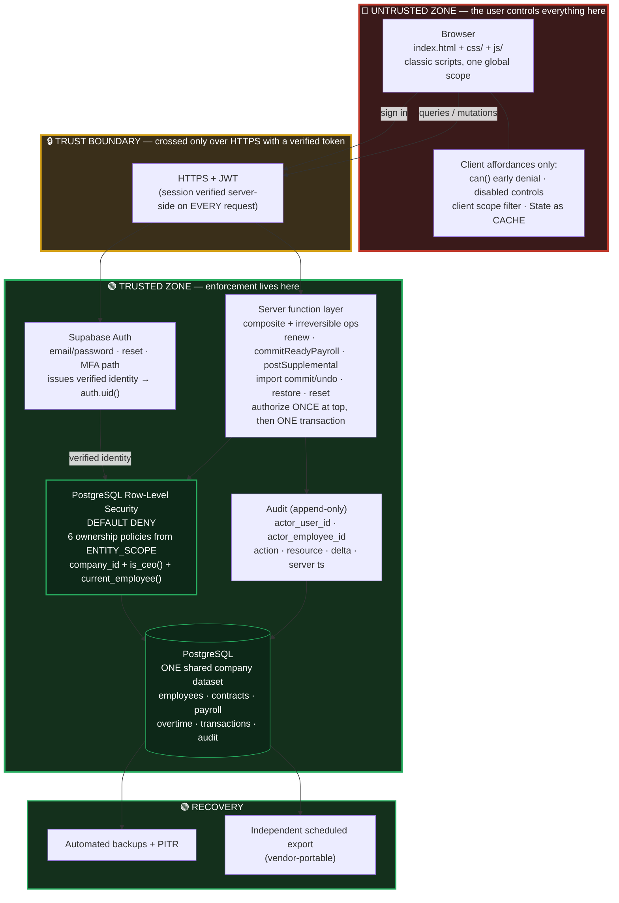

# Multi-User-0 — Shared Multi-User Architecture Decision

**Status:** **ACCEPTED AS THE ARCHITECTURE BASELINE — MERGED / FROZEN** (maintainer ruling, 2026-08-12)
**Type:** Architecture / governance milestone. **No implementation. No runtime change. No migration.**
**Baseline:** `main` @ `102c4ab1f4472f1f4a2de476b305a5525d945ed5` (clean)
**Date:** 2026-08-11 · **Accepted:** 2026-08-12
**Decision record:** [ADR-0003 — Shared Multi-User Architecture](../03b-repository-adr/ADR-0003-shared-multi-user-architecture.md) (**Accepted**)
**Requirement input:** [Multi-User Requirement Note](../99-archive/roadmap-completed/Multi-User-Requirement-Note.md)

> **Maintainer ruling (2026-08-12): APPROVED as the Multi-User-0 architecture baseline.** The analysis
> below is accepted and its recommended direction may be used as the baseline for subsequent planning.
> Multi-User-0 is **closed and frozen**.
>
> **This authorizes no implementation.** No backend provisioning, no database migration, no
> authentication migration, no runtime change, no schema change, and **no `CLAUDE.md` amendment** are
> authorized by this approval. `CLAUDE.md` §4.3 (client-only **MUST**) remains **fully operative and
> unamended**, and continues to **block every Multi-User implementation milestone** until amended
> through its own controlled milestone (§23, GC-1).
>
> **Acceptance ≠ authorization.** The direction is now authoritative; the work is not started and not
> approved. The approved v2.10.0 controlled pilot is unchanged and is **not** multi-user.

---

## 0. Baseline gate

| Invariant | Expected | Observed |
|---|---|---|
| `main == origin/main` | `102c4ab1…` | ✅ |
| Working tree | clean | ✅ |
| Conflicting open PRs | none | ✅ 0 open |
| `APP_VERSION` / `SCHEMA_VERSION` | 2.10.0 / 6 | ✅ |
| `ACTIONS` / `ACTION_SET` / `POLICY` / `ACTION_RESOURCE_ENTITY` | 20 / 20 / 20 / 20 | ✅ |
| Verifier | 2443 PASS / 0 FAIL | ✅ |
| Runtime | 2921 PASS / 34 harnesses / 0 FAIL | ✅ |
| Readiness-1 / Readiness-2 | 119 / 96 | ✅ |
| Artifact | `dist/tam-os-v2.10.0.html`, 1,151,267 B, `60382271…2c7fa704` | ✅ |
| Pilot state | APPROVED / NOT YET LAUNCHED | ✅ |

---

## 1. The requirement, restated precisely

> One shared company dataset across authorized users and devices. The CEO supplies and controls the
> data. Employees must **not** receive independent copies merely because they use another computer.
> Each user accesses the same authoritative dataset; what they may read or mutate is constrained by
> **authenticated** identity, read scope and authorization policy.

The concrete acceptance example, which every design below is tested against:

The company database contains Employee A, Employee B, Payroll A, Payroll B. Employee A signs in from a
different computer. Employee A receives **A's own** employee record, payroll, contracts and overtime.
Employee A must **not** receive B's identity where policy forbids it, B's salary, or B's payroll — and
**not** because the browser hid them, but because **the database never returned them**. The company
dataset still contains both. This must **not** be solved with one database per employee.

---

## 2. Current architecture inventory (mechanical)

### 2.1 Persistence — where canonical state lives today

**Canonical state is `localStorage`, per browser profile**, behind one gateway.

| Concern | Location | Note |
|---|---|---|
| Single persistence gateway | `js/core/storage-adapter.js` — `StorageAdapter.get/set/remove` | The **only** module allowed to touch `localStorage`/`window.storage`. Claude-Artifact mode falls back to `localStorage`. |
| In-memory canonical state | `js/core/state.js` — `const State` | ~20 collections; `txns`, `employees`, `contracts`, `payrollPlans`, `overtimeRecords`, `payrollAdjustments`, `monthlyPlans`, `recurringExpenses`, `importBatches`, `employeeMerges`, `companyAccounts`, `supplementalPayments`, `backups`, `settings`, plus session-only view state. |
| Parameterized collection writer | `js/core/hr-persistence-portability.js` — `persistHR(stateKey)` | One function serving **11** collections via `persistEmployees`, `persistContracts`, `persistPayrollPlans`, `persistRecurring`, `persistMonthlyPlans`, `persistOvertime`, `persistPayrollAdjustments`, `persistEmployeeMerges`, `persistCompanyAccounts`, `persistSupplementalPayments`. |
| Transaction + settings writers | `js/core/state-load-migrations.js` — `persist()`, `loadSettings()`, `loadState()` | |
| Multi-dataset write | `js/core/stabilization.js` — `saveAllData()` | 14 writes, each result inspected (SPR-079); **non-atomic**. |
| Load paths | `loadState()`, `loadHRData()`, `loadSettings()`, `loadBackups()` | |
| Backup / export | `hr-persistence-portability.js` — `buildCompleteBackup()` | Self-describing JSON: `app`, `version`, `release`, `schemaVersion`, `exportedAt`, `storageMode`, plus every collection. |
| Restore / import | `restoreCompleteBackup(data)` | Schema-6 aware. |
| Reset | `js/core/onboarding-reset.js` — `resetAppData`, `startFresh` | Clears all `tam_*` keys. |
| Smart Import | `js/import/smart-import-commit.js`, `import-preview.js` | Commit + undo, with pre-import safety backup. |
| Audit | `js/ui/activity-log.js` — `logActivity()`, key `tam_audit_log_v1`, cap 500 | Writes `localStorage` **directly**, not via `StorageAdapter`. |
| IDs | `js/core/utils.js` — `uid(prefix)` | `prefix + base36(random) + base36(time)`. **Client-generated, opaque, stable strings.** |
| Timestamps | `new Date().toISOString()` / `Date.now()` at call sites | **Client clock** — not authoritative across devices. |

**Storage keys (15 canonical):** `tam_txns_v1`, `tam_settings_v1`, `tam_backups_v1`, `tam_employees_v1`,
`tam_contracts_v1`, `tam_payroll_plans_v1`, `tam_recurring_expenses_v1`, `tam_monthly_plans_v1`,
`tam_overtime_records_v1`, `tam_import_batches_v1`, `tam_payroll_adjustments_v1`,
`tam_employee_merges_v1`, `tam_company_accounts_v1`, `tam_supplemental_payments_v1`,
`tam_audit_log_v1`, plus one-time migration flags (`tam_migrated_*`, `tam_v23_ack`).

> **Architectural finding — this is a favourable starting position.** Persistence is already funnelled
> through one adapter and a small set of named writers. A backend does not require chasing
> `localStorage` calls through 73 modules; it requires re-implementing a **small, enumerable seam**.

### 2.2 Authorization — what exists and where it runs

| Concern | Location |
|---|---|
| Action vocabulary | `js/core/authz.js` — `ACTIONS` (**20**, frozen), `ACTION_SET` (20) |
| Policy table | `POLICY` (20 entries) — action → predicate |
| Resource mapping | `ACTION_RESOURCE_ENTITY` (20) — action → scope entity type, or `null` for collection/system actions |
| Public façade | `can(action, resource?)`; internal pure `canPrincipal(principal, action, resource, ctx)` |
| Scope precondition (AZ-1) | `isInScopeForPrincipal()` in `workspace.js` |
| Fail-closed rule (AZ-2) | unknown/indeterminate ⇒ deny; never a CEO fallback |
| Enforcement points | Domain mutation boundaries across `people/`, `finance/`, `import/`, `ui/` — never in `persist*`/`StorageAdapter` |
| Presentation | `authzDisabled(action, resource)`; 7 single-capability controls visible+disabled; 43 frozen integration surfaces (`tools/integration-surface-manifest.js`) |

**All of it runs in the browser.** Model: CEO is pass-through; Employee is deny-by-default with narrow
own-Draft overtime self-service; null denies everything.

> **This cannot be trusted as a server security boundary.** Every check is a function call in a script
> the user controls. For the approved 1–3 operator trust-based pilot this is documented and accepted.
> For real multi-user it is an affordance only.

### 2.3 Read scope (Readiness-1)

| Concern | Location |
|---|---|
| Predicate registry | `js/core/workspace.js` — `ENTITY_SCOPE` (**6** entity types) |
| Scoped list query | `getScopedRecords(entityType)` |
| Scoped detail query | `getScopedRecordById(entityType, id)` — out-of-scope and non-existent deliberately indistinguishable |
| Workspaces | `getCurrentWorkspace()`; Executive/`ALL_COMPANY` vs Personal/`SELF` |

**The six scoped entity types and their SELF predicates:**

| Entity | Collection | SELF predicate |
|---|---|---|
| `employee` | `State.employees` | `r.id === employeeId` |
| `contract` | `State.contracts` | `r.employeeId === employeeId` |
| `payrollPlan` | `State.payrollPlans` | `r.employeeId === employeeId` |
| `overtime` | `State.overtimeRecords` | `r.employeeId === employeeId` |
| `payrollAdjustment` | `State.payrollAdjustments` | `r.employeeId === employeeId` |
| `transaction` | `State.txns` | `!!r.employeeId && r.employeeId === employeeId` (rows with no `employeeId` are company rows: CEO-only) |

Global Search is scoped **at its collector seam**, so a foreign record is never *indexed*.

> **Architectural finding — this registry is the single most portable asset in the codebase.** Six
> declarative ownership predicates over an ownership column the domain already carries translate
> almost line-for-line into six PostgreSQL Row-Level Security policies. The semantics survive the move
> essentially unchanged; only the enforcement location changes.

### 2.4 Identity

| Concern | Location |
|---|---|
| Canonical seam | `js/core/identity.js` — `IdentityProvider.getCurrentUser() → User \| null` |
| Local adapter | `LocalIdentityProvider` — `getAvailablePrincipals()`, `selectPrincipal(id)` (**local-only**) |
| UI | `js/ui/identity-selector.js` — the "Acting as" `<select>`; the **only** module allowed to call the local adapter |
| Principal shape | `{ id, displayName, principalType: 'ceo'\|'employee', employeeId? }` |
| Linkage | `User.employeeId → Employee.id` (`workspace.js`) |
| Default | `null` — no auto-CEO, no persisted principal, ephemeral (resets on reload) |

**Two fixture principals only.** Selection is spoofable by design and documented in-source as *not a
security boundary*.

> **Architectural finding — the extension point already exists and is frozen.** `identity.js` states:
> *"IdentityProvider — the CANONICAL seam application consumers depend on. Its ONLY method is
> getCurrentUser() → User | null. **A future backend provider satisfies exactly this** and need not
> enumerate or select."* Every application module already consumes identity **only** through
> `getCurrentUser()`, and that isolation is verifier-enforced. An authenticated provider can therefore
> be introduced **without touching consumer modules**.

### 2.5 Current trust boundary

```
┌──────────────────────── ONE BROWSER PROFILE = the entire trust domain ────────────────────────┐
│  "Acting as" selector (spoofable)  →  can() / ACTIONS  →  getScopedRecords()  →  State        │
│                                                              ↓                                │
│                                                    StorageAdapter → localStorage              │
└───────────────────────────────────────────────────────────────────────────────────────────────┘
                          No server. No verification. No boundary crossed.
```

**There is no trust boundary today** — only a product-behaviour boundary inside one trusted device.

### 2.6 Critical gap discovered: the audit trail has no actor

`logActivity()` writes `{ts, type, module, entity, entityId, desc, refs}`. **There is no actor field**
— correct when there is exactly one user, insufficient the moment there are two. Multi-user audit is
**new work, not a port**. This was not previously recorded and is the most significant gap this
inventory surfaced.

---

## 3. Target security model (§4 of the assignment)

**Stated explicitly and non-negotiably:**

| Layer | Trust status |
|---|---|
| **Browser / UI / all client JavaScript** | **UNTRUSTED.** Assume a hostile, fully-instrumented client. |
| **Server / API / database policies** | **THE authorization enforcement boundary.** |
| **Database** | **Authoritative shared persistence.** Sole source of truth. |
| **Authenticated user identity** | **Server-verifiable** (signed token, validated server-side). |
| **Read scope** | **Server-enforced.** Unauthorized rows are never transmitted. |
| **Mutation authorization** | **Server-enforced.** Client denial is advisory only. |

**The existing client-side policy is retained** — as UX affordance and early denial, so denied controls
still appear disabled and users are not led into failing workflows. **It must never again be described
as the enforcement layer.** Every client check must be duplicated server-side; a client check without a
server counterpart is a defect.

**Corollary (server-authoritative facts).** Identity, timestamps for audit and lifecycle transitions,
and monetary posting decisions become **server-generated**. The current client-clock
`new Date().toISOString()` is not authoritative across devices.

---

## 4. Shared-company-data design (§5)

**One dataset. Server-computed projections. Never per-employee databases.**

```
                    ONE company dataset (PostgreSQL)
        employees[A,B] · contracts · payroll[A,B] · overtime · transactions
                                   │
              ┌────────────────────┴────────────────────┐
              │      RLS evaluated per authenticated    │
              │      request against auth.uid()         │
              └────────────────────┬────────────────────┘
                 ┌─────────────────┴─────────────────┐
                 ▼                                   ▼
        CEO session                          Employee A session
        role = ceo                           role = employee, employee_id = A
        → every company row                  → ONLY A's rows
                                             → B's rows are NOT SENT
```

The acceptance example from §1 is satisfied because the **query itself** is constrained, not the
render. The database still contains A and B; the CEO still sees both; A's HTTP response never contains
B.

---

## 5. Tenant / company model (§6) — recommendation

**Recommendation: single-company architecture, but carry a stable `company_id` on every business table
from day one. Do not build multi-tenancy.**

Rationale, stated as a cost asymmetry rather than a preference:

- The requirement is **one** company. Building tenant onboarding, per-tenant configuration, tenant
  admin roles and cross-tenant isolation testing would be unjustified scope, and each is a place a
  confidentiality bug can hide.
- **But** adding a tenant discriminator *later* to a live payroll and finance dataset means a
  migration touching every table, every RLS policy, every query and every audit row, on data that is
  legally and financially sensitive. Carrying one indexed `company_id` column now costs approximately
  nothing.
- Concretely: every RLS policy is written as `company_id = current_company() AND <ownership test>`
  from the start. If multi-tenancy is never needed, the first clause is simply always true.

**This is insurance, not multi-tenancy.** No tenant management is built.

---

## 6. Identity model (§7) — recommendation

### Conceptual entities

| Entity | Role |
|---|---|
| **Company** | The organization owning the dataset. One row initially. |
| **User** | An **authentication** subject (email + credential). Owned by the auth provider. |
| **Employee** | A **business** record (existing `State.employees` shape). Exists whether or not anyone logs in as them. |
| **Membership** | Links User → Company with a stored `role` and an optional `employee_id`. The server-side principal. |
| **Principal** | The **derived** request-time context: `{user_id, company_id, role, employee_id}`. Replaces the client "Acting as" selection. |

### Answers to the required questions

| Question | Answer | Rationale |
|---|---|---|
| Is every User an Employee? | **No.** | The CEO/owner and any future accountant or auditor may need access without being on payroll. Forcing an Employee row would corrupt payroll data with non-employees. |
| Can CEO/admin exist without an Employee record? | **Yes** — `employee_id` is nullable. | Directly follows from the above. Matches today's CEO principal, which carries **no** `employeeId` (and `isValidUser` actively rejects one). |
| Can one User link to one Employee? | **Yes — at most one**, enforced by a unique constraint on `employee_id` per company. | The entire read-scope model rests on a single unambiguous `SELF` identity. Two employees behind one login would make `SELF` undefined. |
| Can one Employee have multiple login identities? | **No.** | Same reason, inverted: it would fragment the audit trail and make "who submitted this overtime" unanswerable. |
| What happens when an Employee leaves? | The **Employee record is retained** (payroll history is immutable and legally required); the **Membership is revoked** so login access ends. | Preserves history without preserving access. Never delete an employee with payroll history. |
| What happens if a User is disabled? | Membership `status = 'disabled'`; all sessions rejected server-side; **no data deleted**. | Access is a membership property, not a data property. |
| How is CEO represented? | `membership.role = 'ceo'`, `employee_id = NULL`. | Mirrors today's CEO principal exactly. |
| Is role stored or derived? | **Stored** on the membership row. | Deriving role from data (e.g. "has no employee record ⇒ CEO") is a privilege-escalation hazard: a data accident becomes a permission grant. Storage is explicit and auditable. |
| What happens to principal selection? | **It disappears as a security-relevant control.** The "Acting as" selector is removed or demoted to a development-only affordance; the principal comes from the verified session. | This is the single most visible user-facing change. |

**Deliberately NOT built:** general RBAC, custom roles, permission groups, delegation. Two roles
(`ceo`, `employee`) match the current product exactly. `CLAUDE.md`-style restraint applies: add
structure when a second caller exists.

---

## 7. Authentication (§8) — comparison and recommendation

| Option | Impl. complexity | Security responsibility | Email/pwd | Reset | Sessions | MFA path | Server verification | Cost at 1–3 users | Lock-in | Fit |
|---|---|---|---|---|---|---|---|---|---|---|
| **A. Supabase Auth** | **Low** | Provider | ✅ | ✅ built-in | JWT, refresh | ✅ TOTP | ✅ **`auth.uid()` readable inside RLS** | **Free tier** | Medium | **Best** — the only option whose identity is natively visible to the database policy engine |
| B. Firebase Auth | Low | Provider | ✅ | ✅ | ✅ | ✅ | ✅ but pairs naturally with Firestore, not Postgres | Free tier | Medium-high | Good auth, wrong data pairing |
| C. Clerk | Low | Provider | ✅ | ✅ | ✅ | ✅ | ✅ via JWT template | Free tier, then MAU-priced | Medium | Excellent DX; second vendor; consumer-scale pricing model |
| D. Auth0 | Medium | Provider | ✅ | ✅ | ✅ | ✅ | ✅ | Free tier, then steeper | Medium | Enterprise-grade, heavier than needed |
| E. Custom username/password | **High** | **Ours** | ✅ | must build | must build | must build | ✅ | Infra only | None | **Rejected** |

**Recommendation: A — Supabase Auth.**

The decisive factor is not popularity or DX; it is that **Supabase Auth's verified identity is directly
readable inside PostgreSQL RLS policies** via `auth.uid()`. Every other option requires the identity to
be transported into the database layer by application code — reintroducing hand-written trust plumbing
exactly where the confidentiality guarantee must be strongest. Choosing the auth provider that the
enforcement engine natively understands removes a whole class of bug.

Custom authentication is rejected on responsibility grounds: password hashing, reset-token handling,
session invalidation and brute-force protection are specialist work, and getting any one wrong is
catastrophic for payroll data.

---

## 8. Backend / API architecture (§9) — comparison and recommendation

| Option | Migration complexity | Authz correctness | Read-scope enforcement | Relational fit | Transactions | Auditability | Ops burden | Cost | Lock-in |
|---|---|---|---|---|---|---|---|---|---|
| **A. Supabase (Postgres + RLS + edge functions)** | **Medium** | **High** — declarative, DB-enforced | **Excellent** — RLS is row-level by construction | **Excellent** | **Full ACID** | Excellent (triggers) | **Low** | **Low** | Medium |
| B. Firebase + Firestore rules | High (data remodel) | Medium | Good | **Poor** | Limited | Medium | Low | Low | High |
| C. Node API + PostgreSQL | High | Medium — every check hand-written | Good if disciplined | Excellent | Full ACID | Excellent | **High** | Medium | **Low** |
| D. Serverless + managed Postgres | Medium-high | Medium | Good | Excellent | Full ACID | Excellent | Medium | Low-medium | Low-medium |

**Recommendation: A — Supabase (PostgreSQL + Row-Level Security + a thin function layer).**

Reasoning:

1. **RLS makes the confidentiality guarantee structural rather than disciplinary.** With a hand-written
   API (option C), forgetting one `WHERE employee_id = ?` leaks salary data. With RLS, the policy is
   attached to the **table**: a forgotten filter returns zero rows, not everyone's rows. For an
   application whose central defect (found in the readiness audit) was *unwired read scope*, choosing
   the architecture that fails closed by construction is the correct trade.
2. **The existing `ENTITY_SCOPE` registry maps directly onto RLS policies** (§10 below) — six
   predicates, six policies.
3. **Relational + transactional fit.** `commitReadyPayroll` writes four collections as one logical
   unit and is documented as **non-atomic** today — a standing known limitation with real residual
   partial states (Scenarios A2/B). Postgres transactions **close that limitation as a side effect**.
4. **Lowest operational burden** for a single-owner project: managed backups, PITR, TLS and patching
   are the vendor's responsibility.

**The thin function layer is not optional.** RLS answers *"may this user see/modify this row?"* It does
**not** express *"authorize this composite operation once, at the top, atomically"* — which is exactly
the frozen semantics of `renewContract`, `commitReadyPayroll`, `postSupplemental`, `commitSmartImport`
and `undoLastSmartImport`. Those become **server-side functions** (Postgres functions or edge
functions) that check authorization once and then execute inside one transaction.

---

## 9. Database (§10) — recommendation

**Recommendation: PostgreSQL.**

Evidence from the actual data shape rather than preference:

| Entity | Relationships | Integrity requirement |
|---|---|---|
| `employees` | referenced by contracts, payroll, overtime, adjustments, transactions | Must not be deletable while payroll history references it |
| `contracts` | → employee; overlap rules; renewal predecessor/successor chain | ADR-011/012 enforce date-extent and overlap rules — inherently relational |
| `overtime` | → employee; → payroll plan once committed | Drift detection compares linked records |
| `payroll_plans` | → employee; → transactions (both directions) | SPR-081 documents **both** broken-linkage directions as Critical findings |
| `payroll_adjustments` | → employee | |
| `transactions` | → payroll plan (optional), → monthly plan (optional), → employee (optional) | Orphan-reference rules are **Critical** integrity findings today |
| `monthly_plans` | → transactions via `committedTxnIds` | `corrupt-plan-ref` warning exists precisely because nothing enforces this |
| `import_batches` | → every record the batch created | Undo must delete exactly that set |
| `audit` | → actor, → resource | Append-only |

Four of the application's **Critical Integrity Check rules** (`payroll-orphan-transaction`,
`payroll-missing-monthlyplan`, `monthlyplan-orphan-transaction`, `corrupt-plan-ref`) exist **solely to
detect referential damage that a relational database would have prevented outright**. That is the
strongest possible evidence for relational integrity: the application already pays, in code and in
operator attention, for its absence.

**Document-oriented storage is rejected**: it would require denormalizing payroll/finance relationships,
weaken multi-row transactions, and preserve the exact class of integrity bug the app currently detects
manually.

**ID strategy:** preserve existing `uid()` string IDs as `text` primary keys. This keeps backup files,
audit `entityId` references and every cross-collection link valid across migration. Add
`created_at`/`updated_at` as **server-generated** `timestamptz`.

---

## 10. Server-side authorization design (§11)

**`ACTIONS` remains 20. No new action is invented.** The vocabulary is re-expressed, not extended.

Worked example — `POST /payroll/:id/post`:

```
1. Verify session               → Supabase Auth validates JWT; reject 401 if invalid/expired
2. Resolve server principal     → SELECT role, employee_id FROM memberships
                                  WHERE user_id = auth.uid() AND status='active'
                                  (NEVER from a client-supplied header/body)
3. Resolve company              → company_id from the membership row
4. Evaluate action              → 'payroll.manage' → POLICY: ceo ⇒ allow, employee ⇒ deny, null ⇒ deny
5. Evaluate resource scope      → AZ-1 equivalent: the payroll row must be in this company,
                                  and (for a SELF-scoped action) owned by principal.employee_id
6. Perform mutation             → BEGIN … payroll + monthly plan + overtime + transactions … COMMIT
                                  (this is where today's non-atomic four-key write becomes atomic)
7. Write audit                  → actor_user_id, actor_employee_id, action, resource, delta, server ts
8. Return                       → authorized result, or an indistinguishable 404 for out-of-scope
```

**Mapping the existing model onto the server:**

| Existing client concept | Server-side destination |
|---|---|
| `ACTIONS` (20) | Shared action constants, mirrored in the function layer; **unchanged vocabulary** |
| `POLICY` (action → predicate) | Server policy table — **the authoritative copy**; the client copy becomes advisory |
| `ACTION_RESOURCE_ENTITY` | Determines whether a resource-scope check runs, and against which table |
| AZ-1 scope precondition | RLS `USING`/`WITH CHECK` clauses + explicit checks in composite functions |
| AZ-2 fail-closed | RLS default-deny (`ENABLE ROW LEVEL SECURITY` with no permissive policy = deny) — **stronger than the client version, because it is the database default** |
| CEO pass-through | `role = 'ceo'` policy branch |
| Employee own-Draft overtime | RLS `WITH CHECK (employee_id = current_employee() AND status = 'Draft')` |
| SE-0 (denied ⇒ zero side effect) | Transaction rollback + rejected `WITH CHECK` — **structurally guaranteed**, not test-verified |
| `authzDisabled()` presentation | **Stays client-side, unchanged**, as affordance |

**Note on SE-0.** Today "denied ⇒ zero business side effect" is proven by dedicated runtime harnesses.
Server-side it becomes a property of the transaction boundary. That is a genuine strengthening: the
guarantee moves from *tested* to *structural*.

---

## 11. Server-side read scope (§12)

**The browser must never receive foreign confidential rows.** Readiness-1's semantics move to the
database.

**The six `ENTITY_SCOPE` predicates become six RLS policies**, essentially line-for-line:

| Entity | Client predicate today | Server RLS policy (conceptual) |
|---|---|---|
| `employee` | `r.id === eid` | `company_id = current_company() AND (is_ceo() OR id = current_employee())` |
| `contract` | `r.employeeId === eid` | `company_id = current_company() AND (is_ceo() OR employee_id = current_employee())` |
| `payrollPlan` | `r.employeeId === eid` | same shape |
| `overtime` | `r.employeeId === eid` | same shape |
| `payrollAdjustment` | `r.employeeId === eid` | same shape |
| `transaction` | `!!r.employeeId && r.employeeId === eid` | `company_id = current_company() AND (is_ceo() OR (employee_id IS NOT NULL AND employee_id = current_employee()))` — preserving the deliberate fail-closed omission of company rows |

**Surface-by-surface:**

| Surface | Enforcement |
|---|---|
| Lists | RLS on the base table; no client filtering required for correctness |
| Detail endpoints | RLS; out-of-scope returns zero rows → **404, indistinguishable from non-existent** (preserves today's deliberate semantics) |
| Aggregates / reports | Computed **server-side over already-filtered rows**, or via security-invoker views. An aggregate must never be computed over rows the user cannot read. |
| Global Search | **Server-side query against RLS-protected tables.** The client never holds an index of foreign records — strictly stronger than today's collector-seam scoping. |
| Selectors / pickers | Same RLS-backed endpoints |
| Exports | Generated server-side from scoped queries |
| Deep links | RLS re-evaluates on every request; a captured id from another principal returns nothing — the server-side equivalent of `getScopedRecordById()` |

**Where enforcement belongs: BOTH — with a clear division.**

- **RLS is the authoritative boundary** for all row access. It is the backstop that cannot be forgotten.
- **The API/function layer** adds what RLS cannot express: composite-operation authorization, atomicity,
  and typed outcome reporting.
- **The client** keeps scoping only as UX (avoiding empty-state flicker and disabled-control churn).

Relying on the API layer alone would repeat the readiness audit's central failure mode — a scope layer
that exists but is not wired to something. RLS cannot be left unwired: it is attached to the table.

---

## 12. Audit model (§13)

Today's record has **no actor**. Target shape:

| Field | Notes |
|---|---|
| `id` | server-generated |
| `company_id` | tenant discriminator |
| `actor_user_id` | **new** — the authenticated user (never client-supplied) |
| `actor_employee_id` | **new** — nullable; null for CEO/admin without an employee record |
| `action` | one of the 20 `ACTIONS` — preserves today's vocabulary |
| `resource_type`, `resource_id` | maps to today's `entity` / `entityId` |
| `description` | maps to today's `desc` |
| `refs` | maps to today's `refs` (JSONB) |
| `delta` | **new** — structured before/after for material changes (money, status, dates) |
| `occurred_at` | **server** timestamp, not client clock |
| `request_id` / `session_id` | optional correlation |

**Rules:** append-only (no UPDATE/DELETE policy for anyone, including CEO); **never** log passwords,
tokens, session material or full credential payloads; retention becomes a policy decision rather than
today's hard 500-record cap.

**Preserved from today:** the action vocabulary, `entity`/`entityId`/`desc`/`refs` structure, the
read-only presentation, and the best-effort principle that **auditing must never break a user action** —
though server-side this becomes "in the same transaction" for material mutations, which is stronger.

---

## 13. Concurrency and consistency (§14)

The current app effectively assumes **one writer**. Multi-user breaks that assumption.

| Scenario | Risk | Recommended minimum |
|---|---|---|
| Two users edit the same record | Silent lost update | **Optimistic concurrency**: `version integer` (or `updated_at` compare) on mutable business tables; mismatch ⇒ typed conflict, never a silent overwrite |
| CEO edits while Employee submits overtime | Drift; posting stale amounts | Transactions + the **existing** drift-detection model (already derived, not stored — it survives) |
| Payroll generation while employee data changes | Payroll captures a moving target | Generate inside **one transaction**; committed payroll is already immutable by rule |
| Duplicate submissions / double-click | Duplicate payroll or transactions | **Idempotency keys** on composite mutations (post, commit, execute, import) — the server recognizes a repeat and returns the original result |
| Stale browser state | User acts on data that changed | Version check rejects with a typed conflict; client refetches |
| Retry after partial failure | Today's documented residual partial states | **Transactions eliminate the class** — no partial commit to reconcile |

**Recommended minimum for TAM OS (deliberately restrained):**

1. **Database transactions** for every composite operation — non-negotiable; this is the single largest
   correctness win and retires several standing known limitations.
2. **Optimistic concurrency (`version`)** on employees, contracts, overtime, payroll plans, transactions.
3. **Idempotency keys** on the five irreversible/composite operations only.
4. **Server-generated timestamps** everywhere for audit and lifecycle.

**Not recommended:** pessimistic locking, real-time presence, collaborative editing, CRDTs. At 1–3
users the conflict rate is near zero; the value is in never *silently* losing a write, not in
sophisticated merging.

---

## 14. Offline behavior (§15) — ruling

**Recommendation: ONLINE-REQUIRED.**

| | Online-required | Offline-capable with sync |
|---|---|---|
| Complexity | Low | **Very high** |
| Correctness risk | Low | **High** — merge semantics for payroll/finance are genuinely ill-defined |
| Confidentiality | Strong — no local dataset copy | **Weakened** — an offline cache re-creates the per-device copy the requirement forbids |
| Fit | Office-based operators, reliable connectivity | Field work, unreliable connectivity |

Two decisive arguments:

1. **Offline caching contradicts the core requirement.** Any offline-capable design must store a
   readable local copy of the user's data. Done naively for the CEO, that is the entire company
   dataset on a laptop — reintroducing exactly what shared persistence was adopted to eliminate.
2. **There is no defensible merge for the domain.** What is the correct resolution of two divergent
   payroll postings, or an offline overtime approval against a since-locked period? Any answer is a
   guess, and guessing about money is the failure mode `CLAUDE.md` §2.1 forbids.

**Accepted consequence:** no connectivity, no application. Mitigate with **read-only exports** (PDF/CSV
generated while online) rather than an offline write path. Revisit only if offline becomes a stated
business requirement.

---

## 15. Frontend impact (§16)

**The objective is not a rewrite.** The domain logic, rendering and UX survive; the data-access floor
is replaced.

| Module / concern | Disposition | Note |
|---|---|---|
| Renderers (`shell-render`, views, `charts`, `data-grid`) | **KEEP** | Presentation is data-source agnostic |
| Navigation, breadcrumbs, Quick Actions, 43 frozen C3 surfaces | **KEEP** | Unchanged semantics |
| `ACTIONS` manifest (`authz.js` vocabulary) | **KEEP** | Same 20 actions; becomes the shared contract with the server |
| `authzDisabled()` / denied presentation | **KEEP** | Explicitly retained as affordance |
| `can()` / `POLICY` | **ADAPT** | Stays for early denial; **loses authoritative status**; must be documented as advisory |
| `getScopedRecords()` / `getScopedRecordById()` / `ENTITY_SCOPE` | **ADAPT** | Semantics preserved; predicates migrate to RLS. Client version becomes a UX filter over already-scoped data |
| `identity.js` — `IdentityProvider` seam | **KEEP** (seam) | The canonical seam was **designed** for this |
| `LocalIdentityProvider` | **REPLACE** | Swapped for an authenticated provider satisfying the same one-method contract |
| `identity-selector.js` ("Acting as") | **REMOVE** (or demote to dev-only) | Replaced by real sign-in; **the most visible user-facing change** |
| `StorageAdapter` | **REPLACE** | Becomes an API/database client; **the single seam that makes this tractable** |
| `persistHR()` / `persist*()` / `saveAllData()` | **ADAPT** | Collection-grained writes become record/transaction-grained calls |
| `State` | **ADAPT** | Demoted from source of truth to a **client cache** of server responses |
| Repository layer (`js/repository/*`) | **ADAPT** | Already the persistence-mechanics boundary — a genuine head start |
| Domain aggregates (`js/domain/*`) | **KEEP** (client) / **MIRROR** (server) | Business rules must be enforced server-side; the pure aggregates are portable |
| Payroll engine, finance engine, supplemental engine | **KEEP** logic / **ADAPT** persistence | Calculations are pure and unchanged |
| Backup / restore (`buildCompleteBackup`) | **ADAPT** | Becomes a server-side export; local restore is superseded by DB recovery |
| Global Search (`global-search.js` engine) | **ADAPT** | The engine is **already source-agnostic by design** — it ranks whatever document set it is handed. Hand it server results. |
| Smart Import | **ADAPT** | Parsing stays client-side; commit/undo become transactional server operations |
| `onboarding-reset.js` (Start Fresh) | **ADAPT** | Becomes a privileged server operation, not a `localStorage` wipe |
| `activity-log.js` | **REPLACE** | Requires the actor model it currently lacks |
| CLI (`js/cli/cli.js`) | **ADAPT** | Read-only ingress can consume the same API |

**Summary: KEEP 8 · ADAPT 13 · REPLACE 4 · REMOVE 1.** The application's identity — its domain model,
UX and calculations — survives. What changes is where data comes from and where permission is decided.

---

## 16. `localStorage` migration strategy (§17) — design only, NOT executed

**Vehicle:** the existing `buildCompleteBackup()` JSON — already self-describing (`app`, `version`,
`schemaVersion`, `exportedAt`) and already covering every collection. No new export format is needed.

| Step | Action | Validation / rollback |
|---|---|---|
| 1 | Export Complete Backup from the authoritative v2.10.0 device | File hashed and archived — **this is the rollback point** |
| 2 | Validate `schemaVersion === 6` and structural integrity | Abort on mismatch; never migrate an unknown schema |
| 3 | Create the `company` row | Trivially reversible |
| 4 | Import canonical records **preserving existing `uid()` IDs** | Per-collection row counts compared to source |
| 5 | Create authenticated users (CEO first) | No business data touched |
| 6 | Link users → employee records (`membership.employee_id`) | **Manual, reviewed mapping** — never inferred from name matching |
| 7 | Verify counts **and monetary totals** per collection | Payroll/finance sums must match the source **exactly** |
| 8 | Verify privacy scope with a real Employee login | Employee must **not** be able to fetch a colleague's payroll — proven against the API, not the UI |
| 9 | **Freeze** the old local dataset (read-only archive) | Old artifact retained, not deleted |
| 10 | Cut over clients | Rollback = resume the frozen v2.10.0 artifact + archived backup |

**Design rules:**

- **ID preservation is required, not optional.** Existing `uid()` strings become `text` primary keys.
  Re-keying would invalidate every cross-collection reference, every audit `entityId`, and every
  historical backup file.
- **Duplicate prevention:** the import is **idempotent on primary key** and runs in **one transaction** —
  it either fully lands or does not land at all. A re-run inserts nothing new.
- **Auditability:** the migration writes its own audit record (source file hash, per-collection counts,
  totals, operator, server timestamp).
- **One-way at cutover:** after cutover, the local dataset is authoritative for **nothing**. Dual-write
  or dual-read periods are explicitly rejected — two authoritative datasets is the problem being solved.

---

## 17. Backup / recovery (§18)

| Mechanism | Owner | Purpose |
|---|---|---|
| **Managed automated DB backups** | Infrastructure (Supabase) | Primary recovery |
| **Point-in-time recovery (PITR)** | Infrastructure (paid tier) | Recover to just before an incident — **the capability with no current equivalent** |
| **Scheduled logical export** (`pg_dump` / scheduled job) | Operator | **Vendor-independent** copy held outside the vendor; guards against account loss, not just data loss |
| **Application-level Complete Backup export** | CEO/operator | Retained for portability, audit and peace of mind — server-generated, whole-company, CEO-only (`data.restore` semantics) |
| **Restore** | Maintainer only | Destructive; requires explicit confirmation; always snapshots first (preserving today's rule) |

**Division of responsibility:**

- **Infrastructure owns:** automated backups, PITR, storage durability, encryption at rest.
- **CEO/operator owns:** periodic verified export to independent storage, and **actually testing a
  restore** — an untested backup is a hypothesis, not a recovery plan.
- **Maintainer owns:** the documented restore runbook and any destructive operation.

**Recommendation:** enable PITR before real payroll data lands. For a payroll system, "restore to
yesterday's snapshot" can mean re-doing a pay run; "restore to 14:05" usually does not.

---

## 18. Deployment (§19)

| Option | Simplicity | Maintenance | HTTPS | Secrets | Updates | Rollback | Cost | Observability |
|---|---|---|---|---|---|---|---|---|
| **A. Static frontend + managed backend** | **High** | **Low** | Automatic | Managed | Redeploy static | **Instant** (previous deploy) | **Low** | Vendor dashboards |
| B. Full-stack managed (single platform) | Medium | Low-medium | Automatic | Managed | Platform deploy | Good | Medium | Good |
| C. Self-hosted VPS | Low | **High** | Manual (certbot) | Manual | Manual | Manual | Low-medium | Must build |

**Recommendation: A — static frontend + managed backend.**

It matches what TAM OS already is: the frontend is **already** a static bundle of `index.html` + CSS +
JS with no build step. Hosting it on a static CDN is close to a no-op, and it composes naturally with
ADR-0002's Model B. For a single-owner project, option C's operational burden (patching, TLS renewal,
backup scripting, monitoring) is a standing liability with no compensating benefit at this scale.

---

## 19. Distribution-1 interaction (§20)

**ADR-0002 is not invalidated.** Model A stays canonical for the v2.10.0 pilot; Model B remains the
approved future architecture.

**Recommendation: Distribution-1 FIRST, then Multi-User implementation — with one coordination point.**

Rationale:

1. **A multi-user client cannot ship as a single inlined HTML file anyway.** It needs configuration
   (API URL, public keys), an auth redirect origin, and a deployable static bundle. Model B is
   effectively a **prerequisite**, not a parallel track.
2. **Doing Multi-User first would mean building it against a distribution model it must then abandon**,
   paying the Model A → Model B migration cost *twice* — once for the pilot artifact and again for the
   multi-user client.
3. **Distribution-1 is already scoped, authorized and post-pilot.** It needs no new governance; ADR-0003
   needs a constitutional amendment. Sequencing the unblocked work first is simply lower risk.

**Coordination point:** Distribution-1's package manifest and verifier revisions should anticipate a
runtime configuration file (API endpoint, public anon key — **never** a secret). That is a small design
allowance, not a Multi-User implementation, and it prevents a second package-format revision.

**Revised sequence:** Controlled Pilot → Post-Pilot Findings → Pilot Exit Review → **Distribution-1** →
**Multi-User-1…8** → General-Use Readiness.

---

## 20. Controlled Pilot interaction (§21) — recommendation

**Recommendation: C — run the current controlled pilot as approved, while Multi-User architecture
proceeds separately as a governance/design track.**

| Option | Assessment |
|---|---|
| A. Pilot runs, *then* multi-user starts | Safe but wastes calendar time; the architecture ruling does not depend on pilot outcomes |
| **B. Pause the pilot until multi-user exists** | **Rejected.** Discards approved, verified, frozen work and delays all real-user feedback by months. The pilot's purpose is to discover whether the *product* works; that question is independent of persistence architecture |
| **C. Pilot runs; multi-user proceeds as a separate track** | **Recommended** |

Justification:

- The pilot's approved scope is **1–3 named internal operators under an explicitly documented
  trust-based model**. That approval remains valid and is unaffected by a future architecture decision.
- **The pilot de-risks the multi-user work.** It will surface domain and UX defects that are far
  cheaper to fix in the current codebase than after a persistence migration. Migrating first would
  mean porting undiscovered bugs.
- **Nothing is silently replaced.** The pilot architecture is untouched; Multi-User is a clearly
  separated future track, exactly as the requirement note demands.

**Binding conditions:**

1. The pilot must **not** be described as multi-user, nor its trust model represented as improved.
2. Pilot audience must **not** be broadened on the strength of a *planned* multi-user architecture.
3. No Multi-User implementation may modify the frozen v2.10.0 RC. Any runtime change requires a new
   candidate, new evidence and a new hash (the standing RC mutation rule).

---

## 21. Technology decision matrix (§22)

**Weights are declared before scoring and are justified by this project's specific history.**

| Criterion | Weight | Why this weight |
|---|---|---|
| Security / authorization correctness | **25%** | Confidential payroll data; the readiness audit's central defect was an unenforced read scope. Highest stakes. |
| Relational fit / data integrity | **15%** | Four Critical integrity rules exist solely to detect referential damage. |
| Migration effort from current model | **15%** | A single-owner project must be able to finish the work. |
| Operational burden | **15%** | One maintainer, best-effort timelines. |
| Backup / recovery | **10%** | Payroll data loss is unacceptable. |
| Auditability | **8%** | Regulatory/business need; existing audit trail is a product feature. |
| Cost | **5%** | 1–3 internal users; all realistic options are cheap. |
| Vendor lock-in | **5%** | Real, but secondary to correctness at this scale. |
| Future maintainability | **2%** | Long-horizon, heavily discounted against present risk. |

Scores 1–5 (5 best).

| Criterion | Wt | **A. Supabase** | B. Firebase | C. Node+PG self-host | D. Serverless+PG |
|---|---|---|---|---|---|
| Security/authz correctness | 25% | **5** | 3 | 3 | 3 |
| Relational fit | 15% | **5** | 1 | **5** | **5** |
| Migration effort | 15% | 4 | 2 | 2 | 3 |
| Operational burden | 15% | **5** | **5** | 1 | 3 |
| Backup/recovery | 10% | 4 | 4 | 2 | 4 |
| Auditability | 8% | **5** | 3 | **5** | **5** |
| Cost | 5% | **5** | **5** | 3 | 4 |
| Vendor lock-in | 5% | 2 | 1 | **5** | 4 |
| Future maintainability | 2% | 4 | 2 | 4 | 4 |
| **Weighted total** | | **4.55** | **2.98** | **2.99** | **3.55** |

**Winner: A — Supabase (PostgreSQL + RLS + Auth), 4.55 / 5.**

**Honest sensitivity check.** Supabase wins on security-correctness and operational burden, and loses
on lock-in. If lock-in weight were raised from 5% to 25% (taking it from all other criteria
proportionally), Supabase would still lead — its margin over option C comes from criteria worth 40%
combined. The result is not weight-sensitive within any defensible range. **Option C (Node + PostgreSQL)
is the designated fallback** if the maintainer rules vendor dependence unacceptable; its cost is
materially higher operational burden and hand-written authorization.

---

## 22. Cost model (§23)

Assumptions: 1–3 users, one company, low transaction volume, internal business use.
**Ranges, not quoted prices — vendor pricing changes and has not been verified live in this assignment.**

| Component | Option | Estimated monthly (USD) |
|---|---|---|
| Authentication | Supabase Auth | **$0** — free tiers cover far more than 3 users |
| Database | Supabase Postgres (free tier) | **$0** — adequate for this data volume |
| Database (recommended paid tier, for **PITR** + no auto-pause) | Supabase Pro | **~$25** |
| Backend/API | Included (RLS + functions) | **$0** |
| Frontend hosting | Static CDN free tier | **$0** |
| Backups | Included; independent `pg_dump` to cheap object storage | **$0–2** |
| Domain (optional) | Registrar | **~$1–2/mo equivalent** |
| **Realistic total** | Free tier | **$0–5 / month** |
| **Recommended total** | Paid DB tier for PITR | **~$25–30 / month** |

**Recommendation: budget the paid database tier.** The delta buys point-in-time recovery and removes
free-tier project auto-pause. For a system holding payroll records, that is the single most
cost-effective risk reduction available, and it remains negligible against the cost of one lost pay
period.

---

## 23. Governance conflicts (§24)

| # | Rule | Conflict | Required work |
|---|---|---|---|
| **GC-1** | **`CLAUDE.md` §4.3 — client-only MUST** (*"No server, database, or API is introduced"*) | **HEAD-ON. This is the blocker.** | **`CLAUDE.md` amendment** — maintainer only |
| GC-2 | `CLAUDE.md` §1 — "no backend, no database, no runtime dependencies"; "All data is stored locally" | Direct contradiction | **`CLAUDE.md` amendment** |
| GC-3 | `CLAUDE.md` §7 — storage keys / `SCHEMA_VERSION` / migration-flag invariants | Storage model is replaced; keys become tables | **`CLAUDE.md` amendment** + **migration plan** |
| GC-4 | `CLAUDE.md` §7.5 — Complete Backup as the recovery contract | Superseded by DB backups + PITR | **`CLAUDE.md` amendment** |
| GC-5 | `CLAUDE.md` §4.1/§4.2 — shared global scope, load-order manifest | **No conflict** — the client stays classic scripts | none |
| GC-6 | `CLAUDE.md` §17 — "Never expose data"; confidential-by-default | **Strengthened**, not conflicted; but data now leaves the device | **SDR** (new) |
| GC-7 | `AI_CONTEXT.md` §17 — *"Explicitly not authorised: … any backend assumption"* | Direct contradiction | **Roadmap/context update** post-ruling |
| GC-8 | ADR-0002 — Model A canonical for v2.10.0 | **No conflict**; interacts via sequencing (§19) | **milestone update** |
| GC-9 | Identity documented as *"not a security boundary"* | Becomes obsolete once authentication is real | **ADR-0003** + doc update |
| GC-10 | Principal model — local "Acting as" selection | Replaced by authenticated sessions | **ADR-0003** + **milestone** |
| GC-11 | Audit model — no actor field | Insufficient for multi-user | **milestone** (Multi-User-6) |

**Classification of required governance work:**

| Instrument | Purpose | Status |
|---|---|---|
| **ADR-0003** | The architecture decision | ✅ **Accepted** (2026-08-12) — direction only; authorizes no implementation |
| **`CLAUDE.md` amendment** | Retire/narrow the client-only MUST (§1, §4.3, §7) | **NOT performed — maintainer authority only** |
| **SDR-0002** (new) | Security decision record: authentication, transport, server-side authorization, confidential data leaving the device, data residency | **Not created** — appropriate only after the ADR is Accepted |
| **Milestone updates** | Multi-User-0 recorded; Multi-User-1…8 proposed | **This PR** |
| **Migration plan** | §16 above, expanded at Multi-User-5 | **Designed, not executed** |

> **`CLAUDE.md` is untouched by this PR.** §4.3 is not overridden, reinterpreted, or worked around. It
> is reported as the blocking conflict it is.

---

## 24. Required decisions (§25)

| # | Decision | Recommendation | Confidence | Evidence |
|---|---|---|---|---|
| **MU-1** | Shared persistence architecture | **PostgreSQL via Supabase, RLS-enforced, single shared company dataset with `company_id` present** | **High** | Relational data shape; 4 Critical integrity rules; non-atomic composite writes; `ENTITY_SCOPE` → RLS mapping |
| **MU-2** | Authentication model | **Supabase Auth** (email/password + reset; TOTP MFA available) | **High** | Only candidate whose verified identity is natively readable by the enforcement engine (`auth.uid()` in RLS) |
| **MU-3** | Server authorization & read-scope model | **RLS as authoritative boundary + thin function layer for composite ops; client `can()`/scope demoted to affordance; `ACTIONS` stays 20** | **High** | Direct mapping of the existing frozen model; RLS default-deny is stronger than the client's fail-closed |
| **MU-4** | Deployment / operational model | **Static frontend + managed backend**, sequenced **after Distribution-1** | **Medium-High** | Frontend is already static/no-build; Model B is a practical prerequisite |

**What is NOT resolved, and what would resolve it:**

| Open | Missing information |
|---|---|
| **Data residency** | Whether PT Total Asset Manajemen has any legal/contractual requirement that payroll data remain on Indonesian infrastructure. **This could invalidate MU-1's vendor and region choice** and must be answered before implementation. Not inferable from the repository. |
| **Expected user count at general use** | Design targets 1–3 now, "small internal team" later. If the real target is 50+ with departmental hierarchies, the two-role model (§6) is insufficient. |
| **Whether employees get login at all in phase 1** | A CEO-only multi-device deployment is materially simpler than employee self-service and could ship much sooner. Not stated in the requirement. |
| **Budget authority** | Whether the ~$25/month paid tier (for PITR) is approved. |
| **MFA requirement** | Whether MFA is required at launch or merely available. |

These are **stated, not invented**. No design below depends on guessing them, but MU-1's region and
MU-4's timing may change once data residency is answered.

---

## 25. Recommended target architecture (§26)



**The one-sentence statement of the architecture:** an untrusted static client talks over HTTPS to a
verified-identity service and a default-deny PostgreSQL database whose Row-Level Security policies —
derived directly from today's `ENTITY_SCOPE` predicates — decide, per row, what any authenticated user
may read or write, with composite operations wrapped in server-side transactions and every mutation
recorded against a real actor.

---

## 26. Proposed implementation decomposition (§27)

**None of these is authorized. Each requires its own Sprint Assignment.**
Sequenced so that **nothing irreversible happens before privacy is proven**.

| # | Milestone | Objective | Dependencies | Major areas affected | Acceptance criteria | Rollback boundary |
|---|---|---|---|---|---|---|
| **MU-1** | **Governance & Backend Foundation** | Land the governance changes and a bare, empty backend. | ADR-0003 **Accepted**; `CLAUDE.md` amended; SDR-0002 | `CLAUDE.md`, `AI_CONTEXT.md`, ADR/SDR, new infra project | Amendment merged; SDR Accepted; empty schema provisioned with `company`, `users`, `memberships`; **no application code changed** | Delete the project; revert docs. **Zero product impact.** |
| **MU-2** | **Authentication & Identity Linkage** | Real sign-in behind the existing `IdentityProvider` seam. | MU-1 | `js/core/identity.js` (new provider), `js/ui/identity-selector.js` | Authenticated provider satisfies `getCurrentUser()` unchanged; CEO signs in; membership→employee linkage works; **no business data moved yet** | Re-install `LocalIdentityProvider`; consumer modules untouched by design |
| **MU-3** | **Shared Persistence (schema + RLS, no cutover)** | Full schema + RLS policies; data still authoritative in `localStorage`. | MU-2 | New schema/migrations; **no client change** | All tables + `company_id`; 6 RLS policies mirroring `ENTITY_SCOPE`; **default-deny proven**; policy tests pass against fabricated data | Drop schema. **Product still fully local — zero user impact.** |
| **MU-4** | **Server Authorization & Read Scope** | Server-side enforcement of all 20 `ACTIONS` + scope; adversarial proof. | MU-3 | Function layer; server policy table | Every action enforced server-side; **an authenticated Employee cannot fetch a colleague's payroll via the raw API** (proven with a real token, bypassing the UI); SE-0 holds via rollback; `ACTIONS` still 20 | Backend unused by clients; **still zero user impact** |
| **MU-5** | **Domain Migration & Data Cutover** | Replace `StorageAdapter` with the API client; migrate the dataset. | MU-4 | `storage-adapter.js`, `persist*`, `State`, repositories, Global Search, Smart Import | §16 migration executed with counts **and monetary totals** matching; privacy re-proven post-migration; all journeys pass against the server | **THE critical boundary.** Rollback = resume the frozen v2.10.0 artifact + archived backup. Old dataset frozen, never deleted. |
| **MU-6** | **Audit, Backup & Recovery** | Actor-bearing audit; verified recovery. | MU-5 | New audit model; backup/restore | Every mutation records actor + server timestamp; audit append-only (proven); PITR **restore actually rehearsed**, not just enabled | Audit/backup are additive; no data-path rollback |
| **MU-7** | **Multi-User E2E Acceptance** | Prove the whole system with **concurrent real users**. | MU-6 | Test/acceptance only | All 8 Readiness-2 journeys re-run multi-user; **two simultaneous sessions**; concurrency rules proven (lost-update rejected, idempotency honoured); privacy proven at the API layer | No production change; a failure blocks MU-8 |
| **MU-8** | **Cutover & Decommission** | Make the shared deployment authoritative. | MU-7 | Deployment, docs, runbooks | Operators on the shared deployment; local artifact archived read-only; runbooks published; general-use blockers closed or re-accepted | Documented return to the frozen artifact within the retention window |

**Sequencing principle:** MU-1…MU-4 are **entirely additive and reversible** — the product keeps working
exactly as today throughout. The first irreversible step is **MU-5**, and it is deliberately gated
behind a milestone (MU-4) whose sole acceptance criterion is *proving the privacy boundary holds against
a hostile authenticated client.*

**Changed from the assignment's suggested shape:** the suggested sequence placed *Shared Persistence*
before *Server Authorization*. This proposal keeps that ordering for the **schema** but requires RLS to
be written **with** the schema (MU-3) and **proven adversarially** (MU-4) before any real data moves —
because migrating confidential payroll data into a store whose policies are unproven is precisely the
risk this architecture exists to eliminate.

---

## 27. Verification (§31)

| Check | Expected | Observed |
|---|---|---|
| Verifier | 2443 PASS / 0 FAIL | ✅ |
| Runtime | 2921 PASS / 34 harnesses / 0 FAIL | ✅ |
| Readiness-1 / Readiness-2 | 119 / 96 | ✅ |
| `ACTIONS` / SET / POLICY / ARE | 20 / 20 / 20 / 20 | ✅ |
| `APP_VERSION` / `SCHEMA_VERSION` | 2.10.0 / 6 | ✅ |
| Artifact | `dist/tam-os-v2.10.0.html`, 1,151,267 B, `60382271…2c7fa704` | ✅ byte-identical |
| Diff under `js/ css/ tools/ index.html dist/ assets/ .github/workflows/ CLAUDE.md .gitattributes` | **zero** | ✅ |

---

## 28. Decisions — ruled and outstanding

### Ruled 2026-08-12

| # | Decision | Ruling |
|---|---|---|
| **D-2** | Accept, amend, or reject **ADR-0003** | ✅ **ACCEPTED as the architecture baseline.** Direction is authoritative; implementation is **not** authorized. |
| **D-5** | Distribution-1 before Multi-User sequencing | ✅ **Confirmed** — sequencing preserved (§19); ADR-0002 not invalidated. |
| **D-6** | Controlled pilot proceeds as approved, in parallel | ✅ **Confirmed** — pilot state unchanged: APPROVED / READY TO START / **NOT YET LAUNCHED**. |

### Still outstanding — each blocks the milestone shown

| # | Decision | Blocks |
|---|---|---|
| **D-1** | **Amend `CLAUDE.md` §4.3** (and §1, §7) to permit a server/database — or reject and require the requirement be met otherwise. **Explicitly NOT authorized by the 2026-08-12 ruling.** | **MU-1 and everything after it.** This is the standing blocker. |
| **D-3** | Confirm the **data-residency** position (any requirement that payroll data stay on Indonesian infrastructure). | **MU-1 — may change the vendor/region choice in §7–§9** |
| **D-4** | Approve the **~$25/month** paid database tier for PITR, or accept free-tier recovery limits. | MU-1 |
| **D-7** | Confirm the **target user count** at general use (validates the two-role model). | MU-3 |
| **D-8** | Confirm whether **employees receive logins in phase 1**, or whether phase 1 is CEO multi-device only. | MU-2 |
| **D-9** | Confirm whether **MFA is required at launch** or merely available. | MU-2 |

The five open items above are **stated, not invented**. No recommendation in this document depends on
guessing them, but D-3 may change the vendor and region selected in §7–§9.

---

*Multi-User-0 is **closed and frozen** as the accepted architecture baseline. The decision record is
[ADR-0003](../03b-repository-adr/ADR-0003-shared-multi-user-architecture.md), status **Accepted**. Acceptance settles
the direction only — **implementation has not begun and is not authorized**, and `CLAUDE.md` §4.3
remains fully operative and continues to block it.*
